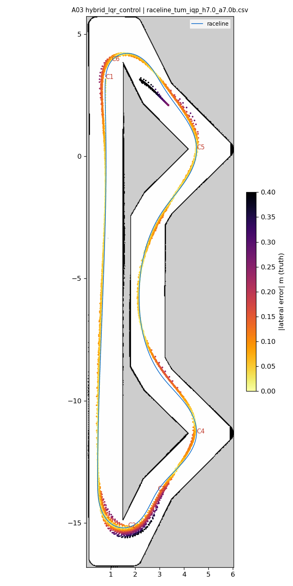
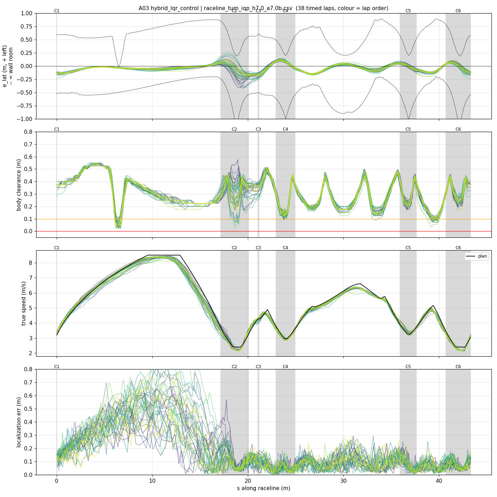
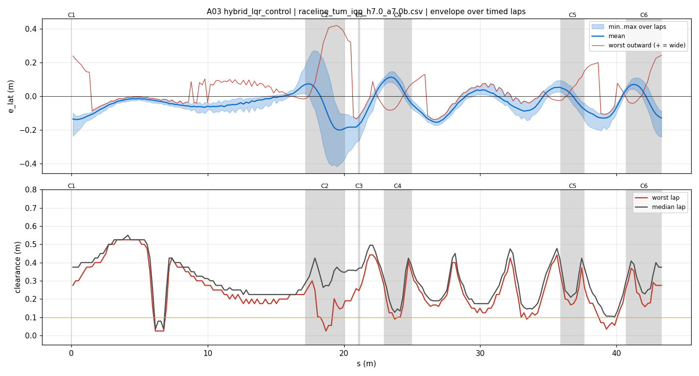
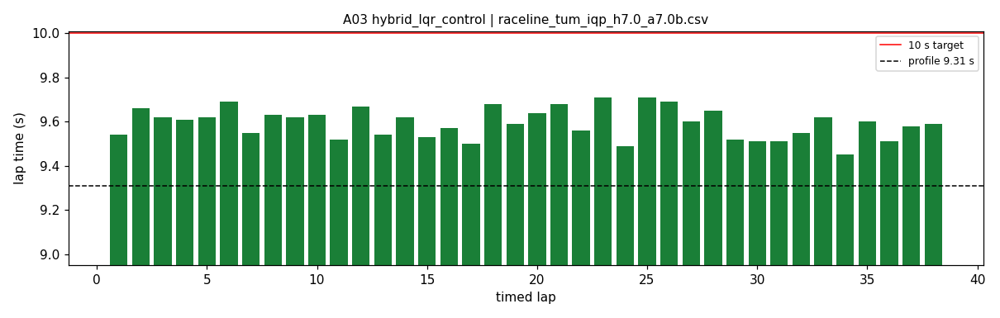
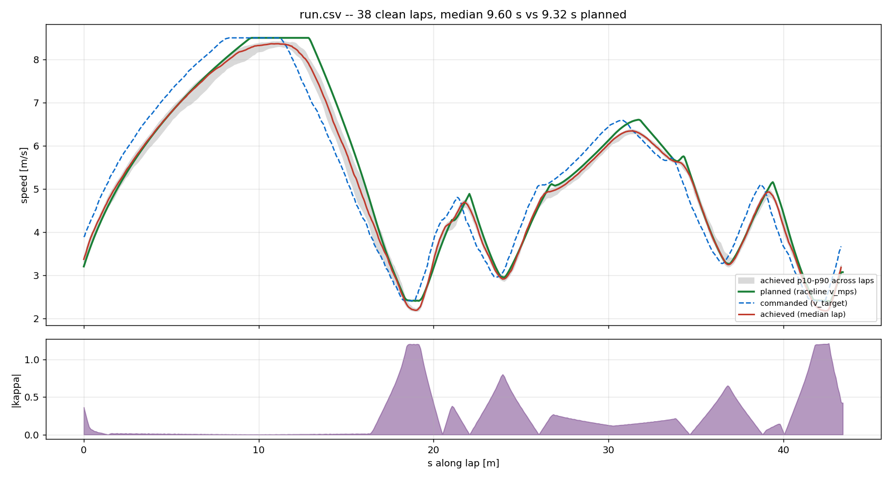
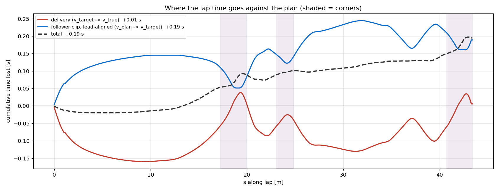

# A03 — hybrid_lqr_control

- **date** 2026-09-18  **line** `raceline_tum_iqp_h7.0_a7.0b.csv` (profile 9.31 s)  **loop cap** 45  **laps asked** 40
- **overrides** `control_hz:=45 warmup_v_max:=2.0 warmup_dist_m:=21.0 enc_rate_window_s:=0.10 amcl_params_file:=amcl_beams360.yaml exit_guard_from:=0.0 exit_guard_full:=0.0 controller_mode:=hybrid_lqr lqr_k_lat:=0.03 lqr_k_head:=0.05 lqr_k_yaw:=0.0 lqr_max_correction_rad:=0.02 recover_settle_s:=2.0 recover_creep_s:=3.0`
- **hypothesis** Hybrid LQR steering correction layered on pure pursuit, with conservative gains bounded to 0.02 rad, improves average and median lap time without raising tracking error.
- **prediction** mean better than T03's 9.589 with no contacts over 25-40 laps

## Result

| timed laps | contacts | best | median | mean | std | worst | <10 s | gap to profile | loop Hz | delay |
|---|---|---|---|---|---|---|---|---|---|---|
| 38 | 0 | 9.450 | 9.600 | 9.594 | 0.067 | 9.710 | 38 | 0.290 | 30.2 | 0.099 |

First contact: none

| tracking (timed laps) | mean | p90 | max |
|---|---|---|---|
| |e_lat| m | 0.074 | 0.148 | 0.418 |
| outward m | -0.002 | 0.127 | 0.418 |
| localization m | 0.154 | 0.392 | 0.944 |
| a_lat m/s² | 3.495 | 6.323 | 7.837 |
| |v_est − v| m/s | 0.169 | 0.345 | 0.885 |

Body clearance: min 0.025 m, p05 0.135 m.  Steering at lock: 0.0 % of ticks.

| corner | s | side | κ | v plan apex | v true apex | worst outward | |e| p90 | min clearance | a_lat max | at lock % |
|---|---|---|---|---|---|---|---|---|---|---|
| C1 | 0.0-0.0 | L | 0.36 | 3.2 | 3.56 | 0.238 | 0.163 | 0.275 | 5.15 | 0.0 |
| C2 | 17.2-20.1 | L | 1.2 | 2.41 | 2.24 | 0.418 | 0.252 | 0.025 | 7.32 | 0.0 |
| C3 | 21.1-21.2 | R | 0.38 | 4.28 | 4.24 | -0.056 | 0.217 | 0.224 | 4.12 | 0.0 |
| C4 | 23.0-24.9 | L | 0.8 | 2.96 | 2.97 | 0.1 | 0.113 | 0.09 | 7.18 | 0.0 |
| C5 | 35.9-37.6 | L | 0.66 | 3.27 | 3.33 | 0.182 | 0.09 | 0.168 | 7.62 | 0.0 |
| C6 | 40.7-43.3 | L | 1.21 | 2.4 | 2.28 | 0.241 | 0.119 | 0.146 | 7.23 | 0.0 |

Gates: 50 clean laps **no**, mean < 10 s (worst < 10.2) **PASS**

## Figures

Time-loss split (plot_speed_tracking.py): see `speed_tracking.txt`.

## Verdict

Hybrid LQR at these gains is lap-time NEUTRAL. 38 clean laps, zero contacts, mean 9.594 against T03's pure-pursuit 9.589 -- identical within noise. It takes the best lap (9.450 vs 9.496) and doubles the clean-lap count, so it is kept for reliability, but steering is at a plateau and the remaining time is not there. The reset cascade at the end of this run was a MANUAL simulator reset, not a crash. This run is the control against which the a_long ladder (S01-S03) is measured.
