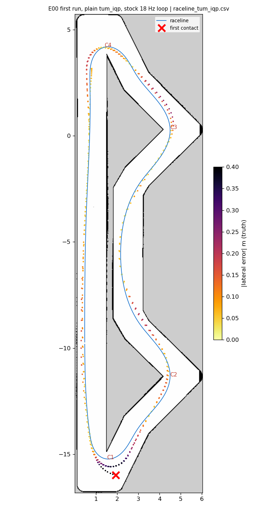
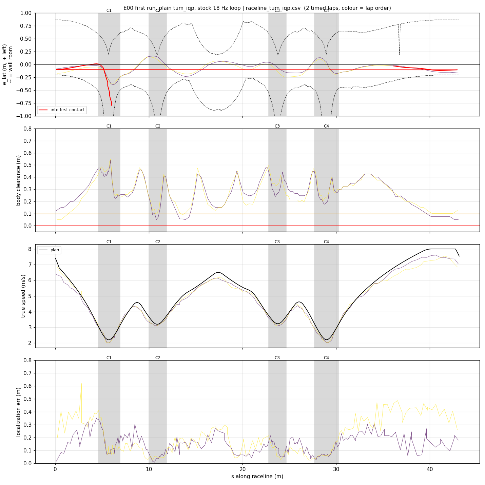
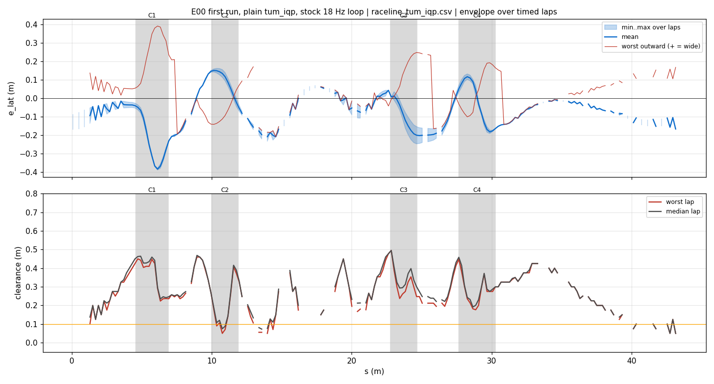
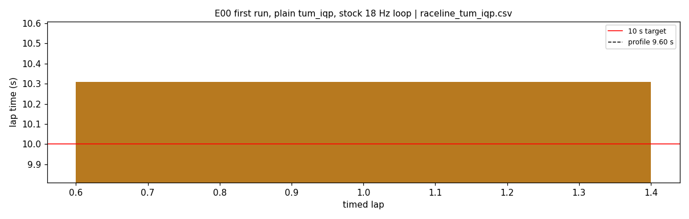
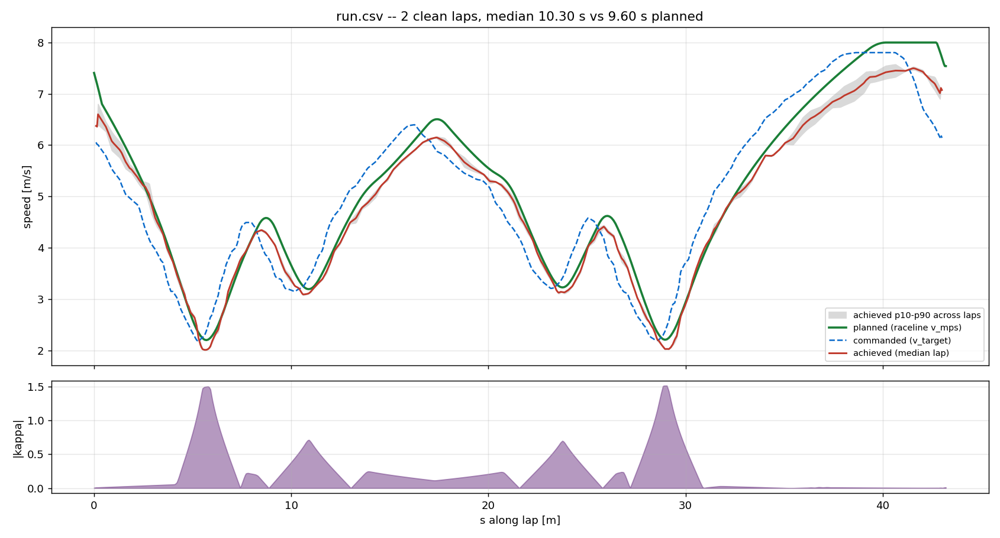
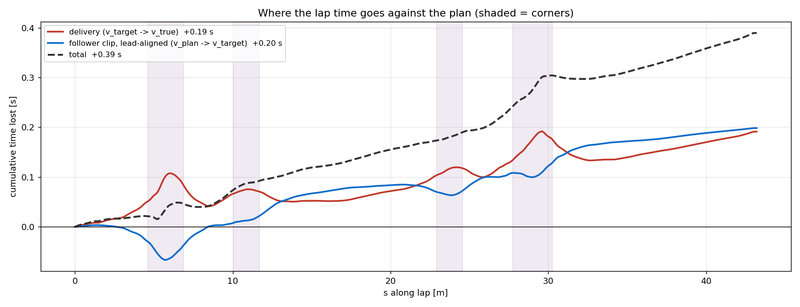

# E00 — first run, plain tum_iqp, stock 18 Hz loop

- **date** 2026-09-17  **line** `raceline_tum_iqp.csv` (profile 9.602 s)  **loop cap** stock  **laps asked** 25
- **overrides** `(none)`
- **hypothesis** Reproduce run_iros_08 (11 clean laps, 10.25-10.5 s) on the line believed to be the one it used.
- **prediction** clean, ~10.3 s

## Result

| timed laps | contacts | best | median | mean | std | worst | <10 s | gap to profile | loop Hz | delay |
|---|---|---|---|---|---|---|---|---|---|---|
| 1 | 1 | 10.309 | 10.309 | 10.309 | — | 10.309 | 0 | 0.707 | 16.7 | 0.179 |

First contact: +27.5 s at s = 5.99 m

| tracking (timed laps) | mean | p90 | max |
|---|---|---|---|
| |e_lat| m | 0.113 | 0.228 | 0.391 |
| outward m | 0.037 | 0.225 | 0.391 |
| localization m | 0.168 | 0.338 | 0.618 |
| a_lat m/s² | 2.921 | 6.263 | 8.077 |
| |v_est − v| m/s | 0.182 | 0.365 | 0.691 |

Body clearance: min 0.05 m, p05 0.09 m.  Steering at lock: 0.0 % of ticks.

| corner | s | side | κ | v plan apex | v true apex | worst outward | |e| p90 | min clearance | a_lat max | at lock % |
|---|---|---|---|---|---|---|---|---|---|---|
| C1 | 4.6-6.9 | L | 1.5 | 2.21 | 2.08 | 0.391 | 0.38 | 0.224 | 7.5 | 0.0 |
| C2 | 10.0-11.9 | L | 0.72 | 3.19 | 3.13 | 0.093 | 0.154 | 0.05 | 6.58 | 0.0 |
| C3 | 22.8-24.7 | L | 0.7 | 3.23 | 3.14 | 0.247 | 0.241 | 0.212 | 7.17 | 0.0 |
| C4 | 27.7-30.3 | L | 1.51 | 2.21 | 2.07 | 0.192 | 0.173 | 0.177 | 7.29 | 0.0 |

Gates: 50 clean laps **no**, mean < 10 s (worst < 10.2) **no**

## Figures

Time-loss split (plot_speed_tracking.py): see `speed_tracking.txt`.

## Verdict

FAILED: contact on lap 3 at the bottom hairpin (C1, s 5.9), understeer at steering lock with localization at 3-6 cm. Target speed there 2.2 m/s: this CSV plans a_lat 7.3 in both hairpins; run_iros_08 in fact followed a hairpin-capped z profile (apex 1.90). Recovery then looped (no checkpoints known for iros2026). Stopped manually.
