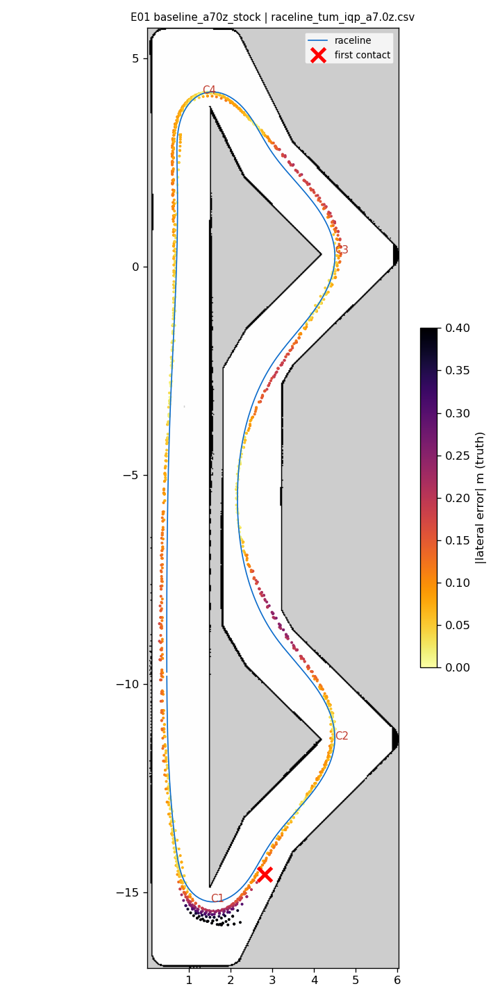
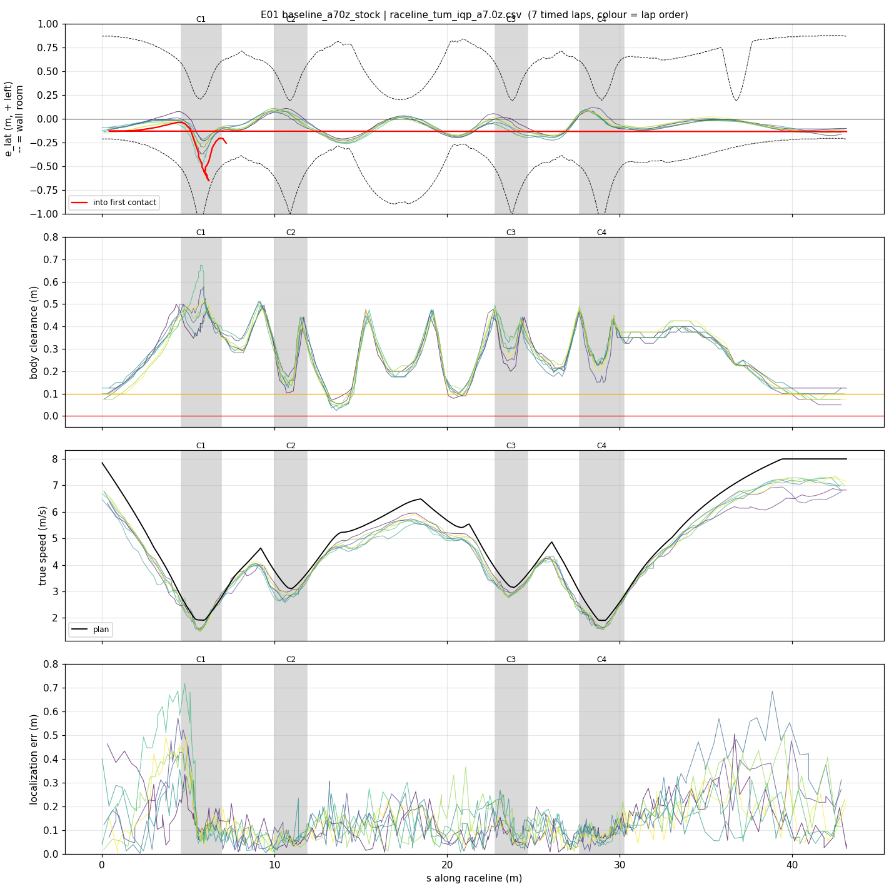
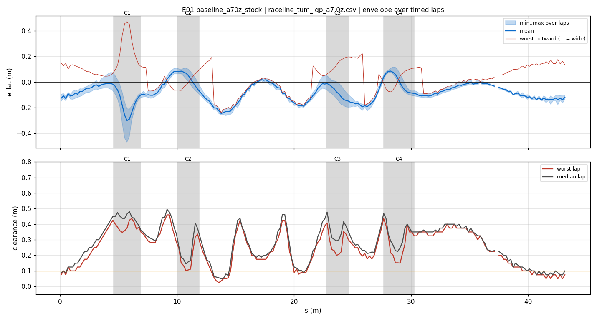
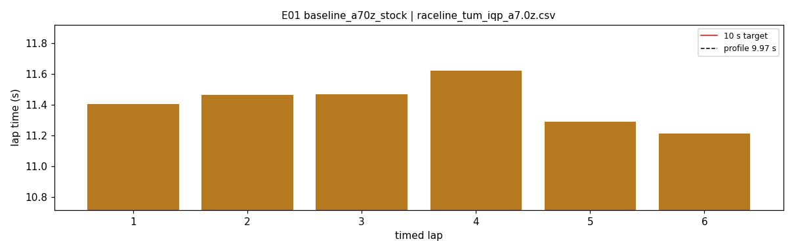
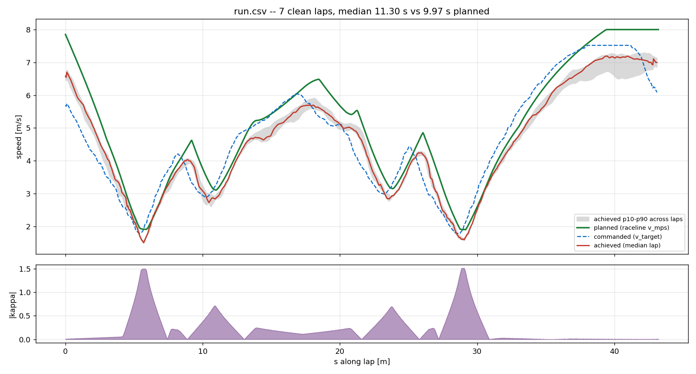
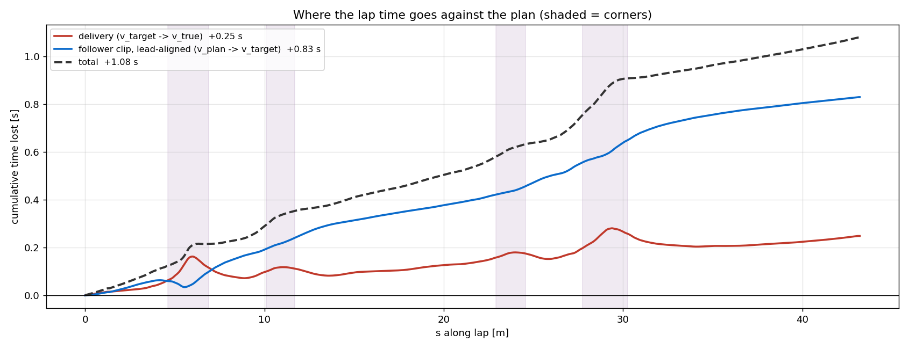

# E01 — baseline_a70z_stock

- **date** 2026-09-17  **line** `raceline_tum_iqp_a7.0z.csv` (profile 9.969 s)  **loop cap** stock  **laps asked** 25
- **overrides** `(none)`
- **hypothesis** run_iros_08's actual profile (hairpins capped, apex 1.90) is clean at the stock loop; gives the logged reference every later change is compared against
- **prediction** 0 contacts in 25 laps, median 10.3-10.5 s (run_iros_08: 10.25-10.70), C1/C4 outward p90 < 0.2 m

## Result

| timed laps | contacts | best | median | mean | std | worst | <10 s | gap to profile | loop Hz | delay |
|---|---|---|---|---|---|---|---|---|---|---|
| 6 | 2 | 11.214 | 11.434 | 11.410 | 0.132 | 11.621 | 0 | 1.464 | 14.6 | 0.205 |

First contact: +87.6 s at s = 7.19 m

| tracking (timed laps) | mean | p90 | max |
|---|---|---|---|
| |e_lat| m | 0.100 | 0.194 | 0.470 |
| outward m | 0.022 | 0.170 | 0.470 |
| localization m | 0.146 | 0.308 | 0.716 |
| a_lat m/s² | 2.257 | 4.957 | 7.917 |
| |v_est − v| m/s | 0.231 | 0.492 | 1.188 |

Body clearance: min 0.025 m, p05 0.09 m.  Steering at lock: 1.76 % of ticks.

| corner | s | side | κ | v plan apex | v true apex | worst outward | |e| p90 | min clearance | a_lat max | at lock % |
|---|---|---|---|---|---|---|---|---|---|---|
| C1 | 4.6-6.9 | L | 1.5 | 1.92 | 1.65 | 0.47 | 0.314 | 0.313 | 4.86 | 11.2 |
| C2 | 10.0-11.9 | L | 0.72 | 3.12 | 2.86 | 0.136 | 0.104 | 0.103 | 6.68 | 0.0 |
| C3 | 22.8-24.7 | L | 0.7 | 3.16 | 2.92 | 0.196 | 0.18 | 0.2 | 6.36 | 0.0 |
| C4 | 27.7-30.3 | L | 1.51 | 1.91 | 1.67 | 0.116 | 0.098 | 0.15 | 5.03 | 0.0 |

Gates: 50 clean laps **no**, mean < 10 s (worst < 10.2) **no**

## Figures

Time-loss split (plot_speed_tracking.py): see `speed_tracking.txt`.

## Verdict

NOT A VALID BASELINE, and a contact. The stock loop ran 15 Hz here (GPU 84-86 C, power throttled 60 -> 32 W), so the measured delay was 205-220 ms, past derate_delay_to 0.21: every speed target was derated to the 6.0 rung (laps 11.2-11.6 s, gap 1.46 s). Contact on timed lap 7 at C1 (s 6.5): on the braking approach the AMCL estimate was 0.36-0.62 m BEHIND the car (err_along), so turn-in came late; the estimate snapped forward inside the hairpin with the car already at steering lock and 0.17 m wide, and it drifted to 0.6 m wide at lock into the exit wall at 2.1 m/s (a_lat < 5, not a grip limit). The same along-track swing (+0.3 at speed -> -0.3 after braking, 0.3-0.9 m per pass) is present in every C1 approach of run_iros_08, so it is systematic, not new. Encoder under-read under braking was tested and rejected (enc/true median 1.00 in the zone). Recovery: the new C1 checkpoint re-localized in 1 s (7 cm), but the respawn itself was missed (encoder speed 2.1 -> 0.46 m/s, above reset_speed_to 0.3; yaw step 12 deg < 20) and the car drove 0.8 m mislocalized into a second contact 0.8 s later, which was then detected.
