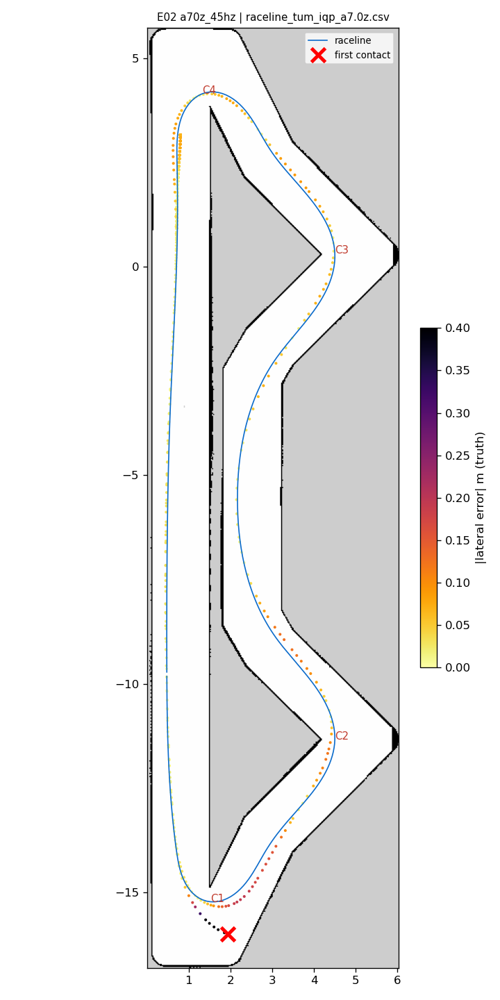
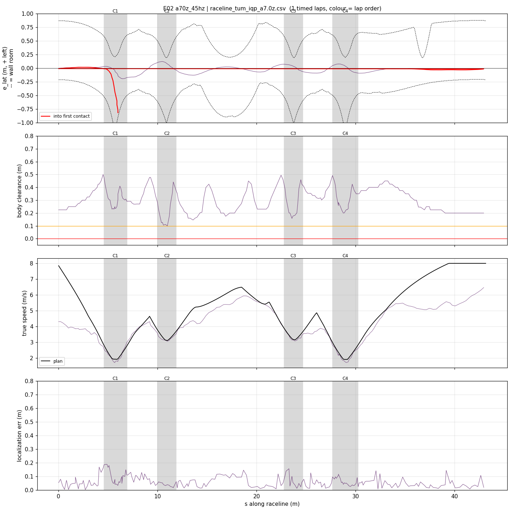
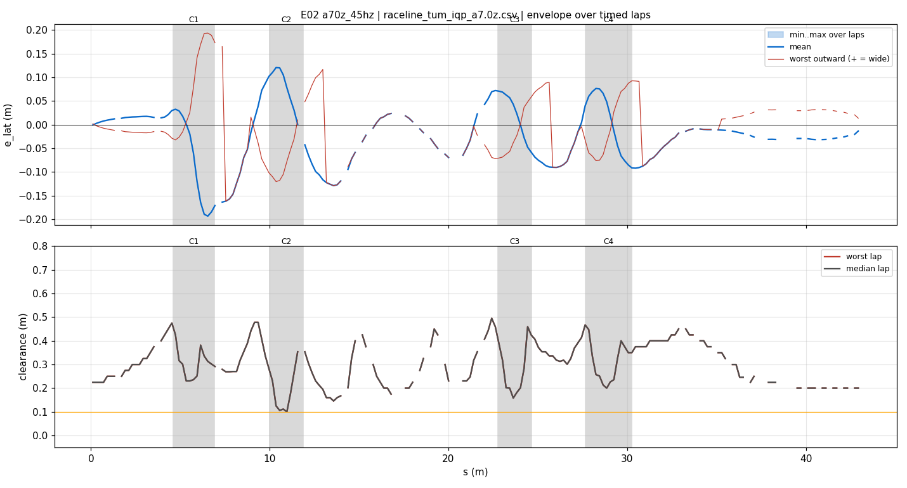
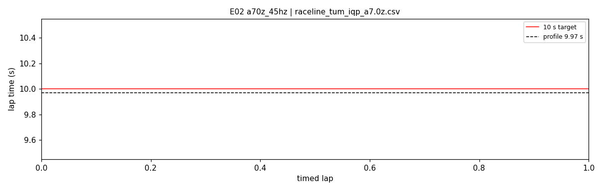
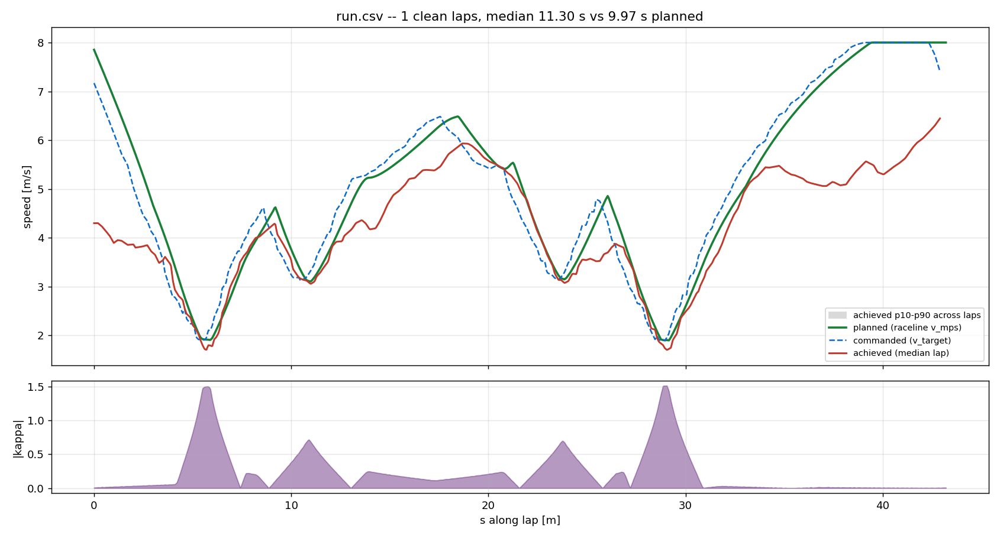
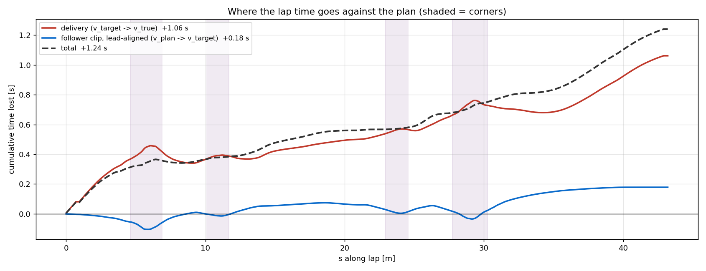

# E02 — a70z_45hz

- **date** 2026-09-17  **line** `raceline_tum_iqp_a7.0z.csv` (profile 9.969 s)  **loop cap** 45  **laps asked** 25
- **overrides** `(none)`
- **hypothesis** At the 45 Hz evaluation loop the round trip drops from ~210 ms to ~70 ms: no derate, less along-track localization swing into C1 (a timing error should scale with the delay), same follower constants
- **prediction** loop 44-45 Hz, delay 65-80 ms, median 10.2-10.5 s, C1 along-error swing < 0.3 m; risk: lookahead floored at 0.7 scale (1.54 m) and latency_comp 0.05 now over-predicts

## Result

| timed laps | contacts | best | median | mean | std | worst | <10 s | gap to profile | loop Hz | delay |
|---|---|---|---|---|---|---|---|---|---|---|
| 0 | 1 | — | — | — | — | — | 0 | — | 30.3 | 0.099 |

First contact: +45.0 s at s = 5.99 m

| tracking (timed laps) | mean | p90 | max |
|---|---|---|---|
| |e_lat| m | 0.055 | 0.121 | 0.193 |
| outward m | -0.003 | 0.090 | 0.193 |
| localization m | 0.060 | 0.117 | 0.188 |
| a_lat m/s² | 2.479 | 5.089 | 6.861 |
| |v_est − v| m/s | 0.260 | 0.542 | 0.875 |

Body clearance: min 0.1 m, p05 0.175 m.  Steering at lock: 0.0 % of ticks.

| corner | s | side | κ | v plan apex | v true apex | worst outward | |e| p90 | min clearance | a_lat max | at lock % |
|---|---|---|---|---|---|---|---|---|---|---|
| C1 | 4.6-6.9 | L | 1.5 | 1.92 | 1.79 | 0.193 | 0.189 | 0.23 | 5.64 | 0.0 |
| C2 | 10.0-11.9 | L | 0.72 | 3.12 | 3.11 | 0.083 | 0.119 | 0.1 | 6.72 | 0.0 |
| C3 | 22.8-24.7 | L | 0.7 | 3.16 | 3.12 | 0.08 | 0.073 | 0.158 | 6.86 | 0.0 |
| C4 | 27.7-30.3 | L | 1.51 | 1.91 | 1.78 | 0.093 | 0.091 | 0.2 | 4.83 | 0.0 |

Gates: 50 clean laps **no**, mean < 10 s (worst < 10.2) **no**

## Figures

Time-loss split (plot_speed_tracking.py): see `speed_tracking.txt`.

## Verdict

CONTACT on timed lap 1 at C1 (s 6.2), entered at 3.9 m/s against a 1.9-2.5 target. What 45 Hz fixed: loop ran at the cap, delay 81-87 ms (was 205-220), localization 0.02-0.29 m through the whole C1 approach (E01: 0.36-0.62 along-track), no derate. What it broke: braking. Per-message wheel-speed differentiation on ~22 ms bridge stamps is jitter-dominated (v_enc 2.8 <-> 5.4 m/s at a steady 3.9), the tire observer read 0.7-1.0 m/s HIGH through the braking zone (v_est 4.6-4.9 vs 3.9), and the slip band (brake edge v_land - 0.08*4 = -0.32 m/s under the estimate) held the wheel command at 3.9-4.2 while the target fell to 1.9. At 3.9 m/s the curvature cap (7.0/v^2 = 0.46) allowed a third of the hairpin's 1.5, steering 0.25-0.52, straight into the outer wall. Same code braked correctly at 15 Hz (E01). Fix candidate: enc_window_s (389e561), ported default 0.
