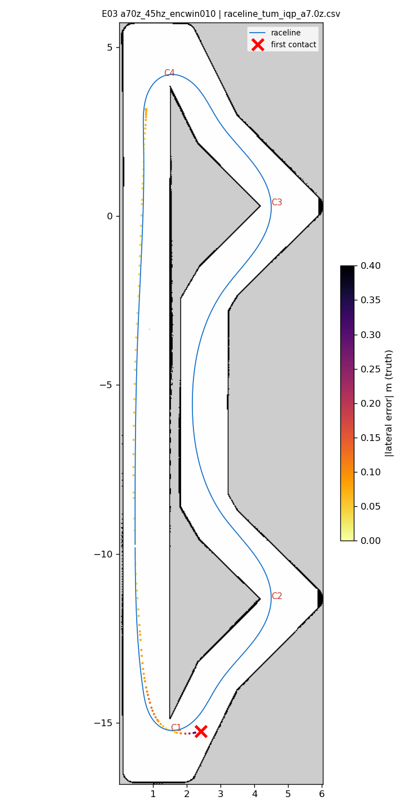
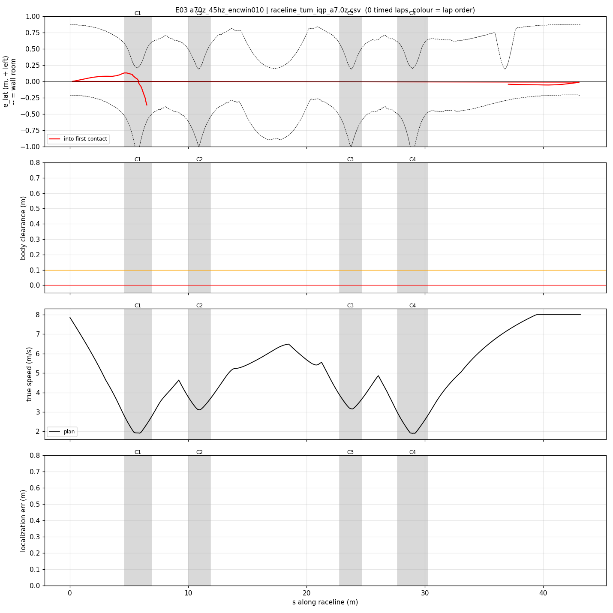
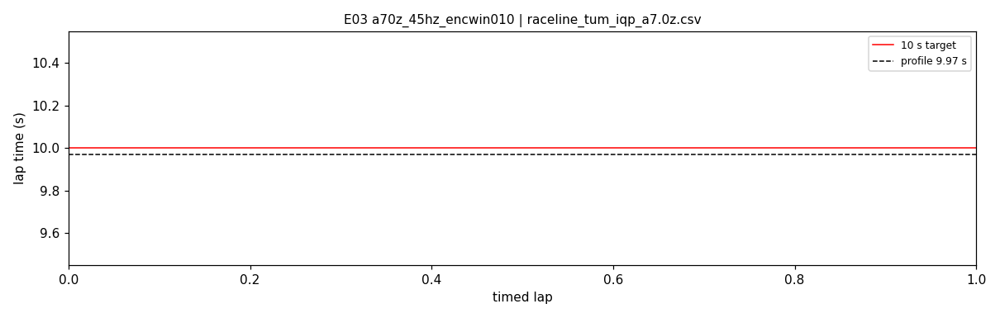

# E03 — a70z_45hz_encwin010

- **date** 2026-09-17  **line** `raceline_tum_iqp_a7.0z.csv` (profile 9.969 s)  **loop cap** 45  **laps asked** 25
- **overrides** `enc_window_s:=0.10`
- **hypothesis** Differentiating the wheel angle over 0.10 s (~4.5 frames at 45 Hz) instead of per message removes the stamp-jitter noise in v_enc, so the tire observer stops reading high under braking and the slip band can bring the car to the planned C1 apex speed
- **prediction** 0 contacts in 25 laps; |v_est - v| p90 < 0.35 m/s (E02 0.54); C1 entry speed at s 5 within 0.4 m/s of target; median 10.2-10.5 s

## Result

| timed laps | contacts | best | median | mean | std | worst | <10 s | gap to profile | loop Hz | delay |
|---|---|---|---|---|---|---|---|---|---|---|
| 0 | 2 | — | — | — | — | — | 0 | — | 20.6 | 0.146 |

First contact: +6.6 s at s = 6.49 m

| tracking (timed laps) | mean | p90 | max |
|---|---|---|---|
| |e_lat| m | 0.187 | 0.414 | 0.554 |
| outward m | 0.151 | 0.414 | 0.554 |
| localization m | 3.459 | 8.821 | 8.821 |
| a_lat m/s² | 0.612 | 2.565 | 6.623 |
| |v_est − v| m/s | 0.334 | 0.549 | 2.283 |

Body clearance: min 0.035 m, p05 0.035 m.  Steering at lock: 45.79 % of ticks.

| corner | s | side | κ | v plan apex | v true apex | worst outward | |e| p90 | min clearance | a_lat max | at lock % |
|---|---|---|---|---|---|---|---|---|---|---|
| C1 | 4.6-6.9 | L | 1.5 | 1.92 | 1.47 | 0.554 | 0.525 | 0.09 | 6.62 | 4.9 |
| C4 | 27.7-30.3 | L | 1.51 | 1.91 | — | -0.066 | 0.071 | 0.5 | 0.4 | 0.0 |

Gates: 50 clean laps **no**, mean < 10 s (worst < 10.2) **no**

## Figures

Time-loss split (plot_speed_tracking.py): see `speed_tracking.txt`.

## Verdict

CONTACT on the out-lap at C1 exit (s 6.7, +6.6 s). enc_window_s 0.10 did what it was for: v_est tracked truth within 0.1-0.3 m/s through the braking zone (E02: +0.7-1.0 high), the car reached the C1 apex at 1.8-1.9 m/s on plan. Then at steering lock the car achieved kappa 0.9-1.16 (yaw_rate/v) against the path's 1.5 and the geometric 1.78, at only 3.4-3.8 m/s^2: heading error opened to -28 deg and it ran 0.42 m wide into the exit wall while accelerating out. Cross-run analysis (E01-E03, run_iros_08, ICRA run 23, Porto run 41): at full lock the car reaches kappa ~1.7 only below ~1.8 m/s; at 2.0-2.6 m/s it falls to 0.9-1.0 at ~4 m/s^2 (front tires saturated at lock). The line's hairpins (kappa 1.5, 26 of 30 deg) planned at 5.45 m/s^2 (apex 1.90) are above what the car can do at lock. Delay estimate still 0.155 s at 6 s (tick seed off), a secondary factor on the out-lap.
