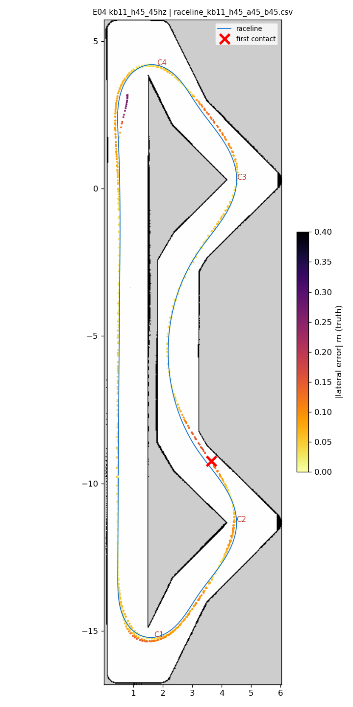
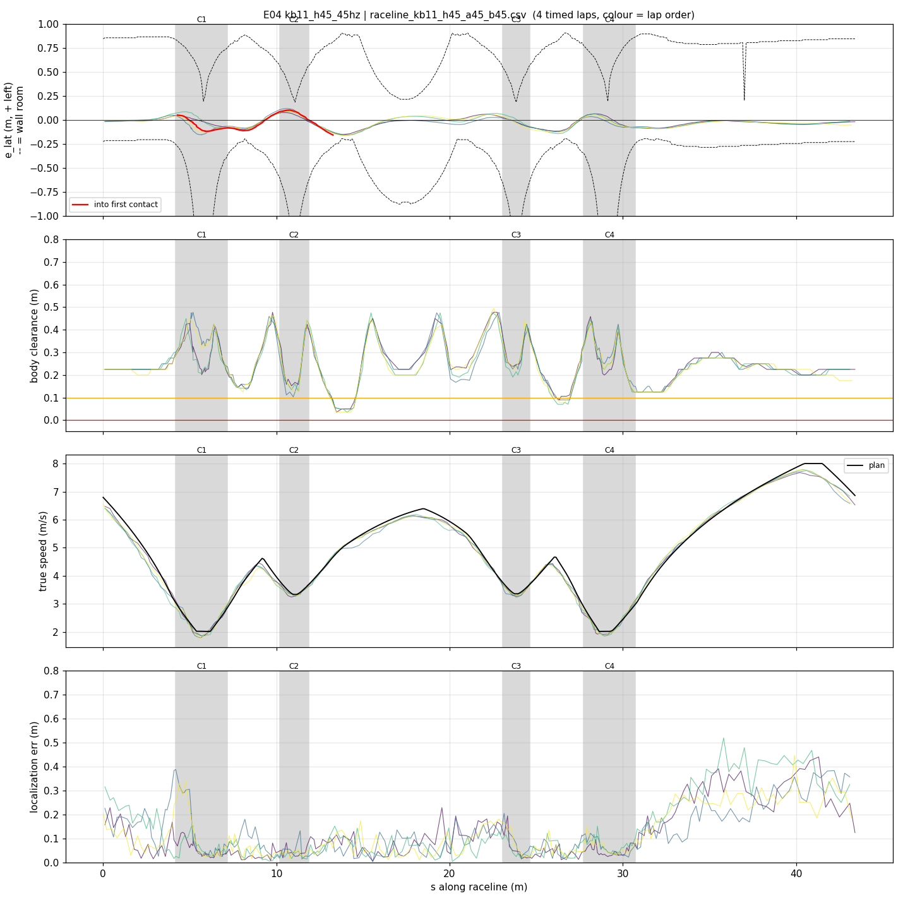
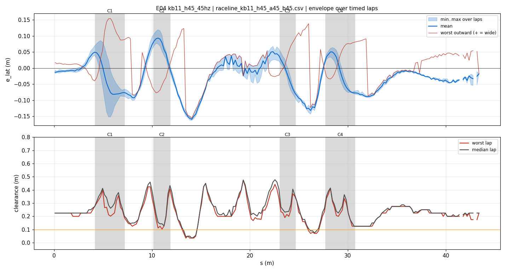
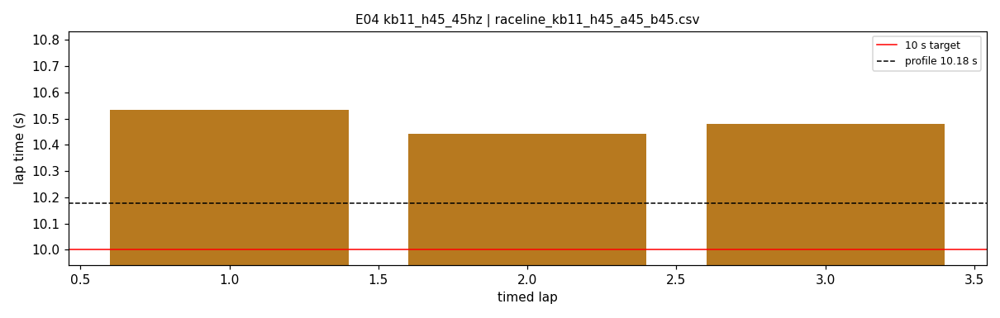
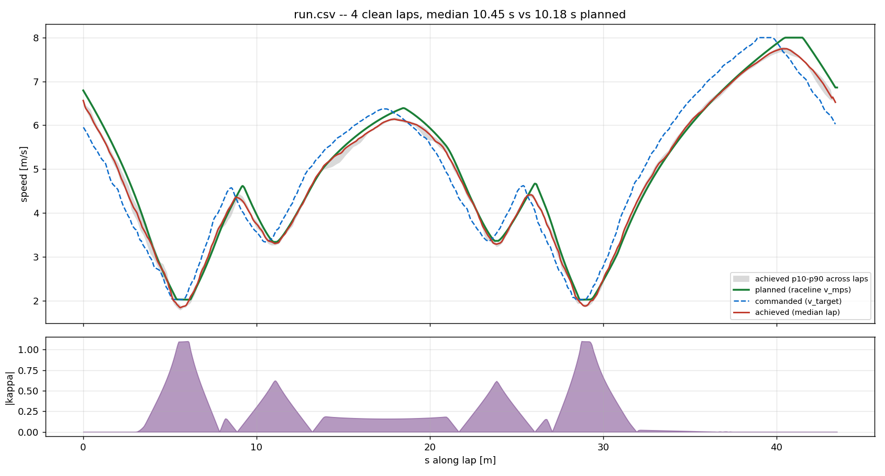
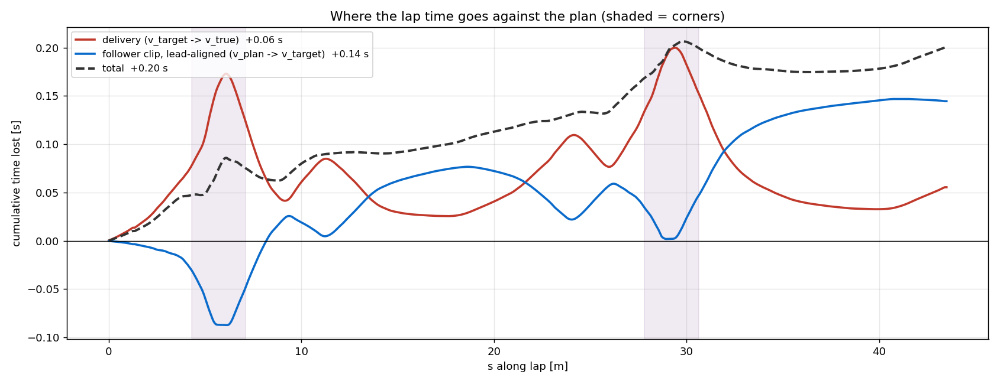

# E04 — kb11_h45_45hz

- **date** 2026-09-17  **line** `raceline_kb11_h45_a45_b45.csv` (profile 10.177 s)  **loop cap** 45  **laps asked** 25
- **overrides** `enc_window_s:=0.10 cmd_delay_tick_seed:=1`
- **hypothesis** Hairpins regenerated at kappa 1.1 (20 deg of steering, was 23-26) and planned at 4.5 m/s^2 keep the front tires off lock, so C1/C4 no longer run wide; with enc_window_s 0.10 (E03 braking fix) and the delay seeded from the tick on the out-lap
- **prediction** 0 contacts in 25 laps; C1/C4 worst outward < 0.25 m, <5 % of hairpin ticks at lock; median 10.4-10.7 s (profile 10.18 + ~0.3)

## Result

| timed laps | contacts | best | median | mean | std | worst | <10 s | gap to profile | loop Hz | delay |
|---|---|---|---|---|---|---|---|---|---|---|
| 3 | 3 | 10.442 | 10.481 | 10.485 | 0.037 | 10.533 | 0 | 0.304 | 23.2 | 0.129 |

First contact: +50.6 s at s = 13.27 m

| tracking (timed laps) | mean | p90 | max |
|---|---|---|---|
| |e_lat| m | 0.052 | 0.107 | 0.163 |
| outward m | 0.002 | 0.086 | 0.154 |
| localization m | 0.112 | 0.273 | 0.519 |
| a_lat m/s² | 2.760 | 5.755 | 7.491 |
| |v_est − v| m/s | 0.110 | 0.221 | 0.780 |

Body clearance: min 0.035 m, p05 0.106 m.  Steering at lock: 0.0 % of ticks.

| corner | s | side | κ | v plan apex | v true apex | worst outward | |e| p90 | min clearance | a_lat max | at lock % |
|---|---|---|---|---|---|---|---|---|---|---|
| C1 | 4.2-7.2 | L | 1.1 | 2.02 | 2.00 | 0.154 | 0.126 | 0.146 | 4.66 | 0.0 |
| C2 | 10.2-11.9 | L | 0.63 | 3.34 | 3.33 | 0.065 | 0.096 | 0.103 | 6.75 | 0.0 |
| C3 | 23.0-24.6 | L | 0.62 | 3.36 | 3.31 | 0.11 | 0.087 | 0.19 | 6.89 | 0.0 |
| C4 | 27.7-30.7 | L | 1.1 | 2.02 | 1.95 | 0.084 | 0.077 | 0.125 | 5.01 | 0.0 |

Gates: 50 clean laps **no**, mean < 10 s (worst < 10.2) **no**

## Figures

Time-loss split (plot_speed_tracking.py): see `speed_tracking.txt`.

## Verdict

INVALID (simulator window minimized for the run): delay 126-141 ms throughout instead of the ~69 ms the tick seed measured at start. Still the first run with clean hairpins: 3 timed laps 10.44-10.53 s (std 0.04), C1/C4 worst outward 0.15/0.08 m, 0 % at steering lock, apex speeds on plan (2.00/1.95 vs 2.02), encoder-window speed estimate p90 error 0.22 m/s. Contact on lap 4 at s 13.8 (C2 exit onto the straight) with e_lat only -0.16 m: body clearance there is 0.03-0.10 m on every lap of every run, the line's tightest spot. Rerun as E05 with the window visible; C2-exit margin zone is the next geometry fix if it recurs.
