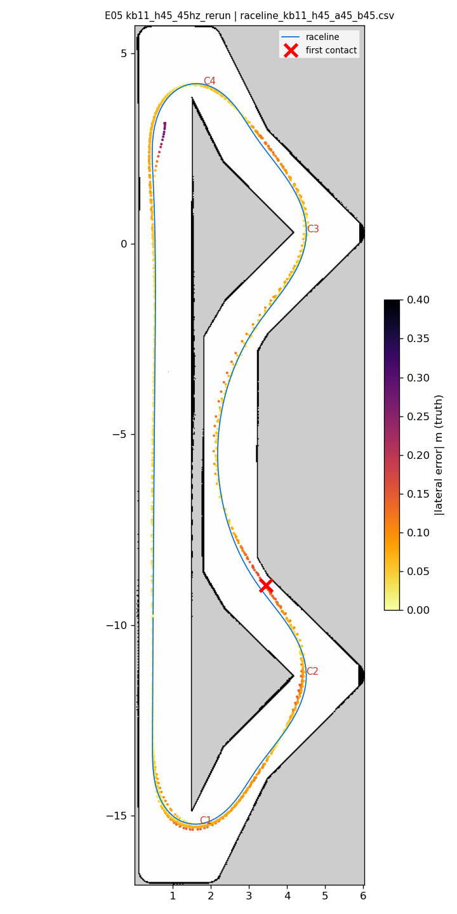
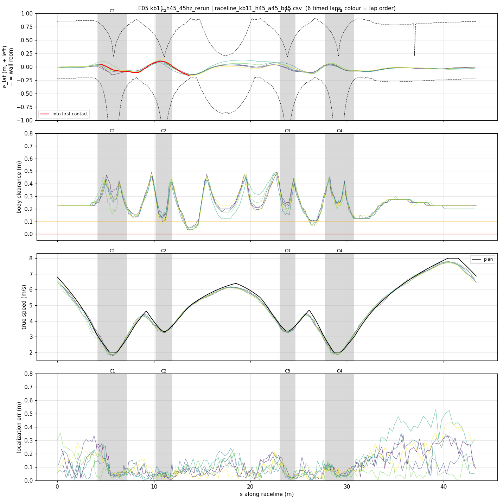
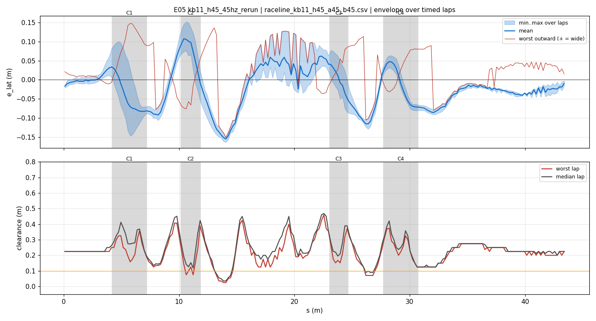
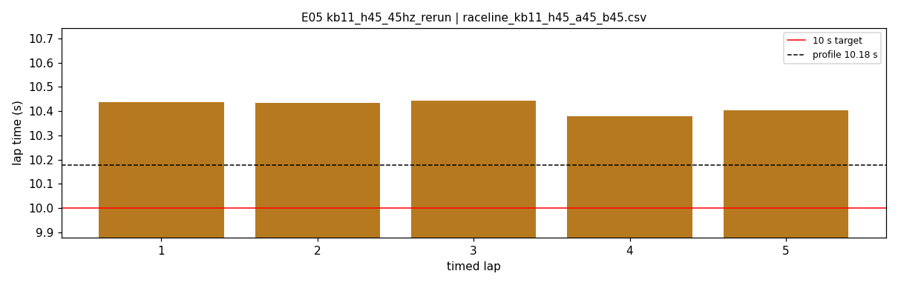
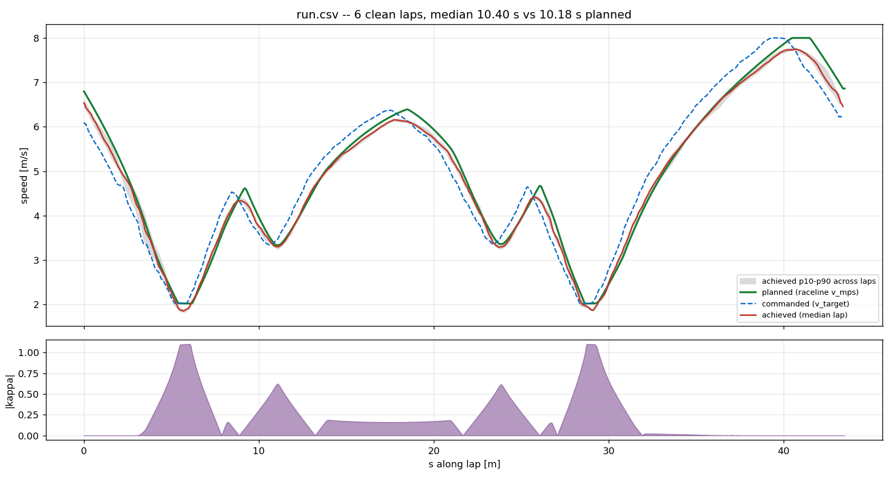
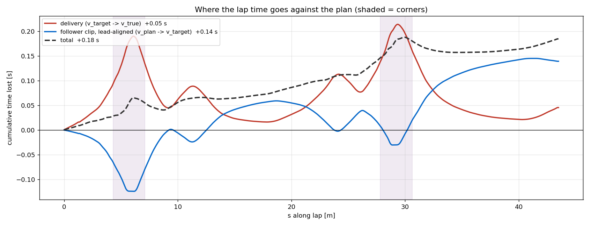

# E05 — kb11_h45_45hz_rerun

- **date** 2026-09-17  **line** `raceline_kb11_h45_a45_b45.csv` (profile 10.177 s)  **loop cap** 45  **laps asked** 25
- **overrides** `enc_window_s:=0.10 cmd_delay_tick_seed:=1`
- **hypothesis** E04 with the simulator window visible (E04 ran minimized, delay 130 ms): the kappa 1.1 hairpins at 4.5 m/s^2 stay clean at the real 45 Hz loop
- **prediction** 0 contacts in 25 laps; delay 65-80 ms; C1/C4 worst outward < 0.25 m, 0-5 % at lock; median 10.3-10.6 s; watch C2 exit s 13-14 clearance

## Result

| timed laps | contacts | best | median | mean | std | worst | <10 s | gap to profile | loop Hz | delay |
|---|---|---|---|---|---|---|---|---|---|---|
| 5 | 3 | 10.379 | 10.433 | 10.419 | 0.024 | 10.443 | 0 | 0.256 | 24.0 | 0.125 |

First contact: +71.4 s at s = 13.67 m

| tracking (timed laps) | mean | p90 | max |
|---|---|---|---|
| |e_lat| m | 0.052 | 0.100 | 0.163 |
| outward m | 0.003 | 0.082 | 0.147 |
| localization m | 0.103 | 0.221 | 0.531 |
| a_lat m/s² | 2.829 | 5.978 | 7.402 |
| |v_est − v| m/s | 0.131 | 0.266 | 0.600 |

Body clearance: min 0.025 m, p05 0.106 m.  Steering at lock: 0.0 % of ticks.

| corner | s | side | κ | v plan apex | v true apex | worst outward | |e| p90 | min clearance | a_lat max | at lock % |
|---|---|---|---|---|---|---|---|---|---|---|
| C1 | 4.2-7.2 | L | 1.1 | 2.02 | 2.00 | 0.147 | 0.097 | 0.146 | 4.91 | 0.0 |
| C2 | 10.2-11.9 | L | 0.63 | 3.34 | 3.32 | 0.101 | 0.112 | 0.075 | 6.87 | 0.0 |
| C3 | 23.0-24.6 | L | 0.62 | 3.36 | 3.31 | 0.09 | 0.078 | 0.152 | 6.99 | 0.0 |
| C4 | 27.7-30.7 | L | 1.1 | 2.02 | 1.95 | 0.081 | 0.071 | 0.125 | 5.01 | 0.0 |

Gates: 50 clean laps **no**, mean < 10 s (worst < 10.2) **no**

## Figures

Time-loss split (plot_speed_tracking.py): see `speed_tracking.txt`.

## Verdict

VALID; contact on lap 6 at the SAME place as E04 (s 13.7-14.5, C2 exit onto the straight), so it is the line, not the minimized window. 5 timed laps 10.38-10.44 s (std 0.024, gap to profile 0.26 s). Hairpins solved: C1/C4 worst outward 0.15/0.08 m, 0 % at lock, apex 2.00/1.95 vs 2.02 plan. At the contact: e_lat -0.14..-0.17 (right), localization 1-5 cm, heading error ~0: the line runs 0.32-0.34 m from the right-hand wall where the chevron's diagonal meets the straight wall (x 3.2, y -8.5..-9.5), so 0.14 m of drift puts the body on the duct. Delay: seeded 63 ms, the correlator then walked it to 125-143 ms (the throttle-to-wheel round trip at 45 Hz is ~6 frames, not the 3 the seed assumes). New checkpoint measured (3.730, -9.945, 2.356). Fix: --margin-zones 12.5:15.5:0.25:R -> line 0.51 m from that wall (raceline_kb11c2_h45_a45_b45.csv, profile 10.25 s).
