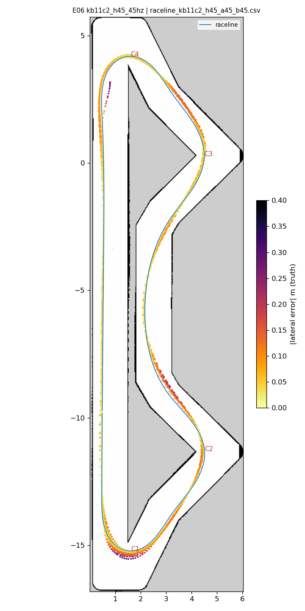
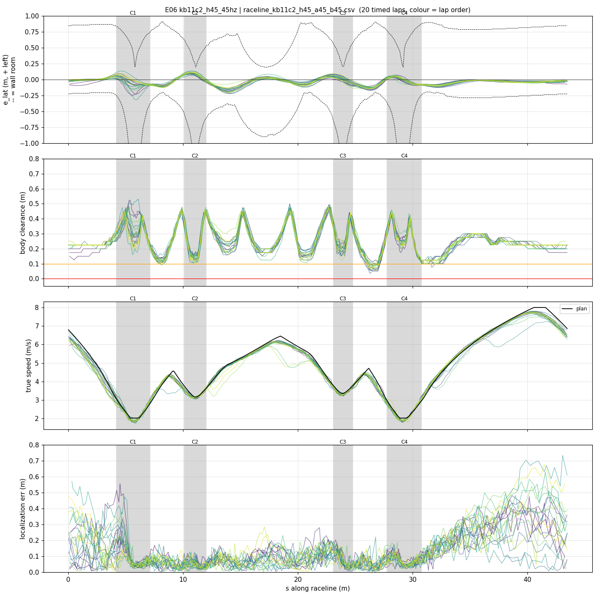
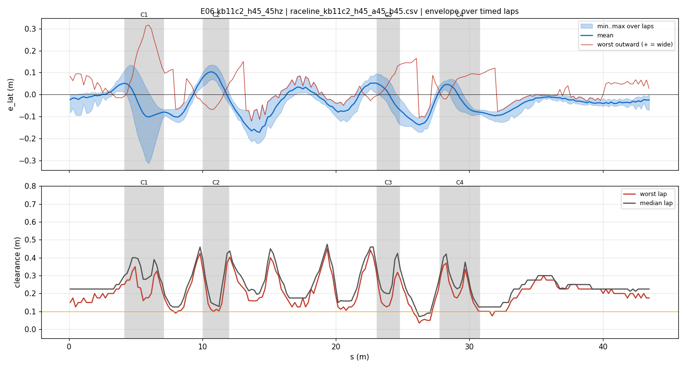
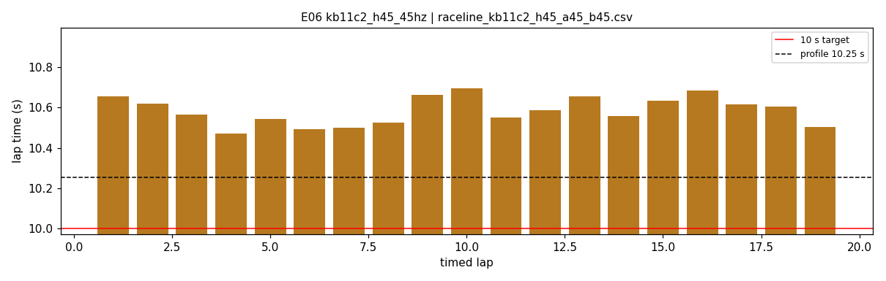
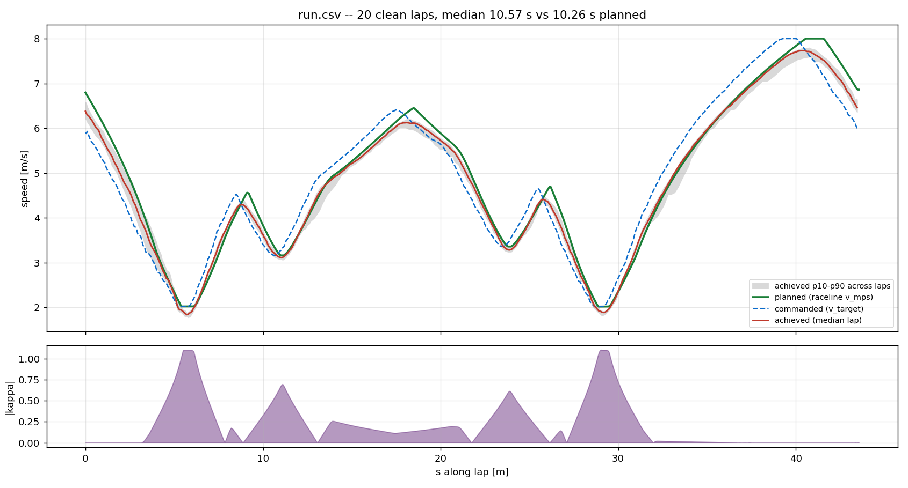
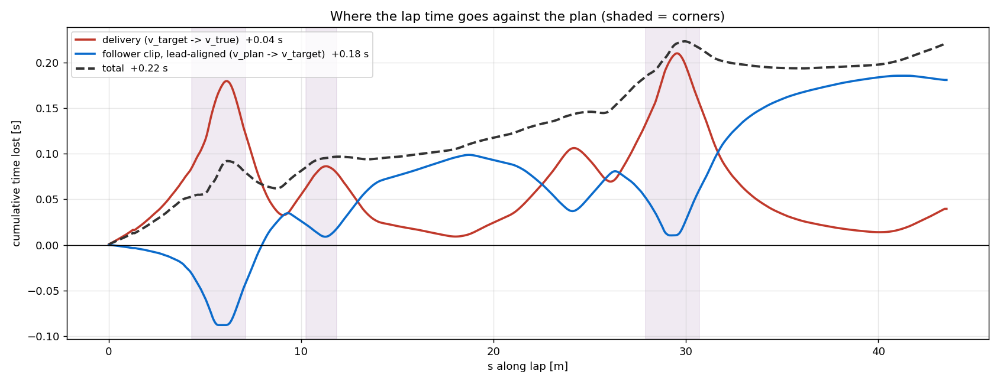

# E06 — kb11c2_h45_45hz

- **date** 2026-09-17  **line** `raceline_kb11c2_h45_a45_b45.csv` (profile 10.254 s)  **loop cap** 45  **laps asked** 25
- **overrides** `enc_window_s:=0.10 cmd_delay_tick_seed:=1`
- **hypothesis** E05 with the line moved 0.51 m (was 0.33) from the right-hand wall at the C2 exit (margin zone 12.5:15.5:0.25:R); everything else identical; the C2-exit contact of E04/E05 disappears
- **prediction** 0 contacts in 25 laps; min body clearance at s 12.5-15.5 >= 0.15 m; median 10.4-10.6 s (profile 10.25 + ~0.26)

## Result

| timed laps | contacts | best | median | mean | std | worst | <10 s | gap to profile | loop Hz | delay |
|---|---|---|---|---|---|---|---|---|---|---|
| 19 | 0 | 10.471 | 10.588 | 10.585 | 0.067 | 10.697 | 0 | 0.334 | 22.1 | 0.136 |

First contact: none

| tracking (timed laps) | mean | p90 | max |
|---|---|---|---|
| |e_lat| m | 0.058 | 0.114 | 0.317 |
| outward m | -0.003 | 0.087 | 0.317 |
| localization m | 0.119 | 0.283 | 0.733 |
| a_lat m/s² | 2.756 | 5.486 | 7.819 |
| |v_est − v| m/s | 0.169 | 0.338 | 1.478 |

Body clearance: min 0.035 m, p05 0.12 m.  Steering at lock: 0.0 % of ticks.

| corner | s | side | κ | v plan apex | v true apex | worst outward | |e| p90 | min clearance | a_lat max | at lock % |
|---|---|---|---|---|---|---|---|---|---|---|
| C1 | 4.2-7.1 | L | 1.1 | 2.02 | 1.94 | 0.317 | 0.142 | 0.125 | 4.82 | 0.0 |
| C2 | 10.1-12.0 | L | 0.7 | 3.16 | 3.15 | 0.093 | 0.108 | 0.1 | 6.7 | 0.0 |
| C3 | 23.1-24.8 | L | 0.62 | 3.36 | 3.32 | 0.145 | 0.093 | 0.125 | 7.25 | 0.0 |
| C4 | 27.8-30.8 | L | 1.1 | 2.02 | 1.93 | 0.1 | 0.082 | 0.1 | 5.08 | 0.0 |

Gates: 50 clean laps **no**, mean < 10 s (worst < 10.2) **no**

## Figures

Time-loss split (plot_speed_tracking.py): see `speed_tracking.txt`.

## Verdict

ACCEPTED as the SAFE FALLBACK. Stopped by hand after 19 clean timed laps (0 contacts): 10.47-10.70 s, mean 10.59, std 0.07, gap to profile 0.33 s. The C2-exit margin zone removed the E04/E05 contact (line 0.51 m from that wall). Hairpins at 0 % lock; C1 worst outward 0.32 m once (median well under 0.15). Min body clearance 0.035 m (comparative metric, IPS anchor). Delay settled 130-140 ms at the 45 Hz cap. Lap times drift 10.47 -> 10.70 over the run: watch loop decay on long runs.
