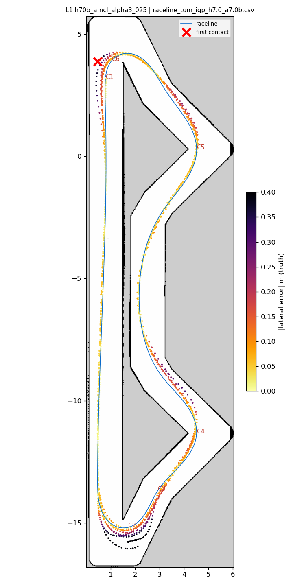
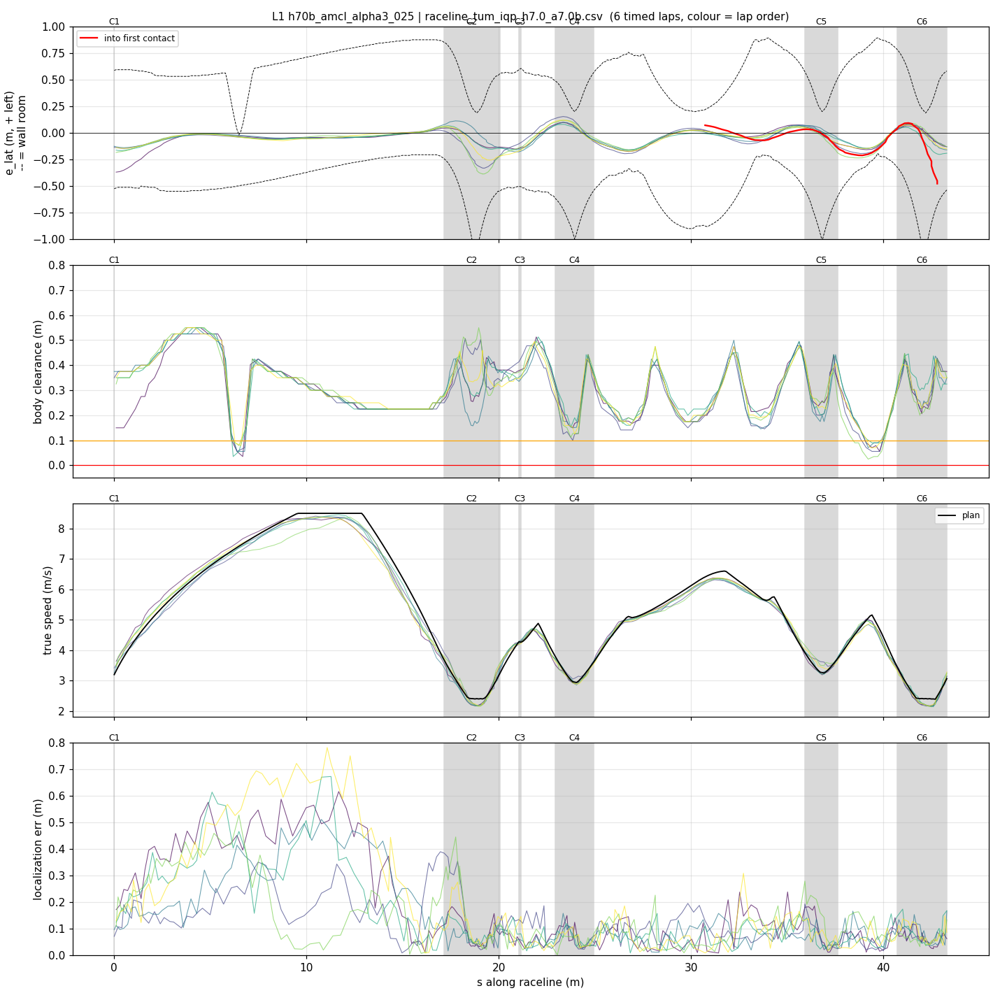
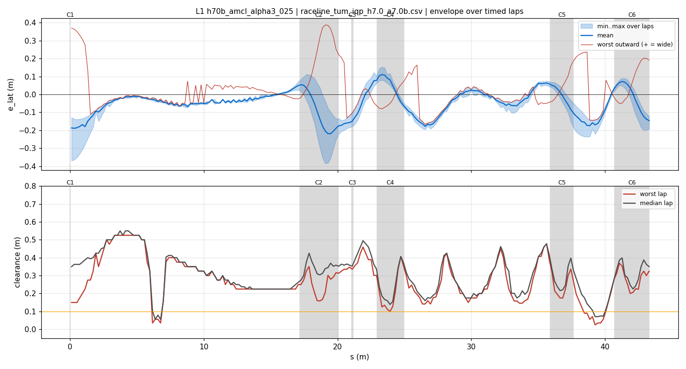
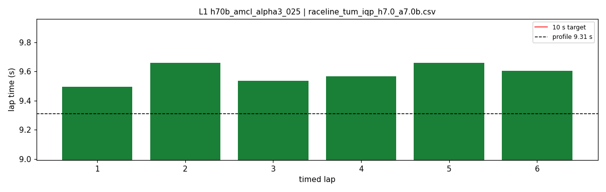
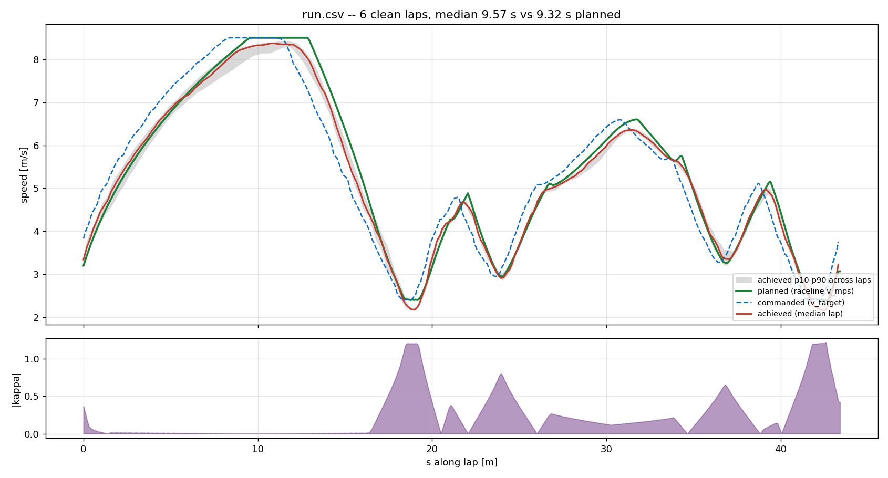
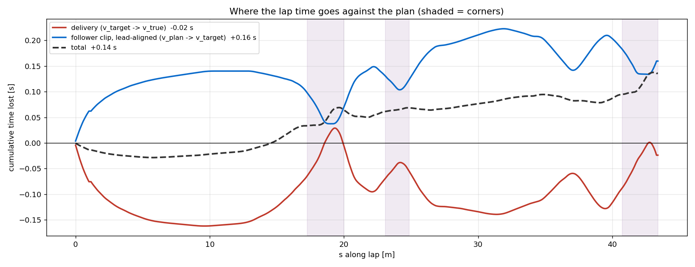

# L1 — h70b_amcl_alpha3_025

- **date** 2026-09-17  **line** `raceline_tum_iqp_h7.0_a7.0b.csv` (profile 9.31 s)  **loop cap** 45  **laps asked** 25
- **overrides** `control_hz:=45 warmup_v_max:=2.0 warmup_dist_m:=21.0 enc_rate_window_s:=0.10 amcl_params_file:=/root/Documents/roboracer/experiments/iros2026/params/amcl_alpha3_025.yaml`
- **hypothesis** Audit: 14/21 valid first contacts are hairpin 1 with along-track localization error; at turn-in the estimate lags the car (clean laps -0.10..-0.31 m, contact laps to -0.8, 13/15 wide). AMCL alpha3 0.10 gives too little along-track particle spread after the 17 m straight, so the end wall pulls the estimate forward late; 0.25 lets it correct within the braking zone
- **prediction** hairpin-1 turn-in along error mean closer to 0 and p10..p90 spread narrower than V1 (-0.30..-0.08); cross-track p90 stays <= 0.06 m; fewer hairpin-1 contacts

## Result

| timed laps | contacts | best | median | mean | std | worst | <10 s | gap to profile | loop Hz | delay |
|---|---|---|---|---|---|---|---|---|---|---|
| 6 | 2 | 9.493 | 9.586 | 9.586 | 0.062 | 9.660 | 6 | 0.276 | 30.3 | 0.099 |

First contact: +88.3 s at s = 42.81 m

| tracking (timed laps) | mean | p90 | max |
|---|---|---|---|
| |e_lat| m | 0.080 | 0.162 | 0.387 |
| outward m | 0.006 | 0.145 | 0.387 |
| localization m | 0.137 | 0.351 | 0.781 |
| a_lat m/s² | 3.494 | 6.235 | 7.615 |
| |v_est − v| m/s | 0.158 | 0.319 | 0.790 |

Body clearance: min 0.025 m, p05 0.127 m.  Steering at lock: 0.0 % of ticks.

| corner | s | side | κ | v plan apex | v true apex | worst outward | |e| p90 | min clearance | a_lat max | at lock % |
|---|---|---|---|---|---|---|---|---|---|---|
| C1 | 0.0-0.0 | L | 0.36 | 3.2 | 3.59 | 0.369 | 0.352 | 0.15 | 5.05 | 0.0 |
| C2 | 17.2-20.1 | L | 1.2 | 2.41 | 2.25 | 0.387 | 0.314 | 0.158 | 6.73 | 0.0 |
| C3 | 21.1-21.2 | R | 0.38 | 4.28 | 4.24 | -0.051 | 0.178 | 0.335 | 4.08 | 0.0 |
| C4 | 23.0-24.9 | L | 0.8 | 2.96 | 2.98 | 0.126 | 0.117 | 0.1 | 7.25 | 0.0 |
| C5 | 35.9-37.6 | L | 0.66 | 3.27 | 3.42 | 0.221 | 0.124 | 0.16 | 7.61 | 0.0 |
| C6 | 40.7-43.3 | L | 1.21 | 2.4 | 2.27 | 0.203 | 0.138 | 0.158 | 6.79 | 0.0 |

Gates: 50 clean laps **no**, mean < 10 s (worst < 10.2) **PASS**

## Figures

Time-loss split (plot_speed_tracking.py): see `speed_tracking.txt`.

## Verdict

Rejected. 7 timed laps 9.493-9.660, contact lap 8 at hairpin 1 (e_lat -0.81, along 0.78). Hairpin-1 turn-in along error mean -0.26, p10 -0.59, p90 -0.04 (V1: -0.18/-0.30/-0.08): a wider along-track spread adds noise instead of speeding the correction. Cross-track unchanged 0.04. The lag at turn-in is a consistent -0.18 m on clean laps, i.e. a timing offset; next lever is latency_comp_s (0.05, tuned at a 175 ms loop) -> 0.09 (L2).
