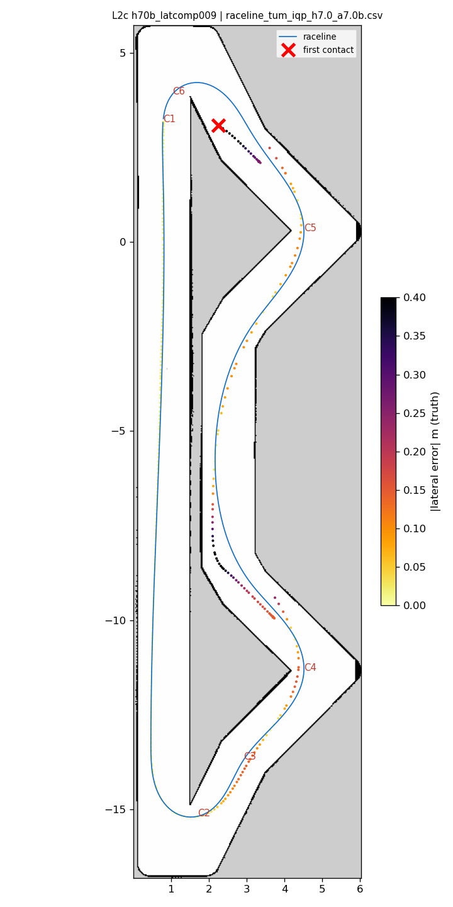
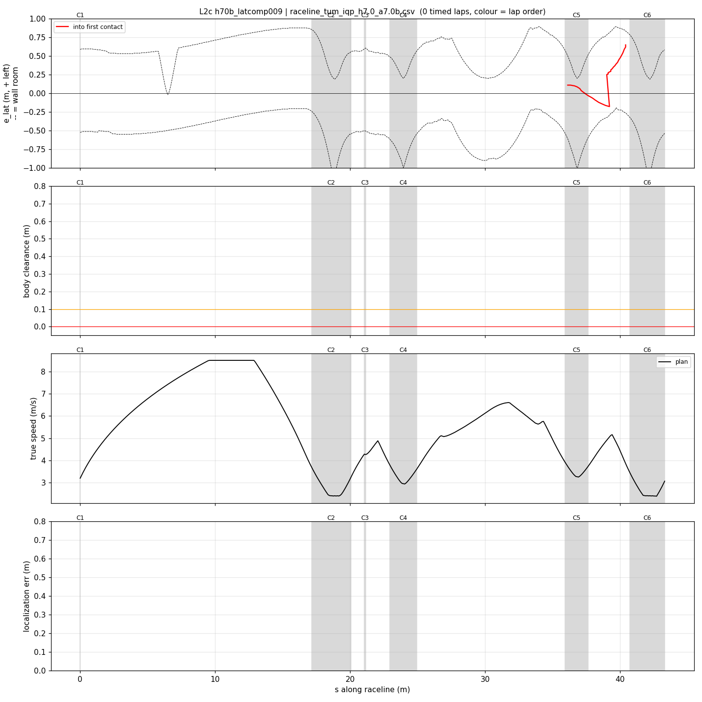
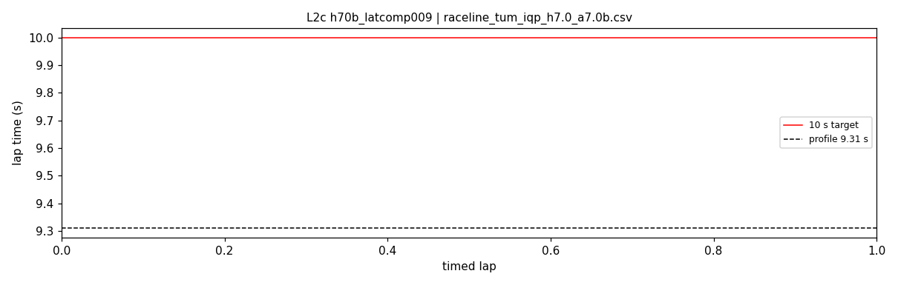

# L2c — h70b_latcomp009

- **date** 2026-09-17  **line** `raceline_tum_iqp_h7.0_a7.0b.csv` (profile 9.31 s)  **loop cap** 45  **laps asked** 25
- **overrides** `control_hz:=45 warmup_v_max:=2.0 warmup_dist_m:=21.0 enc_rate_window_s:=0.10 latency_comp_s:=0.09`
- **hypothesis** Rerun of L2/L2b after fixing the launch bug that started AMCL without parameters. The estimate lags the car by ~0.18 m at hairpin-1 turn-in (V1); latency_comp_s 0.05 -> 0.09 moves the steering pose ~0.15-0.2 m forward there
- **prediction** hairpin-1 contacts gone or rarer; hairpin worst outward smaller than V1; no new inside cuts; laps 9.5-9.6

## Result

| timed laps | contacts | best | median | mean | std | worst | <10 s | gap to profile | loop Hz | delay |
|---|---|---|---|---|---|---|---|---|---|---|
| 0 | 2 | — | — | — | — | — | 0 | — | 29.6 | 0.102 |

First contact: +21.7 s at s = 40.41 m

| tracking (timed laps) | mean | p90 | max |
|---|---|---|---|
| |e_lat| m | 0.161 | 0.351 | 0.665 |
| outward m | 0.068 | 0.278 | 0.483 |
| localization m | 0.969 | 2.604 | 2.727 |
| a_lat m/s² | 0.670 | 3.013 | 6.792 |
| |v_est − v| m/s | 0.881 | 3.218 | 5.073 |

Body clearance: min 0.025 m, p05 0.125 m.  Steering at lock: 32.34 % of ticks.

| corner | s | side | κ | v plan apex | v true apex | worst outward | |e| p90 | min clearance | a_lat max | at lock % |
|---|---|---|---|---|---|---|---|---|---|---|
| C1 | 0.0-0.0 | L | 0.36 | 3.2 | 0.17 | -0.014 | 0.019 | 0.55 | 0.07 | 0.0 |
| C2 | 17.2-20.1 | L | 1.2 | 2.41 | 1.90 | 0.124 | 0.1 | 0.175 | 4.11 | 0.0 |
| C3 | 21.1-21.2 | R | 0.38 | 4.28 | 2.04 | -0.085 | 0.144 | 0.369 | 1.05 | 0.0 |
| C4 | 23.0-24.9 | L | 0.8 | 2.96 | 2.93 | 0.099 | 0.149 | 0.056 | 5.73 | 0.0 |
| C5 | 35.9-37.6 | L | 0.66 | 3.27 | 3.59 | 0.086 | 0.106 | 0.146 | 6.79 | 0.0 |
| C6 | 40.7-43.3 | L | 1.21 | 2.4 | — | -0.495 | 0.646 | 0.025 | 1.5 | 82.6 |

Gates: 50 clean laps **no**, mean < 10 s (worst < 10.2) **no**

## Figures

Time-loss split (plot_speed_tracking.py): see `speed_tracking.txt`.

## Verdict

Rejected. AMCL active (launch fix confirmed). Out-lap, right after the warmup released: contact at the C2 exit ((3.85,-9.56)) at 4.85 m/s, e_lat -0.28, localization 1-12 cm, heading error -9..-12 deg held from the chevron apex onward: the 0.09 s propagation made the follower unwind the steering early. This spot never hit at latency_comp 0.05 (T03, V1, L1). latency_comp_s stays 0.05.
