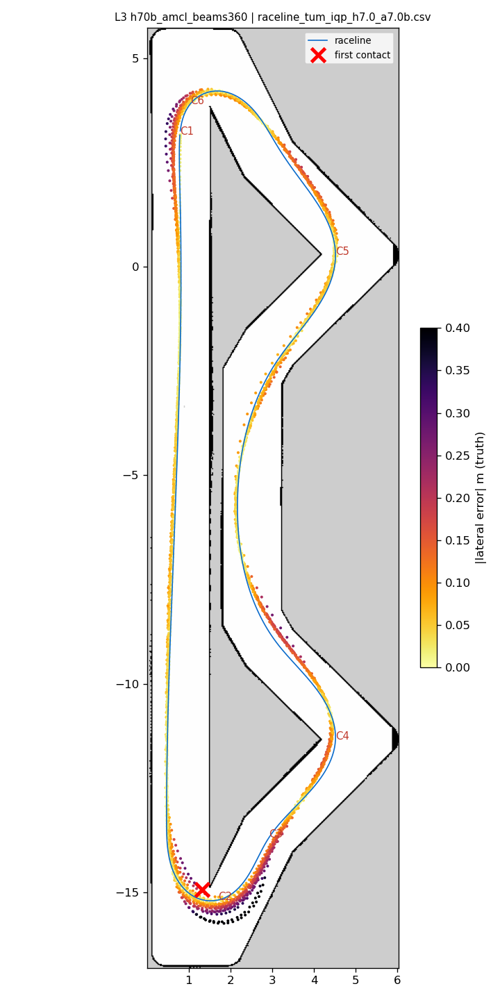
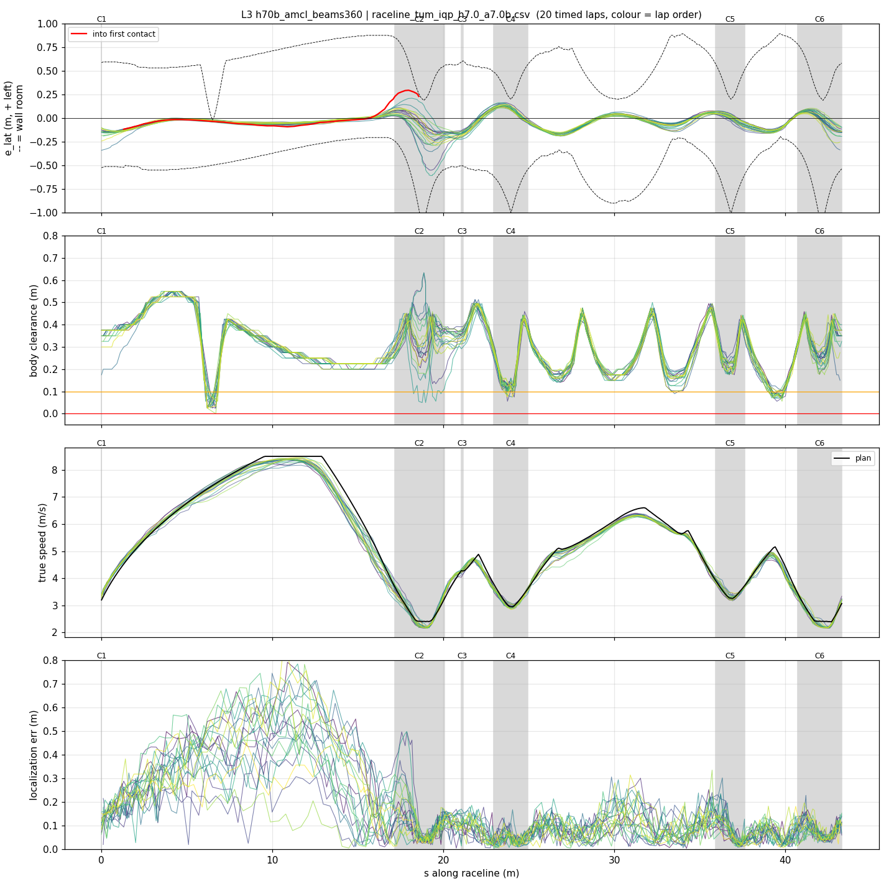
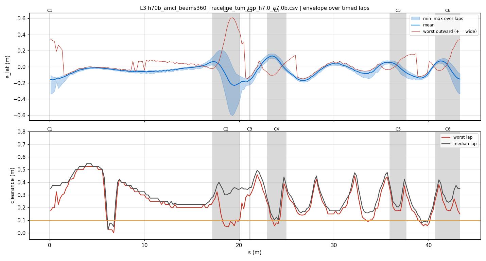
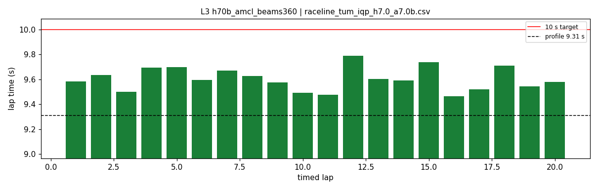
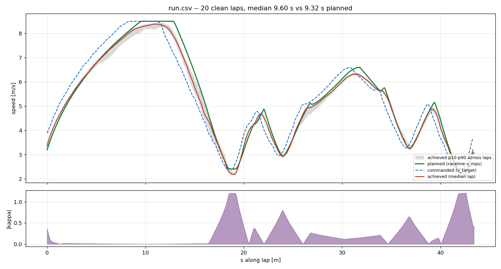
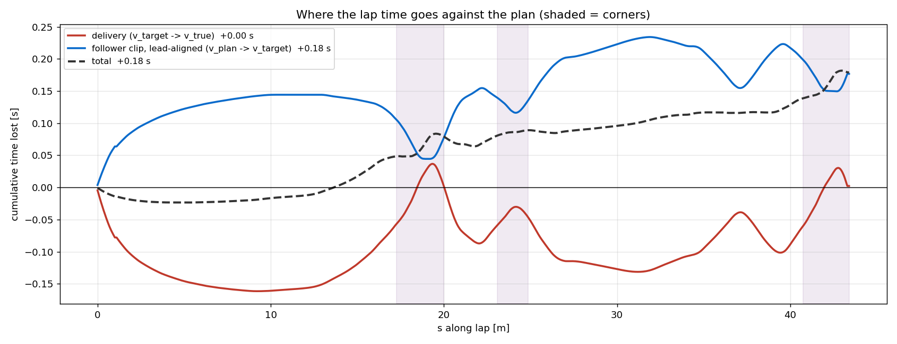

# L3 — h70b_amcl_beams360

- **date** 2026-09-17  **line** `raceline_tum_iqp_h7.0_a7.0b.csv` (profile 9.31 s)  **loop cap** 45  **laps asked** 25
- **overrides** `control_hz:=45 warmup_v_max:=2.0 warmup_dist_m:=21.0 enc_rate_window_s:=0.10 amcl_params_file:=/root/Documents/roboracer/experiments/iros2026/params/amcl_beams360.yaml`
- **hypothesis** Hairpin-1 contacts come from along-track lag at turn-in (audit). With max_beams 180 over 270 deg only a few rays land on the end wall of the 17 m straight as it comes into range; 360 doubles the along-track evidence so AMCL pulls the estimate forward before turn-in
- **prediction** hairpin-1 turn-in along error mean closer to 0 and p10 better than V1 (-0.18 / -0.30); cross p90 <= 0.05; no CPU-driven loop slowdown (delay median <= 0.11)

## Result

| timed laps | contacts | best | median | mean | std | worst | <10 s | gap to profile | loop Hz | delay |
|---|---|---|---|---|---|---|---|---|---|---|
| 20 | 2 | 9.465 | 9.593 | 9.603 | 0.089 | 9.787 | 20 | 0.282 | 30.3 | 0.099 |

First contact: +213.6 s at s = 18.56 m

| tracking (timed laps) | mean | p90 | max |
|---|---|---|---|
| |e_lat| m | 0.081 | 0.161 | 0.608 |
| outward m | 0.003 | 0.142 | 0.608 |
| localization m | 0.152 | 0.388 | 0.880 |
| a_lat m/s² | 3.419 | 6.270 | 7.757 |
| |v_est − v| m/s | 0.177 | 0.360 | 0.894 |

Body clearance: min 0.0 m, p05 0.125 m.  Steering at lock: 0.0 % of ticks.

| corner | s | side | κ | v plan apex | v true apex | worst outward | |e| p90 | min clearance | a_lat max | at lock % |
|---|---|---|---|---|---|---|---|---|---|---|
| C1 | 0.0-0.0 | L | 0.36 | 3.2 | 3.57 | 0.34 | 0.196 | 0.175 | 7.12 | 0.0 |
| C2 | 17.2-20.1 | L | 1.2 | 2.41 | 2.25 | 0.608 | 0.28 | 0.05 | 7.2 | 0.0 |
| C3 | 21.1-21.2 | R | 0.38 | 4.28 | 4.27 | -0.059 | 0.206 | 0.246 | 5.11 | 0.0 |
| C4 | 23.0-24.9 | L | 0.8 | 2.96 | 2.99 | 0.106 | 0.131 | 0.056 | 7.4 | 0.0 |
| C5 | 35.9-37.6 | L | 0.66 | 3.27 | 3.33 | 0.15 | 0.089 | 0.175 | 7.76 | 0.0 |
| C6 | 40.7-43.3 | L | 1.21 | 2.4 | 2.29 | 0.336 | 0.141 | 0.146 | 6.91 | 0.0 |

Gates: 50 clean laps **no**, mean < 10 s (worst < 10.2) **PASS**

## Figures

Time-loss split (plot_speed_tracking.py): see `speed_tracking.txt`.

## Verdict

Accepted. AMCL max_beams 180 -> 360: 20 clean timed laps, all under 10 s, best 9.465, mean 9.603, worst 9.787, std 0.089, delay median 0.099 (no loop cost). Hairpin-1 turn-in along-track error mean -0.14, p10 -0.33, p90 +0.01 over 22 passes (V1: -0.18/-0.30/-0.08 over 9): the lag is smaller and centred. Contact on lap 21 at hairpin 1 from one outlier pass (along error 1.02 m, cut 0.27 m inside, heading error -21 deg). Next: 720 beams (L4).
