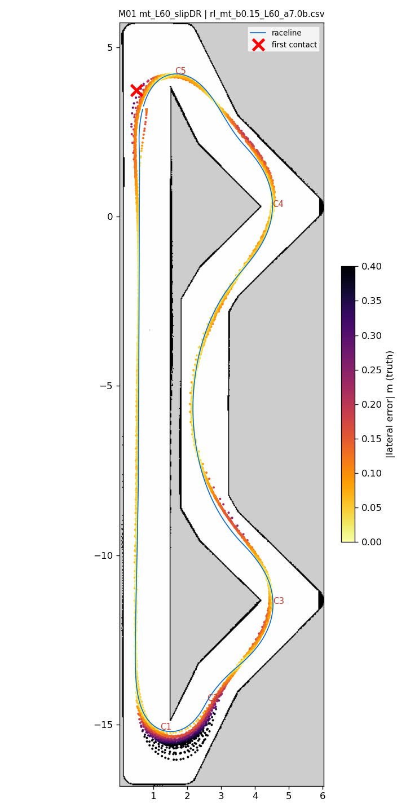
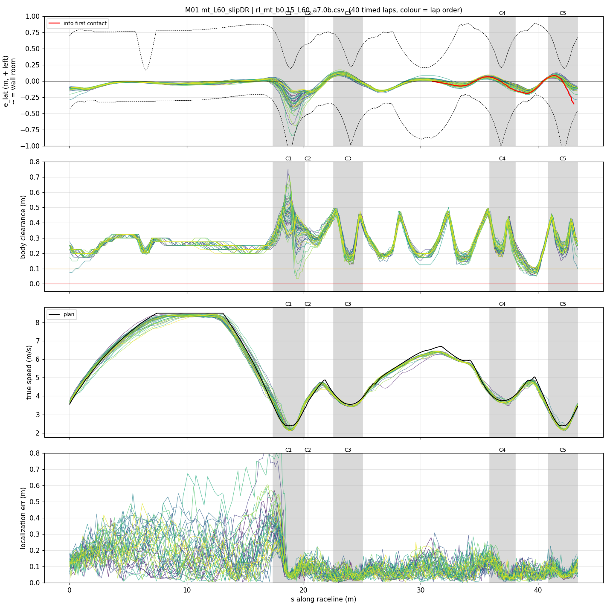
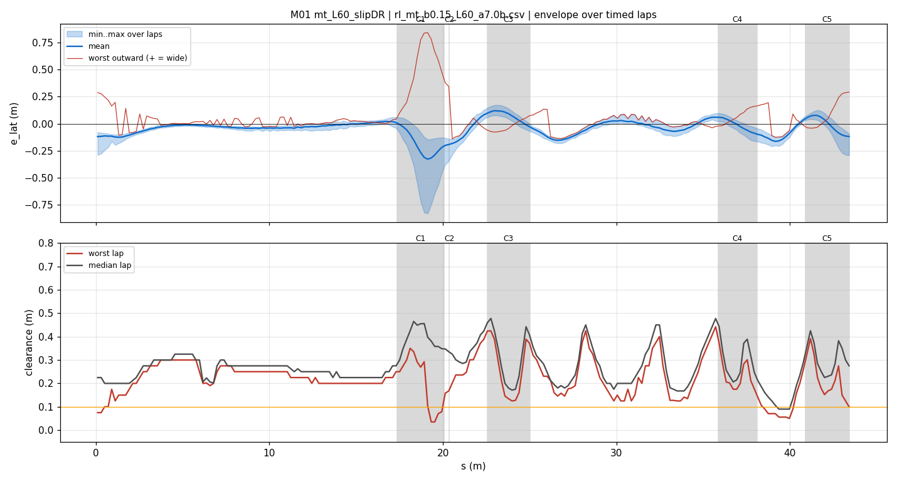
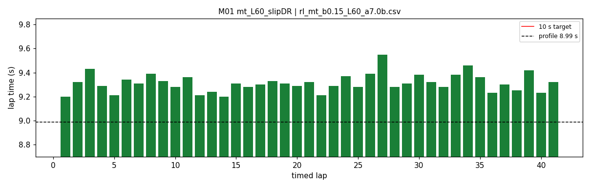

# M01 — mt_L60_slipDR

- **date** 2026-09-18  **line** `rl_mt_b0.15_L60_a7.0b.csv` (profile 8.988 s)  **loop cap** 45  **laps asked** 40
- **overrides** `distance_source:=slip control_hz:=45 warmup_v_max:=2.0 warmup_dist_m:=21.0 enc_rate_window_s:=0.10 amcl_params_file:=amcl_beams360.yaml exit_guard_from:=0.0 exit_guard_full:=0.0 controller_mode:=hybrid_lqr lqr_k_lat:=0.03 lqr_k_head:=0.05 lqr_k_yaw:=0.0 lqr_max_correction_rad:=0.02 recover_settle_s:=2.0 recover_creep_s:=3.0`
- **hypothesis** Two independent gains stack: (1) Abdullah's opt_mintime line rl_mt_b0.15 (30 clean laps, 9.459 mean on his machine) re-profiled with our a_long 6.0 -- same geometry, paper 9.128 -> 8.987; (2) dead reckoning with the wheelspin removed (distance_source:=slip), which replayed on six logs takes the straight's encoder over-read from +5.3..+6.8 % to within +-1 % and should shrink the along-track error that caused every hairpin-1 contact.
- **prediction** mean ~0.12-0.15 s under S03's 9.436; along-track error at the hairpin-1 brake point well under S03's +0.54 m mean

## Result

| timed laps | contacts | best | median | mean | std | worst | <10 s | gap to profile | loop Hz | delay |
|---|---|---|---|---|---|---|---|---|---|---|
| 41 | 1 | 9.200 | 9.310 | 9.314 | 0.073 | 9.550 | 41 | 0.322 | 32.2 | 0.093 |

First contact: +399.8 s at s = 43.09 m

| tracking (timed laps) | mean | p90 | max |
|---|---|---|---|
| |e_lat| m | 0.085 | 0.170 | 0.843 |
| outward m | 0.011 | 0.152 | 0.843 |
| localization m | 0.117 | 0.252 | 0.885 |
| a_lat m/s² | 3.804 | 6.549 | 8.059 |
| |v_est − v| m/s | 0.159 | 0.327 | 0.992 |

Body clearance: min 0.035 m, p05 0.152 m.  Steering at lock: 0.0 % of ticks.

| corner | s | side | κ | v plan apex | v true apex | worst outward | |e| p90 | min clearance | a_lat max | at lock % |
|---|---|---|---|---|---|---|---|---|---|---|
| C1 | 17.4-20.1 | L | 1.22 | 2.39 | 2.31 | 0.843 | 0.396 | 0.035 | 7.26 | 0.0 |
| C2 | 20.4-20.4 | R | 0.41 | 3.67 | 3.79 | 0.479 | 0.271 | 0.079 | 6.15 | 0.0 |
| C3 | 22.5-25.0 | L | 0.55 | 3.54 | 3.46 | 0.108 | 0.124 | 0.125 | 7.22 | 0.0 |
| C4 | 35.9-38.1 | L | 0.5 | 3.75 | 3.72 | 0.175 | 0.111 | 0.09 | 7.59 | 0.0 |
| C5 | 40.9-43.4 | L | 1.23 | 2.39 | 2.27 | 0.292 | 0.109 | 0.1 | 7.55 | 0.0 |

Gates: 50 clean laps **no**, mean < 10 s (worst < 10.2) **PASS**

## Figures

Time-loss split (plot_speed_tracking.py): see `speed_tracking.txt`.

## Verdict

ACCEPTED, -0.12 s mean against S03 (9.436 -> 9.314), 17 of 41 timed laps under 9.30. The drift fix did what it was built for: along-track error at the hairpin-1 brake point +0.54 m mean / 0.72 p90 (S03) -> +0.13 / 0.34, whole-run along p90 0.46 -> 0.25 m, and hairpin 1 never bit. The contact was elsewhere: hairpin-2 EXIT (s 43.3) on lap 43, localization exact (along -0.02 m), the car entered 0.3-0.4 m/s over target (2.77 vs 2.50), understeered (yaw rate 2.0 vs 2.5 rad/s on the lap before with more steer) and ran 0.40 m wide. Per-lap worst exit on the other 39 laps -0.28 m; S03 and mtb15 carry the same tail. The RECOVERY then cascaded (7 resets, global search timed out): the creep's +0.25 corner-seeking bias walked the car into the left wall on the start straight, and last_good stayed frozen at the first checkpoint while the sim reset the car further down each time. Both fixed in localization_bootstrap.py after this run.
