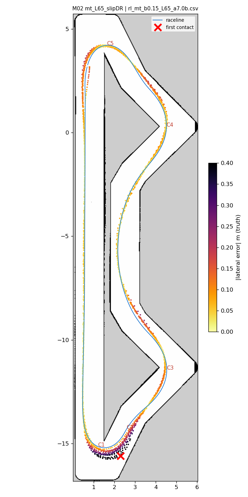
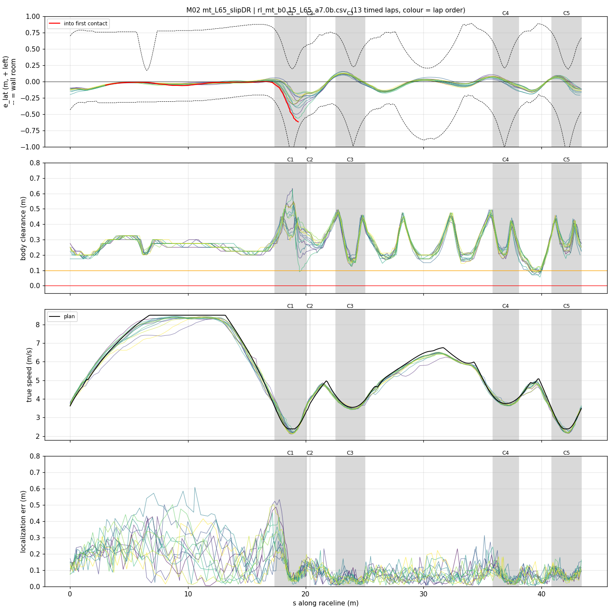
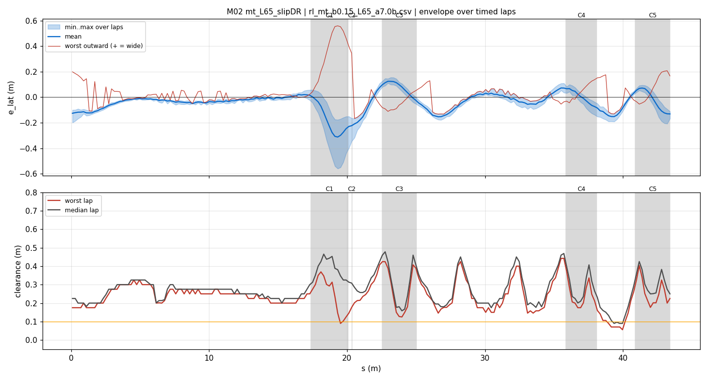
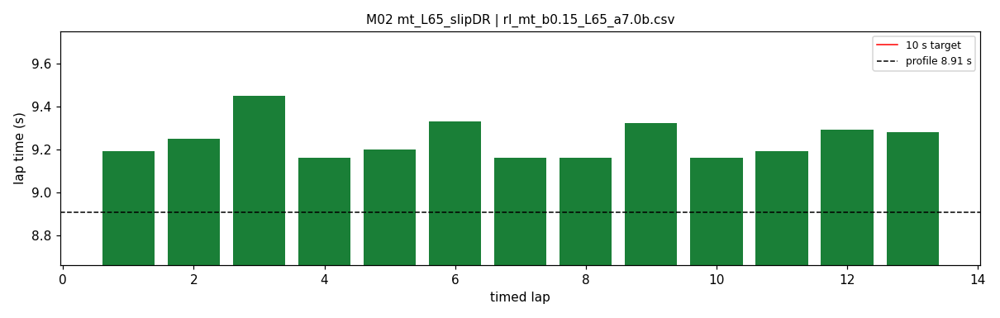

# M02 — mt_L65_slipDR

- **date** 2026-09-18  **line** `rl_mt_b0.15_L65_a7.0b.csv` (profile 8.907 s)  **loop cap** 45  **laps asked** 40
- **overrides** `distance_source:=slip control_hz:=45 warmup_v_max:=2.0 warmup_dist_m:=21.0 enc_rate_window_s:=0.10 amcl_params_file:=amcl_beams360.yaml exit_guard_from:=0.0 exit_guard_full:=0.0 controller_mode:=hybrid_lqr lqr_k_lat:=0.03 lqr_k_head:=0.05 lqr_k_yaw:=0.0 lqr_max_correction_rad:=0.02 recover_settle_s:=2.0 recover_creep_s:=3.0`
- **hypothesis** a_long 6.0 -> 6.5 on the M01 line (paper 8.987 -> 8.906), everything else identical; the recovery fixes are in.
- **prediction** mean ~0.08 s under M01 (9.314) if the car delivers the extra longitudinal grip

## Result

| timed laps | contacts | best | median | mean | std | worst | <10 s | gap to profile | loop Hz | delay |
|---|---|---|---|---|---|---|---|---|---|---|
| 13 | 1 | 9.160 | 9.200 | 9.242 | 0.085 | 9.450 | 13 | 0.293 | 31.8 | 0.094 |

First contact: +141.8 s at s = 19.36 m

| tracking (timed laps) | mean | p90 | max |
|---|---|---|---|
| |e_lat| m | 0.082 | 0.174 | 0.560 |
| outward m | 0.010 | 0.153 | 0.560 |
| localization m | 0.118 | 0.259 | 0.607 |
| a_lat m/s² | 3.809 | 6.628 | 7.800 |
| |v_est − v| m/s | 0.163 | 0.331 | 0.999 |

Body clearance: min 0.056 m, p05 0.158 m.  Steering at lock: 0.0 % of ticks.

| corner | s | side | κ | v plan apex | v true apex | worst outward | |e| p90 | min clearance | a_lat max | at lock % |
|---|---|---|---|---|---|---|---|---|---|---|
| C1 | 17.4-20.1 | L | 1.22 | 2.39 | 2.34 | 0.56 | 0.377 | 0.09 | 7.55 | 0.0 |
| C2 | 20.4-20.4 | R | 0.41 | 3.74 | 3.88 | 0.463 | 0.329 | 0.125 | 5.19 | 0.0 |
| C3 | 22.5-25.0 | L | 0.55 | 3.54 | 3.48 | 0.094 | 0.123 | 0.125 | 7.59 | 0.0 |
| C4 | 35.9-38.1 | L | 0.5 | 3.75 | 3.73 | 0.167 | 0.099 | 0.106 | 7.75 | 0.0 |
| C5 | 40.9-43.4 | L | 1.23 | 2.39 | 2.29 | 0.208 | 0.12 | 0.177 | 7.3 | 0.0 |

Gates: 50 clean laps **no**, mean < 10 s (worst < 10.2) **PASS**

## Figures

Time-loss split (plot_speed_tracking.py): see `speed_tracking.txt`.

## Verdict

a_long 6.5 delivered its paper gain (-0.07 s vs M01, predicted -0.08). Both contacts were at hairpin 1 (s 18-19.5): apex reached +0.4..+0.75 m/s over target, understeer, 0.6-0.7 m wide. Cause: the encoder UNDER-reads 6-9 % in the hairpin-1 braking zone (every log, ours and his); S03 hid it behind the straight over-read, which the slip fix removed, so the estimate fell 0.2-0.7 m behind the car, the car braked late. Per lap: along lag vs apex overspeed r=-0.40, overspeed vs wide r=-0.88; mean apex overspeed +0.10 (S03) -> +0.17 (M01) -> +0.27 (M02). Hairpin-1 apex/exit is 0.19 s of the 0.33 s gap to the profile (true-position segmentation): speed matches there, the car runs wide. Second cascade: the recovery creep centring was sign-inverted (steered toward the nearer wall). Fixed after this run: slip_k_brake 1.1, creep centring sign + gap steering.
