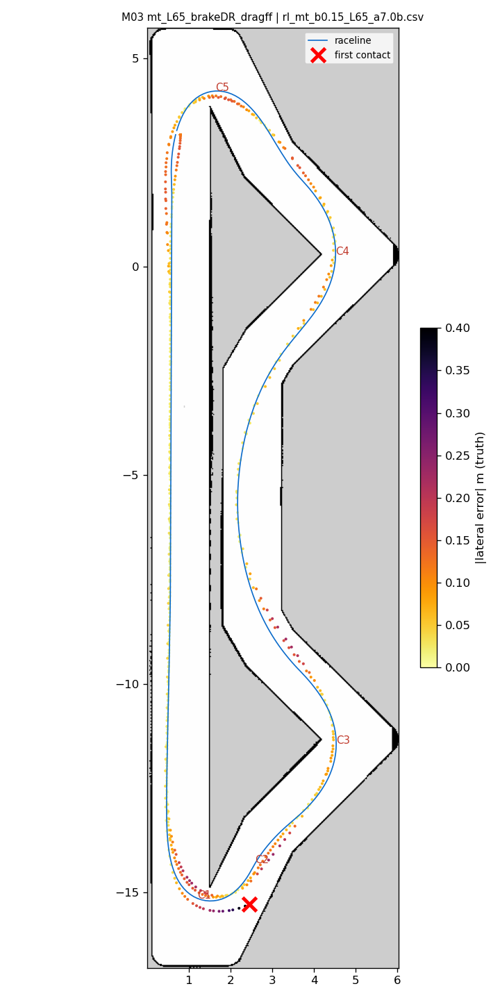
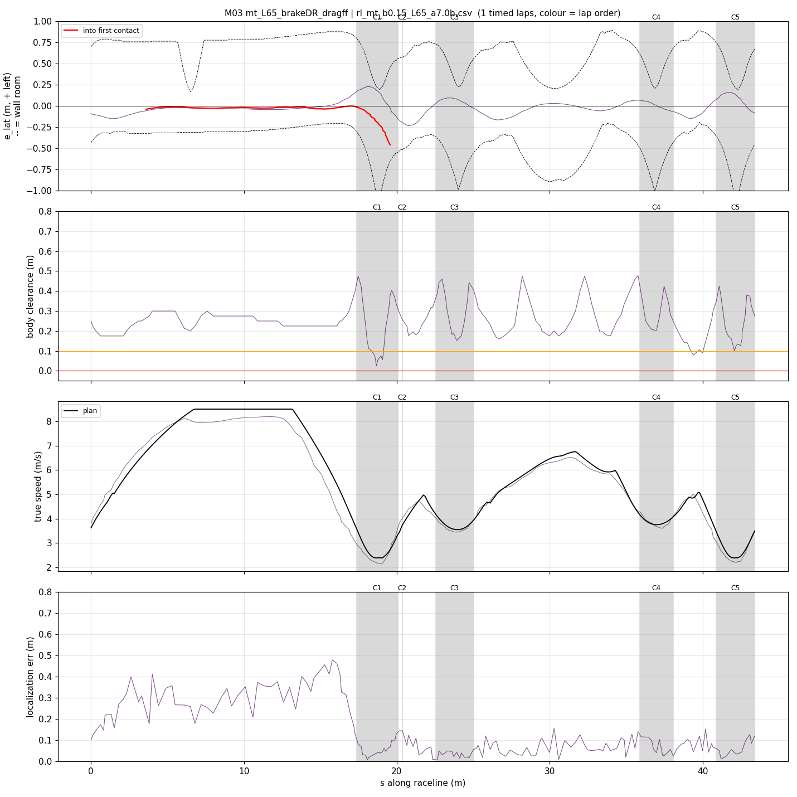
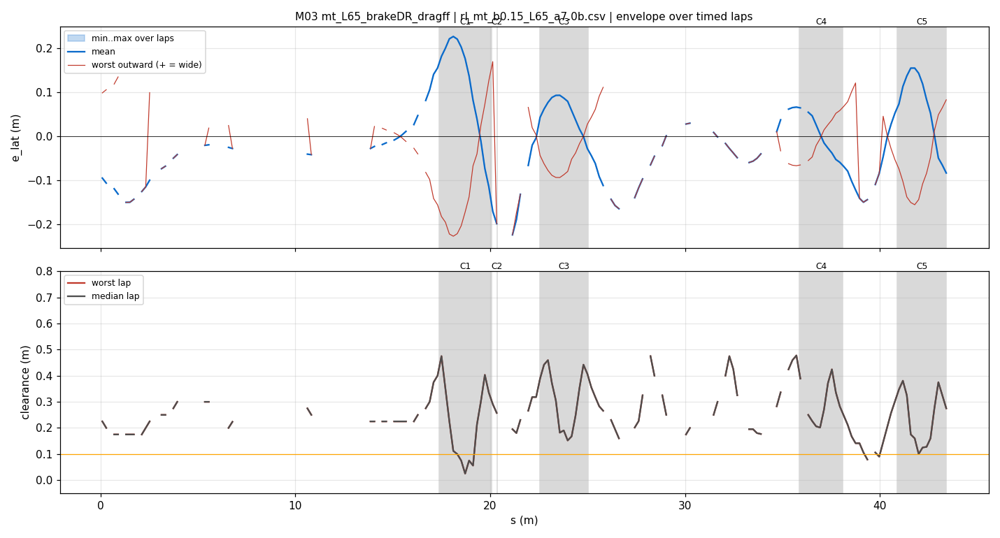
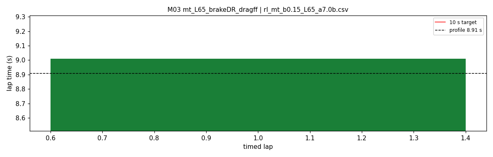

# M03 — mt_L65_brakeDR_dragff

- **date** 2026-09-18  **line** `rl_mt_b0.15_L65_a7.0b.csv` (profile 8.907 s)  **loop cap** 45  **laps asked** 40
- **overrides** `distance_source:=slip control_hz:=45 warmup_v_max:=2.0 warmup_dist_m:=21.0 enc_rate_window_s:=0.10 amcl_params_file:=amcl_beams360.yaml exit_guard_from:=0.0 exit_guard_full:=0.0 controller_mode:=hybrid_lqr lqr_k_lat:=0.03 lqr_k_head:=0.05 lqr_k_yaw:=0.0 lqr_max_correction_rad:=0.02 recover_settle_s:=2.0 recover_creep_s:=3.0 drag_ff:=1.0`
- **hypothesis** M02 + dead-reckoning braking term (slip_k_brake 1.1) + drag_ff 1.0 + creep steering fix.
- **prediction** hairpin-1 apex overspeed ~0, less running wide, mean ~9.10-9.15

## Result

| timed laps | contacts | best | median | mean | std | worst | <10 s | gap to profile | loop Hz | delay |
|---|---|---|---|---|---|---|---|---|---|---|
| 1 | 1 | 9.010 | 9.010 | 9.010 | — | 9.010 | 1 | 0.103 | 26.6 | 0.113 |

First contact: +30.8 s at s = 19.56 m

| tracking (timed laps) | mean | p90 | max |
|---|---|---|---|
| |e_lat| m | 0.079 | 0.164 | 0.234 |
| outward m | -0.047 | 0.066 | 0.170 |
| localization m | 0.132 | 0.345 | 0.478 |
| a_lat m/s² | 3.742 | 6.621 | 7.544 |
| |v_est − v| m/s | 0.177 | 0.389 | 1.020 |

Body clearance: min 0.025 m, p05 0.106 m.  Steering at lock: 0.0 % of ticks.

| corner | s | side | κ | v plan apex | v true apex | worst outward | |e| p90 | min clearance | a_lat max | at lock % |
|---|---|---|---|---|---|---|---|---|---|---|
| C1 | 17.4-20.1 | L | 1.22 | 2.39 | 2.21 | 0.17 | 0.222 | 0.025 | 7.35 | 0.0 |
| C2 | 20.4-20.4 | R | 0.41 | 3.74 | 3.92 | 0.17 | 0.232 | 0.177 | 7.19 | 0.0 |
| C3 | 22.5-25.0 | L | 0.55 | 3.54 | 3.45 | 0.062 | 0.09 | 0.152 | 6.62 | 0.0 |
| C4 | 35.9-38.1 | L | 0.5 | 3.75 | 3.75 | 0.079 | 0.068 | 0.202 | 7.43 | 0.0 |
| C5 | 40.9-43.4 | L | 1.23 | 2.39 | 2.25 | 0.083 | 0.155 | 0.1 | 6.85 | 0.0 |

Gates: 50 clean laps **no**, mean < 10 s (worst < 10.2) **PASS**

## Figures

Time-loss split (plot_speed_tracking.py): see `speed_tracking.txt`.

## Verdict

The braking term did its job at hairpin 1: apex speed on target (2.23-2.38 vs 2.39; M02 up to +0.77). Everything else got worse. hp1 contact: at target speed, ran wide on the exit (-0.11 -> -0.52 m). hp2 contact: the follower speed estimate read +0.6..+0.8 m/s high, so the brake-floor wheel command (v_est - 0.08) actually DROVE the car, 3.65 m/s at the apex vs 2.38. drag_ff has a trigger bug: a_pred == 0 also covers the plan BRAKING with the car under target, so it fed drive into braking zones and at the lateral-limit apex; the observer is also pulled by pose speed, which the new DR braking term feeds. Recovery #3 rejected a seed 0.09 m from the checkpoint because the scan/std check failed, then the global search could not converge. Fixed after: drag_ff only on flat plan with lateral room; recovery accepts a seed that agrees with the prior on every attempt.
