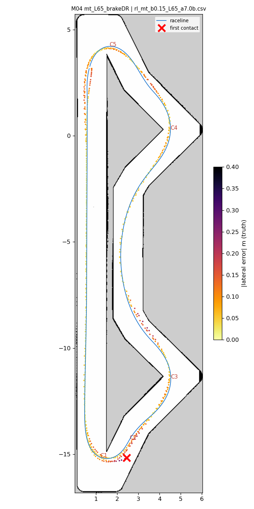
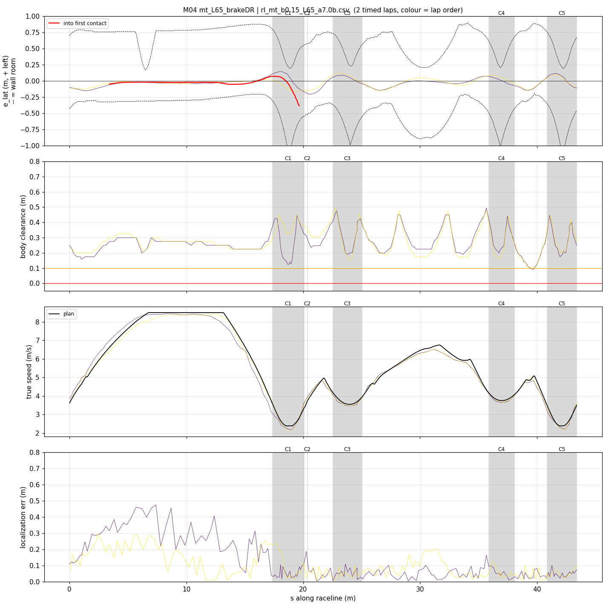
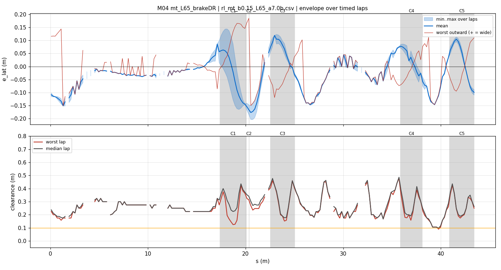
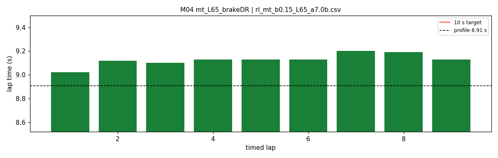

# M04 — mt_L65_brakeDR

- **date** 2026-09-18  **line** `rl_mt_b0.15_L65_a7.0b.csv` (profile 8.907 s)  **loop cap** 45  **laps asked** 40
- **overrides** `distance_source:=slip control_hz:=45 warmup_v_max:=2.0 warmup_dist_m:=21.0 enc_rate_window_s:=0.10 amcl_params_file:=amcl_beams360.yaml exit_guard_from:=0.0 exit_guard_full:=0.0 controller_mode:=hybrid_lqr lqr_k_lat:=0.03 lqr_k_head:=0.05 lqr_k_yaw:=0.0 lqr_max_correction_rad:=0.02 recover_settle_s:=2.0 recover_creep_s:=3.0`
- **hypothesis** M02 + dead-reckoning braking term + recovery fixes, drag_ff OFF: isolates the braking term.
- **prediction** hairpin-1 apex overspeed ~0; mean under M02 9.242

## Result

| timed laps | contacts | best | median | mean | std | worst | <10 s | gap to profile | loop Hz | delay |
|---|---|---|---|---|---|---|---|---|---|---|
| 9 | 1 | 9.020 | 9.130 | 9.128 | 0.049 | 9.200 | 9 | 0.223 | 28.5 | 0.105 |

First contact: +39.9 s at s = 19.66 m

| tracking (timed laps) | mean | p90 | max |
|---|---|---|---|
| |e_lat| m | 0.065 | 0.139 | 0.203 |
| outward m | -0.019 | 0.100 | 0.185 |
| localization m | 0.102 | 0.245 | 0.474 |
| a_lat m/s² | 3.924 | 6.584 | 7.703 |
| |v_est − v| m/s | 0.166 | 0.347 | 0.658 |

Body clearance: min 0.09 m, p05 0.158 m.  Steering at lock: 0.0 % of ticks.

| corner | s | side | κ | v plan apex | v true apex | worst outward | |e| p90 | min clearance | a_lat max | at lock % |
|---|---|---|---|---|---|---|---|---|---|---|
| C1 | 17.4-20.1 | L | 1.22 | 2.39 | 2.22 | 0.185 | 0.162 | 0.125 | 7.26 | 0.0 |
| C2 | 20.4-20.4 | R | 0.41 | 3.74 | 3.80 | 0.185 | 0.203 | 0.236 | 5.3 | 0.0 |
| C3 | 22.5-25.0 | L | 0.55 | 3.54 | 3.46 | 0.08 | 0.111 | 0.152 | 6.72 | 0.0 |
| C4 | 35.9-38.1 | L | 0.5 | 3.75 | 3.67 | 0.088 | 0.083 | 0.158 | 7.21 | 0.0 |
| C5 | 40.9-43.4 | L | 1.23 | 2.39 | 2.30 | 0.11 | 0.103 | 0.175 | 6.8 | 0.0 |

Gates: 50 clean laps **no**, mean < 10 s (worst < 10.2) **PASS**

## Figures

Time-loss split (plot_speed_tracking.py): see `speed_tracking.txt`.

## Verdict

The braking term works: apex on target, hp1 apex/exit loss 0.19 -> 0.09 s (true-position segmentation), hp2 on profile, pace ~0.1 s under M02. The contact was hp1 EXIT at target speed with exact localization: curvature command on the steer_a_lat_max cap 85 % of hp1 ticks (cap 1.09 = path 1.08), yaw rate 85-95 % of needed -> no correction authority. Recovery worked (seed accepted, creep clean). Across-track findings for M05: follower speed estimate -0.27 m/s under acceleration / -0.17 cruising on every 45 Hz run (enc_rate_window_s 0.10 = 50 ms lag; default 0.05, his 20 Hz run unbiased); car 0.25-0.35 m/s under a flat plan everywhere (no feedforward on flat; drag_ff trigger now fixed).
