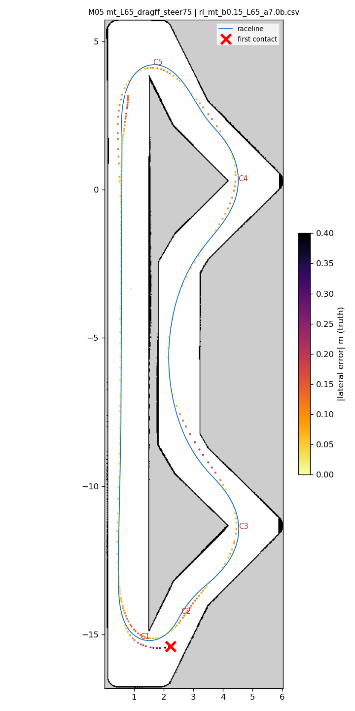
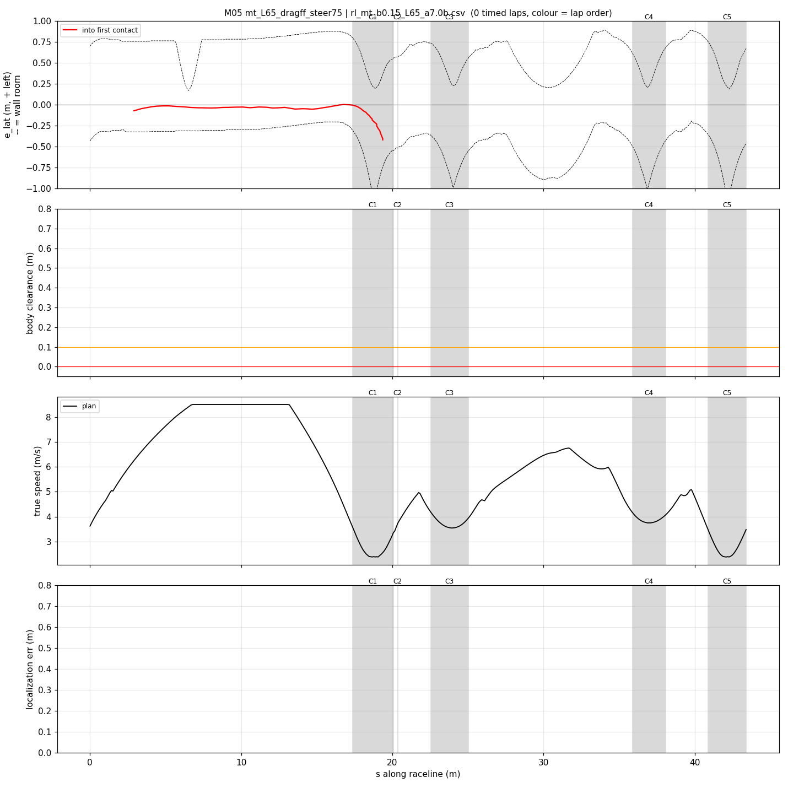
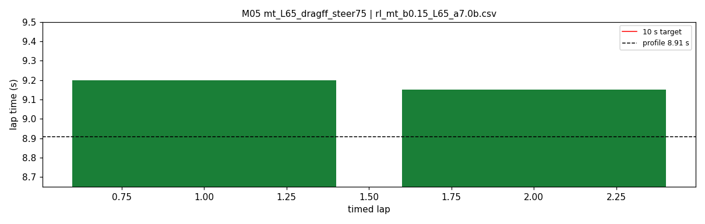

# M05 — mt_L65_dragff_steer75

- **date** 2026-09-18  **line** `rl_mt_b0.15_L65_a7.0b.csv` (profile 8.907 s)  **loop cap** 45  **laps asked** 40
- **overrides** `distance_source:=slip control_hz:=45 warmup_v_max:=2.0 warmup_dist_m:=21.0 enc_rate_window_s:=0.10 amcl_params_file:=amcl_beams360.yaml exit_guard_from:=0.0 exit_guard_full:=0.0 controller_mode:=hybrid_lqr lqr_k_lat:=0.03 lqr_k_head:=0.05 lqr_k_yaw:=0.0 lqr_max_correction_rad:=0.02 recover_settle_s:=2.0 recover_creep_s:=3.0 drag_ff:=1.0 steer_a_lat_max:=7.5 (enc_rate_window_s:=0.05 -- NO-OP, not a launch tunable; every run used 0.05)`
- **hypothesis** M04 + fixed drag_ff + steer_a_lat_max 7.5 (+ enc window 0.05, which turned out to be what every run already used).
- **prediction** gap to profile <= 0.12 s

## Result

| timed laps | contacts | best | median | mean | std | worst | <10 s | gap to profile | loop Hz | delay |
|---|---|---|---|---|---|---|---|---|---|---|
| 2 | 1 | 9.150 | 9.175 | 9.175 | 0.025 | 9.200 | 2 | 0.268 | 27.3 | 0.110 |

First contact: +21.6 s at s = 19.36 m

| tracking (timed laps) | mean | p90 | max |
|---|---|---|---|
| |e_lat| m | 0.102 | 0.249 | 0.583 |
| outward m | -0.032 | 0.083 | 0.583 |
| localization m | 0.659 | 2.791 | 3.710 |
| a_lat m/s² | 1.988 | 5.922 | 8.415 |
| |v_est − v| m/s | 0.529 | 1.887 | 3.454 |

Body clearance: min 0.025 m, p05 0.135 m.  Steering at lock: 0.0 % of ticks.

| corner | s | side | κ | v plan apex | v true apex | worst outward | |e| p90 | min clearance | a_lat max | at lock % |
|---|---|---|---|---|---|---|---|---|---|---|
| C1 | 17.4-20.1 | L | 1.22 | 2.39 | 2.19 | 0.583 | 0.483 | 0.05 | 7.7 | 0.0 |
| C2 | 20.4-20.4 | R | 0.41 | 3.74 | 3.14 | 0.483 | 0.455 | 0.05 | 7.7 | 0.0 |
| C3 | 22.5-25.0 | L | 0.55 | 3.54 | 2.94 | 0.079 | 0.359 | 0.05 | 6.87 | 0.0 |
| C4 | 35.9-38.1 | L | 0.5 | 3.75 | 3.04 | 0.106 | 0.257 | 0.05 | 7.26 | 0.0 |
| C5 | 40.9-43.4 | L | 1.23 | 2.39 | 2.31 | 0.35 | 0.116 | 0.025 | 7.31 | 0.0 |

Gates: 50 clean laps **no**, mean < 10 s (worst < 10.2) **PASS**

## Figures

Time-loss split (plot_speed_tracking.py): see `speed_tracking.txt`.

## Verdict

hp1 exit understeer again at target apex speed: commanded yaw ~3.2 rad/s, achieved 1.55, with the wheel 0.3 m/s over the car. steer_a_lat_max is also the friction-circle cap in _throttle_slip, so 7.5 raised the exit drive slip allowance 0.02 -> 0.039 and spent more front grip. Steering chatter NOT worse than M04 (|dsteer| 0.042 vs 0.041/tick); the shaky look was the recoveries. ROOT CAUSE found after this run: every raced profile violates the combined friction ellipse at corner exits (make_speed_variants enforce_long has no ellipse; tph drops drag where it binds) -- rl_mt_b0.15_L65 up to 1.34x, worst at the hp1 exit. New tool raceline/enforce_friction_ellipse.py re-solves speeds under the ellipse.
