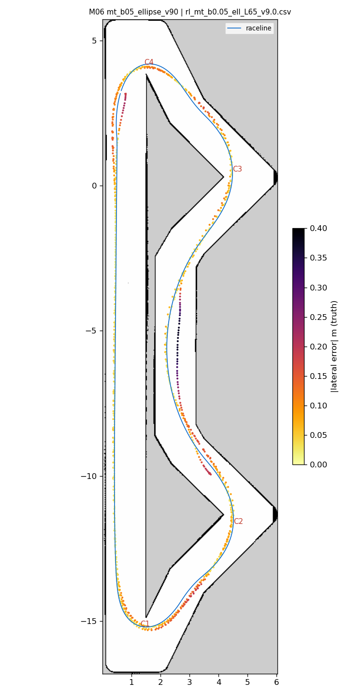
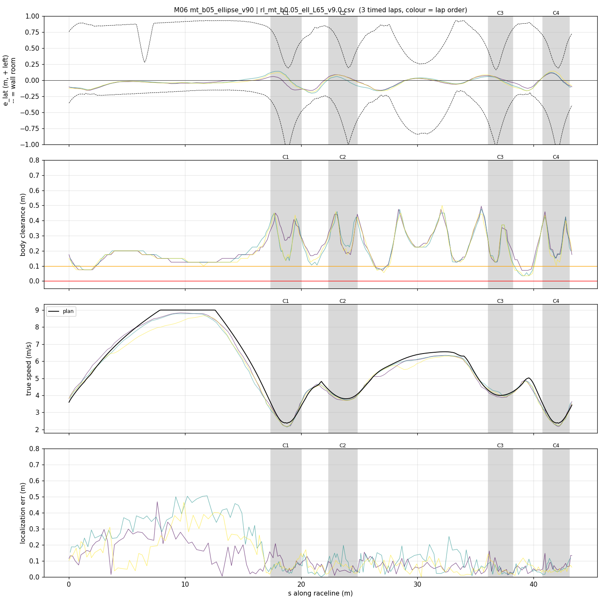
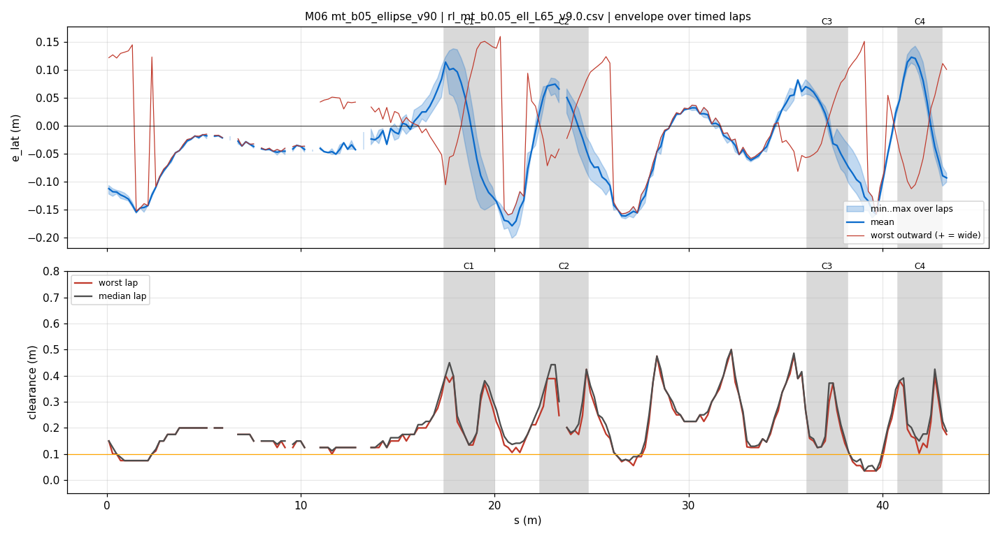
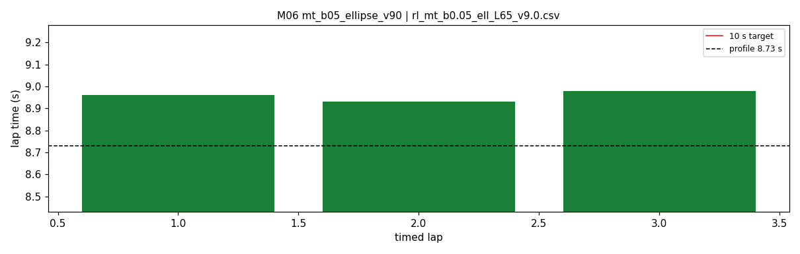

# M06 — mt_b05_ellipse_v90

- **date** 2026-09-18  **line** `rl_mt_b0.05_ell_L65_v9.0.csv` (profile 8.729 s)  **loop cap** 45  **laps asked** 40
- **overrides** `distance_source:=slip control_hz:=45 warmup_v_max:=2.0 warmup_dist_m:=21.0 amcl_params_file:=amcl_beams360.yaml exit_guard_from:=0.0 exit_guard_full:=0.0 controller_mode:=hybrid_lqr lqr_k_lat:=0.03 lqr_k_head:=0.05 lqr_k_yaw:=0.0 lqr_max_correction_rad:=0.02 recover_settle_s:=2.0 recover_creep_s:=3.0 v_max:=9.0 enc_rate_window_s:=0.05`
- **hypothesis** Tighter opt_mintime geometry (b0.05) with a friction-ellipse-feasible profile, a_long 6.5, v_max 9.0 (paper 8.728); controller = M04.
- **prediction** ~8.85-8.95 s, no exit understeer contacts

## Result

| timed laps | contacts | best | median | mean | std | worst | <10 s | gap to profile | loop Hz | delay |
|---|---|---|---|---|---|---|---|---|---|---|
| 3 | 1 | 8.930 | 8.960 | 8.957 | 0.021 | 8.980 | 3 | 0.231 | 29.2 | 0.103 |

First contact: none

| tracking (timed laps) | mean | p90 | max |
|---|---|---|---|
| |e_lat| m | 0.067 | 0.139 | 0.202 |
| outward m | -0.018 | 0.104 | 0.160 |
| localization m | 0.114 | 0.264 | 0.505 |
| a_lat m/s² | 3.886 | 6.702 | 8.458 |
| |v_est − v| m/s | 0.189 | 0.410 | 0.928 |

Body clearance: min 0.035 m, p05 0.075 m.  Steering at lock: 0.0 % of ticks.

| corner | s | side | κ | v plan apex | v true apex | worst outward | |e| p90 | min clearance | a_lat max | at lock % |
|---|---|---|---|---|---|---|---|---|---|---|
| C1 | 17.4-20.0 | L | 1.22 | 2.4 | 2.21 | 0.16 | 0.141 | 0.135 | 6.86 | 0.0 |
| C2 | 22.3-24.8 | L | 0.48 | 3.81 | 3.72 | 0.108 | 0.083 | 0.175 | 7.17 | 0.0 |
| C3 | 36.1-38.2 | L | 0.43 | 4.01 | 4.06 | 0.122 | 0.087 | 0.071 | 7.37 | 0.0 |
| C4 | 40.8-43.1 | L | 1.22 | 2.4 | 2.26 | 0.112 | 0.118 | 0.103 | 6.92 | 0.0 |

Gates: 50 clean laps **no**, mean < 10 s (worst < 10.2) **PASS**

## Figures

Time-loss split (plot_speed_tracking.py): see `speed_tracking.txt`.

## Verdict

Pace confirmed: 8.96 and 8.93 on paper 8.728 (gap ~0.22). The contact came on lap 1 just after the warmup cap lifted, at s 26.8 with localization exact and only 0.19 m of lateral error: b0.05 sits ~0.10 m closer to the right wall than b0.15 on the straight-ish sections s 26-27, 33, 38-39, where its right-side slack is 0.01-0.11 m over the measured p99 wander. Timed-lap wander on M06 itself: s25-28 -0.17, s37-40 -0.16, s33 -0.06. Next: b0.15 geometry blended into s25-28 and s37.3-40 (raceline/blend_lines.py), paper 8.810.
