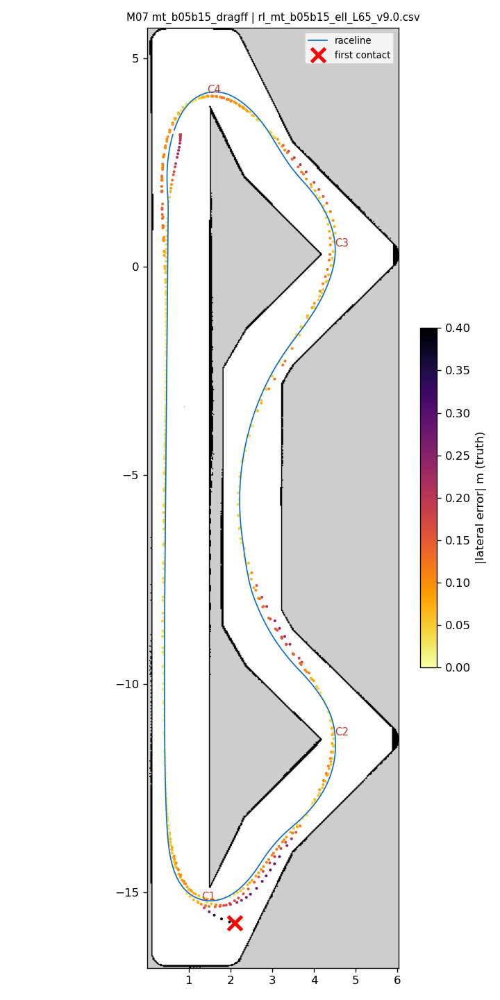
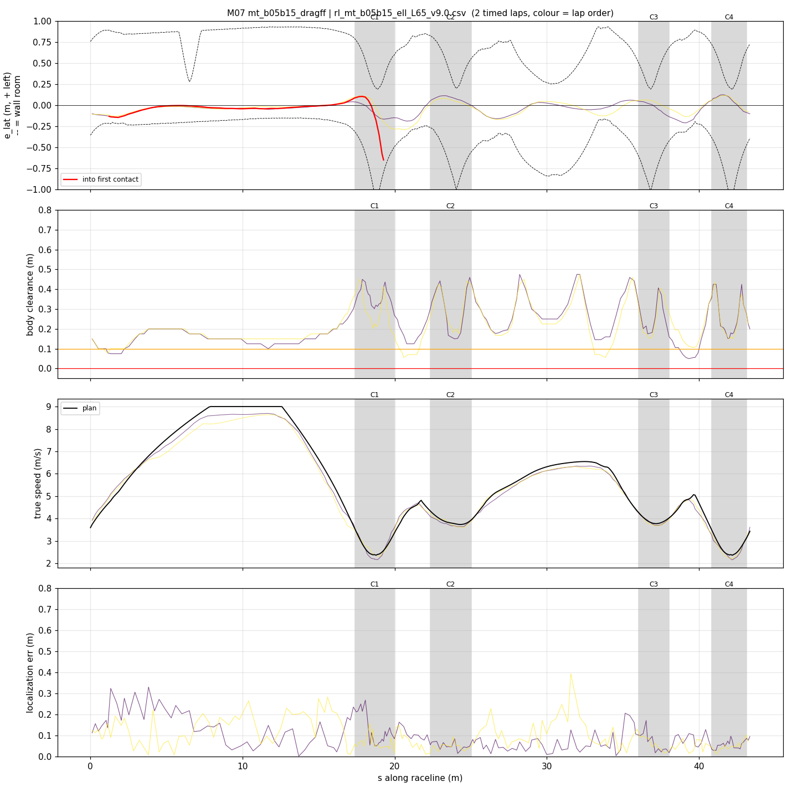
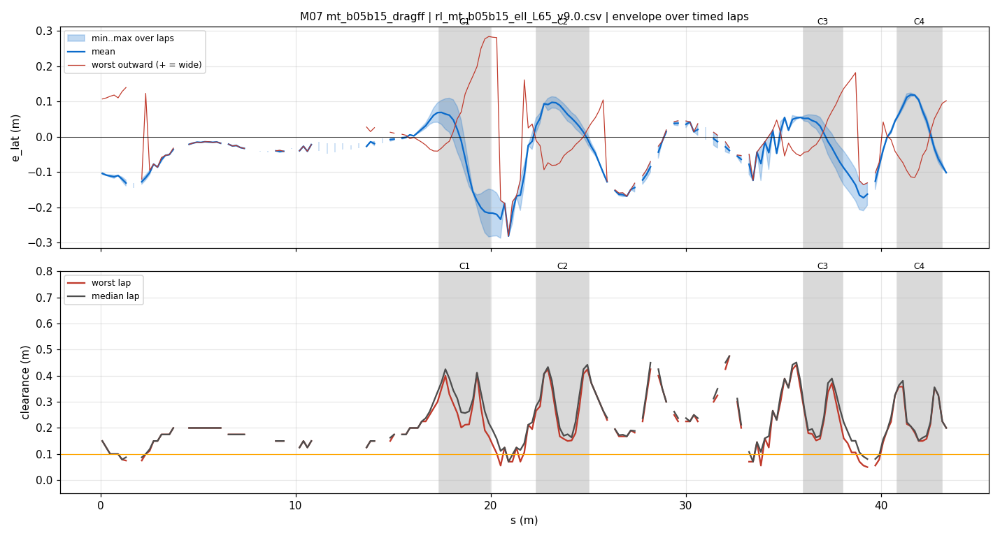
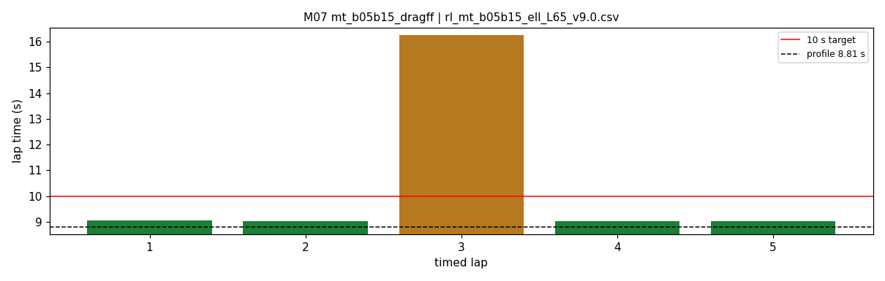

# M07 — mt_b05b15_dragff

- **date** 2026-09-18  **line** `rl_mt_b05b15_ell_L65_v9.0.csv` (profile 8.811 s)  **loop cap** 45  **laps asked** 40
- **overrides** `distance_source:=slip control_hz:=45 warmup_v_max:=2.0 warmup_dist_m:=21.0 amcl_params_file:=amcl_beams360.yaml exit_guard_from:=0.0 exit_guard_full:=0.0 controller_mode:=hybrid_lqr lqr_k_lat:=0.03 lqr_k_head:=0.05 lqr_k_yaw:=0.0 lqr_max_correction_rad:=0.02 recover_settle_s:=2.0 recover_creep_s:=3.0 v_max:=9.0 enc_rate_window_s:=0.05 drag_ff:=1.0`
- **hypothesis** b0.05 with b0.15 geometry blended into s25-28 and s37.3-40 (paper 8.810) + fixed drag_ff.
- **prediction** 8.95-9.0 s, no right-wall contacts

## Result

| timed laps | contacts | best | median | mean | std | worst | <10 s | gap to profile | loop Hz | delay |
|---|---|---|---|---|---|---|---|---|---|---|
| 5 | 1 | 9.020 | 9.030 | 10.476 | 2.887 | 16.250 | 4 | 0.219 | 30.4 | 0.099 |

First contact: +39.4 s at s = 19.27 m

| tracking (timed laps) | mean | p90 | max |
|---|---|---|---|
| |e_lat| m | 0.074 | 0.157 | 0.289 |
| outward m | -0.014 | 0.114 | 0.284 |
| localization m | 0.094 | 0.198 | 0.393 |
| a_lat m/s² | 3.815 | 6.705 | 7.756 |
| |v_est − v| m/s | 0.163 | 0.341 | 0.900 |

Body clearance: min 0.05 m, p05 0.079 m.  Steering at lock: 0.0 % of ticks.

| corner | s | side | κ | v plan apex | v true apex | worst outward | |e| p90 | min clearance | a_lat max | at lock % |
|---|---|---|---|---|---|---|---|---|---|---|
| C1 | 17.4-20.0 | L | 1.22 | 2.4 | 2.32 | 0.284 | 0.248 | 0.103 | 7.3 | 0.0 |
| C2 | 22.3-25.0 | L | 0.49 | 3.75 | 3.64 | 0.054 | 0.098 | 0.15 | 6.95 | 0.0 |
| C3 | 36.0-38.0 | L | 0.49 | 3.79 | 3.73 | 0.165 | 0.118 | 0.106 | 7.04 | 0.0 |
| C4 | 40.8-43.1 | L | 1.22 | 2.4 | 2.23 | 0.102 | 0.113 | 0.15 | 7.01 | 0.0 |

Gates: 50 clean laps **no**, mean < 10 s (worst < 10.2) **no**

## Figures

Time-loss split (plot_speed_tracking.py): see `speed_tracking.txt`.

## Verdict

Warmup lap clean (the blend fixed M06 s26.8). Contact: hairpin-1 entry, car +1.63 m/s over target at s 17.5. Braking lag is systemic on every run: +0.5..+1.0 m/s over target through s14-16.5 with the brake band saturated -- the car decelerates 6.5-7 m/s2 (p90 8.4-8.8), i.e. MORE than the plan; the lag is the ~0.1 s command delay against a 5.5 m/s2 plan. Entering at 8.63 m/s (v_max 9.0) the lag did not close before turn-in, where the throttle law friction-circle cap then cut brake slip to its 0.02 floor. drag_ff: gap to profile 0.22 s vs M06 0.23 s -- no measurable gain; off again.
