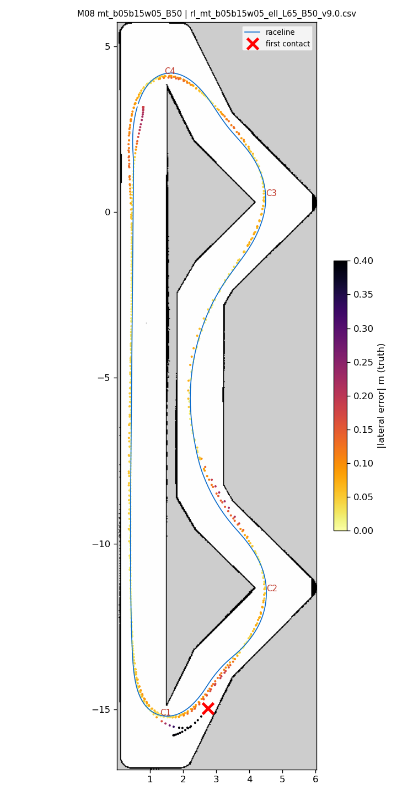
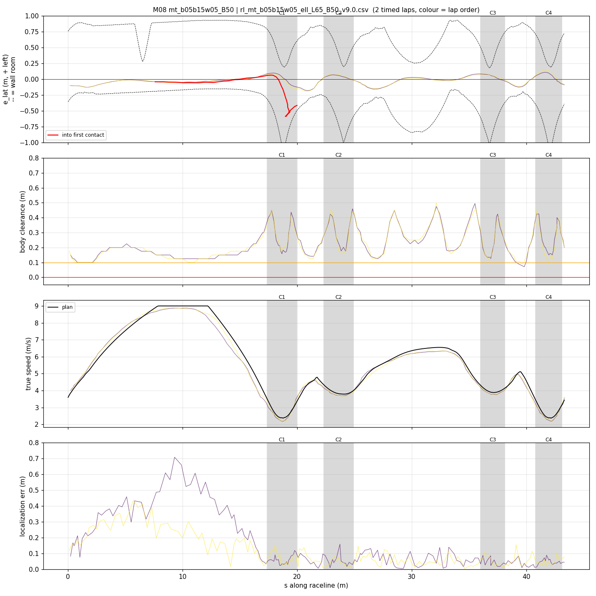
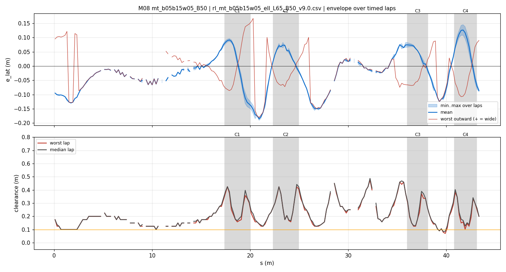
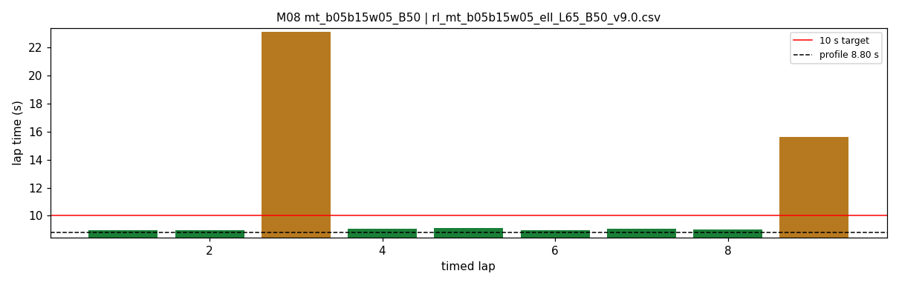

# M08 — mt_b05b15w05_B50

- **date** 2026-09-18  **line** `rl_mt_b05b15w05_ell_L65_B50_v9.0.csv` (profile 8.801 s)  **loop cap** 45  **laps asked** 40
- **overrides** `distance_source:=slip control_hz:=45 warmup_v_max:=2.0 warmup_dist_m:=21.0 amcl_params_file:=amcl_beams360.yaml exit_guard_from:=0.0 exit_guard_full:=0.0 controller_mode:=hybrid_lqr lqr_k_lat:=0.03 lqr_k_head:=0.05 lqr_k_yaw:=0.0 lqr_max_correction_rad:=0.02 recover_settle_s:=2.0 recover_creep_s:=3.0 v_max:=9.0 enc_rate_window_s:=0.05`
- **hypothesis** Half-way blend (0.05 m) in the two tight zones, a_brake 5.0 to absorb the command delay, drag_ff off; paper 8.799.
- **prediction** 8.98-9.02 s, no hairpin-1 entry contacts

## Result

| timed laps | contacts | best | median | mean | std | worst | <10 s | gap to profile | loop Hz | delay |
|---|---|---|---|---|---|---|---|---|---|---|
| 9 | 1 | 8.950 | 9.070 | 11.316 | 4.633 | 23.070 | 7 | 0.269 | 28.5 | 0.105 |

First contact: +40.2 s at s = 19.98 m

| tracking (timed laps) | mean | p90 | max |
|---|---|---|---|
| |e_lat| m | 0.061 | 0.127 | 0.191 |
| outward m | -0.024 | 0.082 | 0.167 |
| localization m | 0.118 | 0.318 | 0.707 |
| a_lat m/s² | 3.871 | 6.593 | 7.732 |
| |v_est − v| m/s | 0.165 | 0.356 | 0.678 |

Body clearance: min 0.071 m, p05 0.1 m.  Steering at lock: 0.0 % of ticks.

| corner | s | side | κ | v plan apex | v true apex | worst outward | |e| p90 | min clearance | a_lat max | at lock % |
|---|---|---|---|---|---|---|---|---|---|---|
| C1 | 17.4-20.0 | L | 1.22 | 2.4 | 2.24 | 0.167 | 0.138 | 0.158 | 7.55 | 0.0 |
| C2 | 22.3-24.9 | L | 0.48 | 3.79 | 3.69 | 0.047 | 0.074 | 0.158 | 6.66 | 0.0 |
| C3 | 36.0-38.1 | L | 0.46 | 3.89 | 3.79 | 0.06 | 0.079 | 0.125 | 6.72 | 0.0 |
| C4 | 40.8-43.1 | L | 1.22 | 2.4 | 2.25 | 0.09 | 0.127 | 0.103 | 6.75 | 0.0 |

Gates: 50 clean laps **no**, mean < 10 s (worst < 10.2) **no**

## Figures

Time-loss split (plot_speed_tracking.py): see `speed_tracking.txt`.

## Verdict

hp1 ENTRY again: +0.95 m/s at turn-in. The follower speed estimate read +0.86 m/s high there; the friction-circle brake floor placed the wheel at v_est - 0.08, i.e. ABOVE the real car, so braking became drive (IMU +2.6 m/s2). The turn-in over-read exists on every run (max +0.38..+0.56 even in S03) and grows at v_max 9.0 (+0.77/+0.86). Offline replay: the tire model fed our wheel speed reproduces the bias (no cornering drag; cruise -0.14..-0.20 at 45 Hz, ~0 on the 20 Hz run); an IMU-complementary blend cuts turn-in/brake p95 error 0.45 -> 0.24-0.34. Step back: nearly every contact M01-M08 is at the kappa-1.22 hairpins, planned at a_lat 7.0 (tire peak 7.06) with a 0.1 s delay and a 0.5-0.9 m/s speed-estimate error -- zero margin. Next: target_lead_s 0.08 (the node default, zeroed for IROS), brake_cap_margin 0.2 (new), v_max 8.5, a_brake 5.0, run >= 30 laps.
