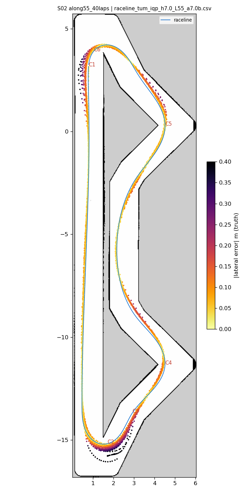
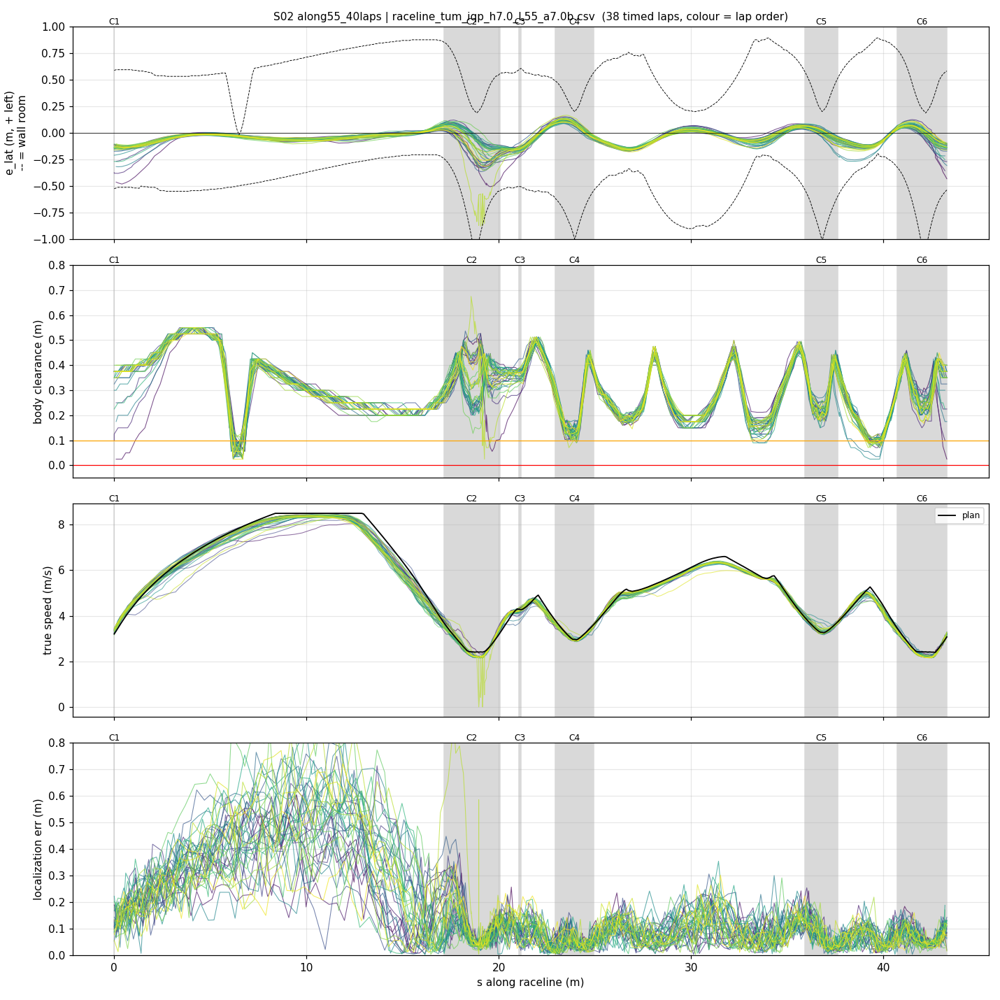
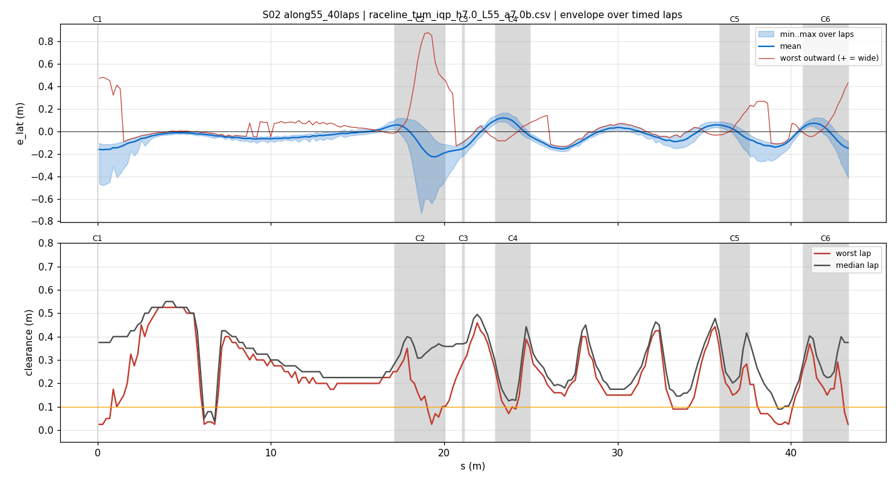
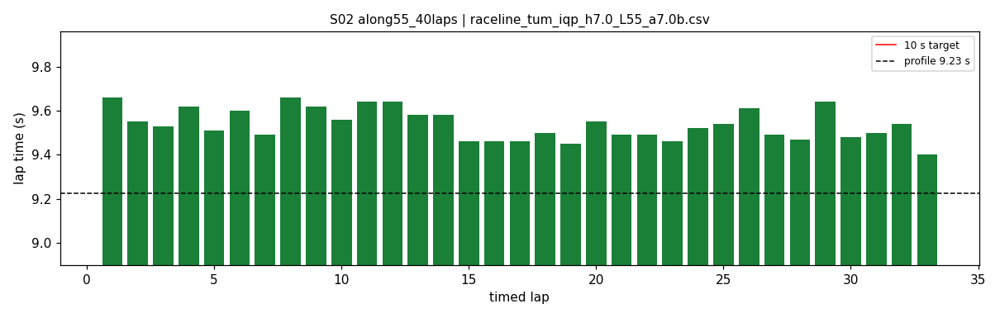
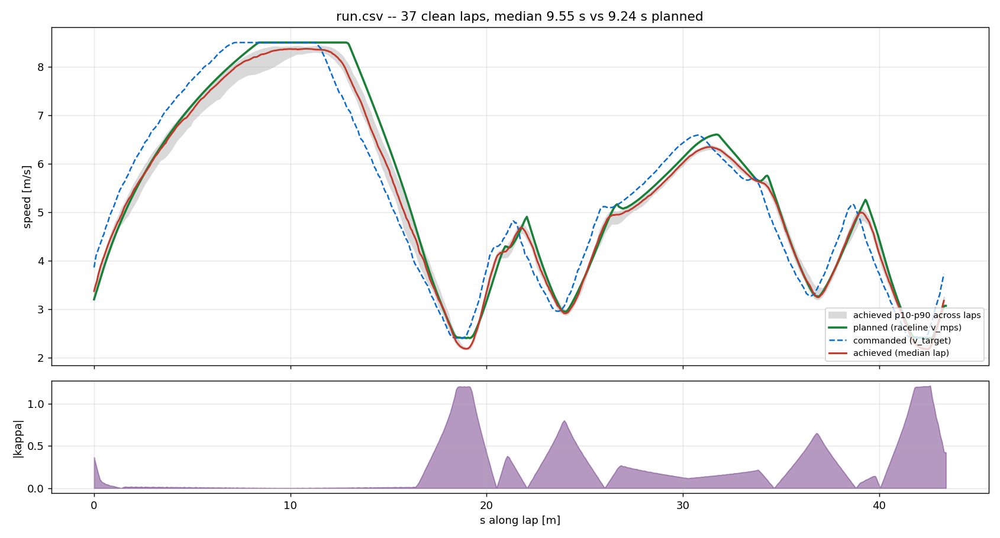
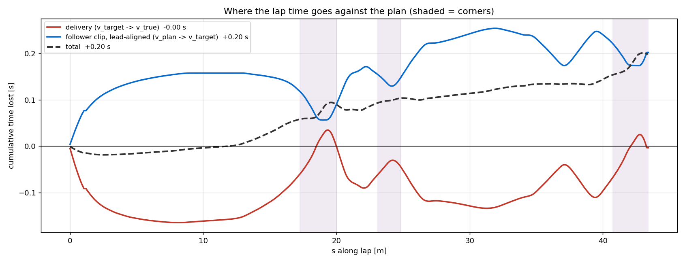

# S02 — along55_40laps

- **date** 2026-09-18  **line** `raceline_tum_iqp_h7.0_L55_a7.0b.csv` (profile 9.225 s)  **loop cap** 45  **laps asked** 40
- **overrides** `control_hz:=45 warmup_v_max:=2.0 warmup_dist_m:=21.0 enc_rate_window_s:=0.10 amcl_params_file:=amcl_beams360.yaml exit_guard_from:=0.0 exit_guard_full:=0.0 controller_mode:=hybrid_lqr lqr_k_lat:=0.03 lqr_k_head:=0.05 lqr_k_yaw:=0.0 lqr_max_correction_rad:=0.02 recover_settle_s:=2.0 recover_creep_s:=3.0 # raceline re-profiled at --a-long 5.5 (was 5.0)`
- **hypothesis** Repeat of S01 for sample size: the straight is limited by the raceline profile's longitudinal budget, not the controller. a_long 5.0 -> 5.5 on the same geometry.
- **prediction** reproduce S01's -0.06 s over a 40-lap sample; corner speeds and braking unchanged

## Result

| timed laps | contacts | best | median | mean | std | worst | <10 s | gap to profile | loop Hz | delay |
|---|---|---|---|---|---|---|---|---|---|---|
| 33 | 1 | 9.400 | 9.530 | 9.538 | 0.070 | 9.660 | 33 | 0.305 | 31.3 | 0.096 |

First contact: none

| tracking (timed laps) | mean | p90 | max |
|---|---|---|---|
| |e_lat| m | 0.087 | 0.159 | 0.877 |
| outward m | 0.013 | 0.145 | 0.877 |
| localization m | 0.150 | 0.391 | 0.958 |
| a_lat m/s² | 3.474 | 6.261 | 7.778 |
| |v_est − v| m/s | 0.173 | 0.354 | 1.052 |

Body clearance: min 0.025 m, p05 0.125 m.  Steering at lock: 1.51 % of ticks.

| corner | s | side | κ | v plan apex | v true apex | worst outward | |e| p90 | min clearance | a_lat max | at lock % |
|---|---|---|---|---|---|---|---|---|---|---|
| C1 | 0.0-0.0 | L | 0.36 | 3.2 | 3.58 | 0.481 | 0.267 | 0.025 | 7.78 | 0.0 |
| C2 | 17.2-20.1 | L | 1.2 | 2.41 | 1.66 | 0.877 | 0.572 | 0.025 | 7.64 | 8.9 |
| C3 | 21.1-21.2 | R | 0.38 | 4.28 | 4.22 | -0.014 | 0.186 | 0.224 | 4.97 | 0.0 |
| C4 | 23.0-24.9 | L | 0.8 | 2.96 | 2.98 | 0.101 | 0.121 | 0.071 | 7.38 | 0.0 |
| C5 | 35.9-37.6 | L | 0.66 | 3.27 | 3.34 | 0.265 | 0.09 | 0.106 | 7.75 | 0.0 |
| C6 | 40.7-43.3 | L | 1.21 | 2.4 | 2.29 | 0.432 | 0.127 | 0.025 | 7.53 | 0.0 |

Gates: 50 clean laps **no**, mean < 10 s (worst < 10.2) **PASS**

## Figures

Time-loss split (plot_speed_tracking.py): see `speed_tracking.txt`.

## Verdict

ACCEPTED and reproduces S01. 33 timed laps then one hairpin-1 contact at lap 35 which recovered cleanly with no cascade (9.63/9.57/9.52 after). Mean 9.538 against A03's 9.594 -- a -0.056 s gain matching S01's -0.063 from only 8 laps, so the effect is real and repeatable. Tracking error unchanged. Note for future runs: this run's mean read 9.589 at lap 14 and 9.572 at lap 16 before settling at 9.538 by lap 33 -- do NOT judge a rung on a partial mean before ~25 laps.
