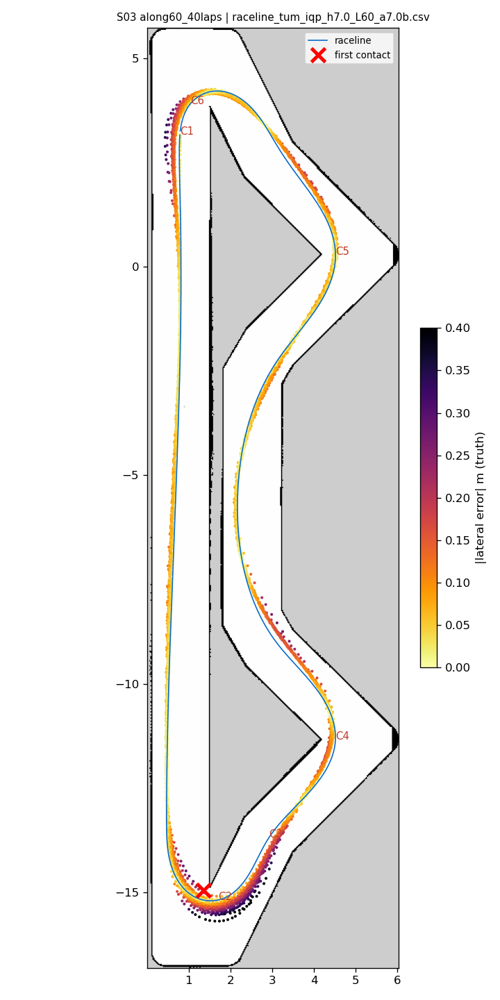
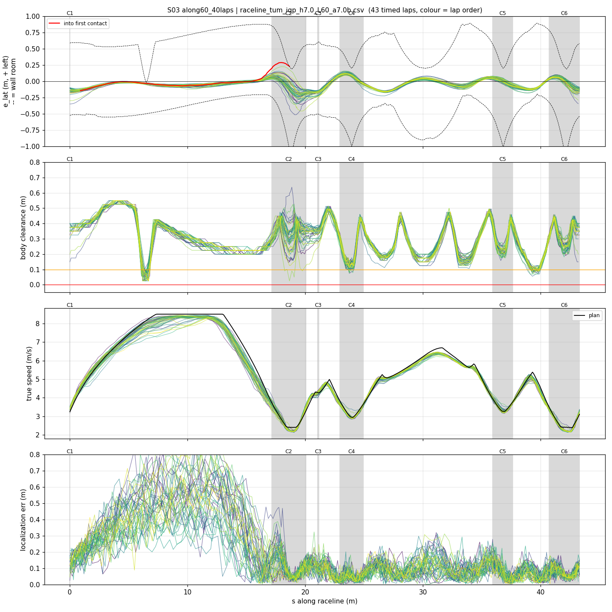
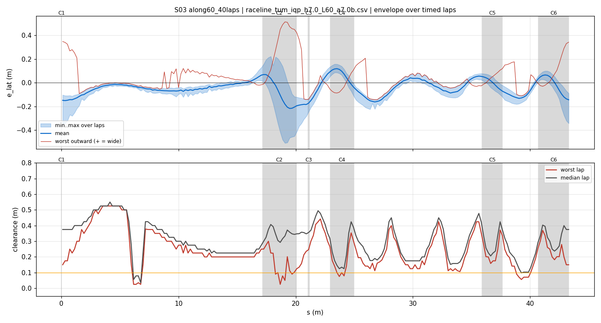
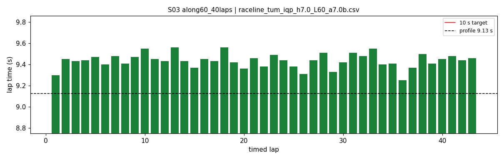
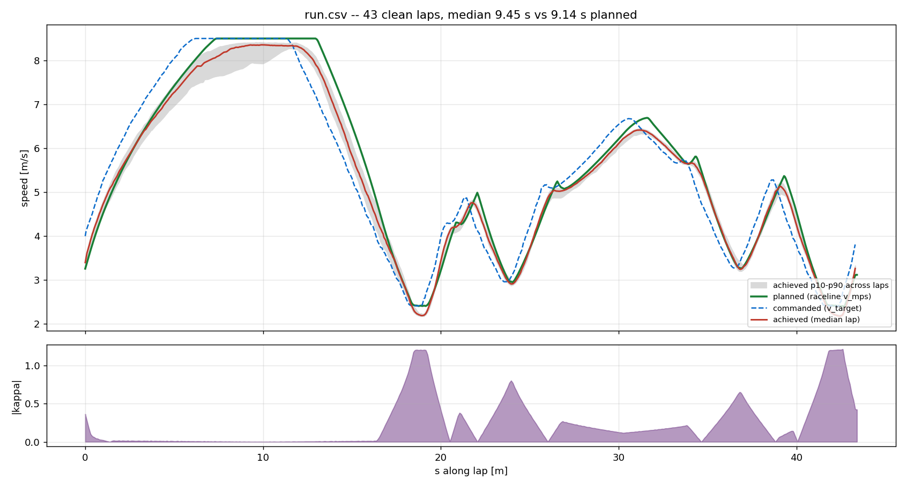
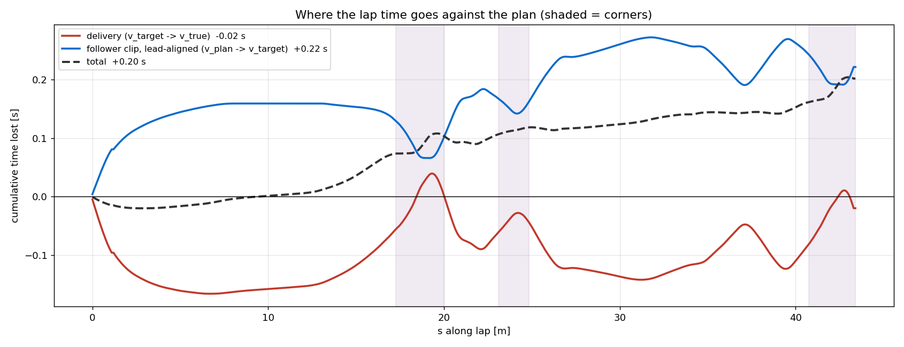

# S03 — along60_40laps

- **date** 2026-09-18  **line** `raceline_tum_iqp_h7.0_L60_a7.0b.csv` (profile 9.125 s)  **loop cap** 45  **laps asked** 40
- **overrides** `control_hz:=45 warmup_v_max:=2.0 warmup_dist_m:=21.0 enc_rate_window_s:=0.10 amcl_params_file:=amcl_beams360.yaml exit_guard_from:=0.0 exit_guard_full:=0.0 controller_mode:=hybrid_lqr lqr_k_lat:=0.03 lqr_k_head:=0.05 lqr_k_yaw:=0.0 lqr_max_correction_rad:=0.02 recover_settle_s:=2.0 recover_creep_s:=3.0`
- **hypothesis** The straight is limited by the RACELINE PROFILE, not the controller: telemetry shows throttle peaking at 0.35 of 1.0 and the slip band pinned at 0.12 (99.2 % of peak tire grip), while the profile plans only 4.95 m/s2 gross of drag and the car demonstrably delivers p90 5.5-6.0, max 6.5. Re-profiling the SAME geometry at a_long 6.0 should convert that headroom into lap time without touching corner speeds, braking points or the line itself.
- **prediction** -0.10 s vs the a_long 5.5 rung (S02) from the point-mass model; corner minima and braking unchanged; tracking error flat; the straight reaches 8.5 m/s near half distance instead of 74 %

## Result

| timed laps | contacts | best | median | mean | std | worst | <10 s | gap to profile | loop Hz | delay |
|---|---|---|---|---|---|---|---|---|---|---|
| 43 | 1 | 9.250 | 9.440 | 9.436 | 0.067 | 9.560 | 43 | 0.315 | 31.3 | 0.096 |

First contact: +427.0 s at s = 18.66 m

| tracking (timed laps) | mean | p90 | max |
|---|---|---|---|
| |e_lat| m | 0.077 | 0.157 | 0.514 |
| outward m | 0.001 | 0.135 | 0.514 |
| localization m | 0.162 | 0.435 | 1.016 |
| a_lat m/s² | 3.610 | 6.417 | 7.779 |
| |v_est − v| m/s | 0.172 | 0.349 | 1.240 |

Body clearance: min 0.025 m, p05 0.127 m.  Steering at lock: 0.0 % of ticks.

| corner | s | side | κ | v plan apex | v true apex | worst outward | |e| p90 | min clearance | a_lat max | at lock % |
|---|---|---|---|---|---|---|---|---|---|---|
| C1 | 0.0-0.0 | L | 0.36 | 3.25 | 3.64 | 0.348 | 0.18 | 0.15 | 6.96 | 0.0 |
| C2 | 17.2-20.1 | L | 1.2 | 2.41 | 2.25 | 0.514 | 0.256 | 0.025 | 7.53 | 0.0 |
| C3 | 21.1-21.2 | R | 0.38 | 4.28 | 4.28 | -0.064 | 0.213 | 0.158 | 4.46 | 0.0 |
| C4 | 23.0-24.9 | L | 0.8 | 2.96 | 2.97 | 0.176 | 0.121 | 0.075 | 7.44 | 0.0 |
| C5 | 35.9-37.6 | L | 0.66 | 3.27 | 3.32 | 0.154 | 0.083 | 0.158 | 7.49 | 0.0 |
| C6 | 40.7-43.3 | L | 1.21 | 2.4 | 2.29 | 0.343 | 0.135 | 0.146 | 7.74 | 0.0 |

Gates: 50 clean laps **no**, mean < 10 s (worst < 10.2) **PASS**

## Figures

Time-loss split (plot_speed_tracking.py): see `speed_tracking.txt`.

## Verdict

ACCEPTED and the largest gain since control_hz 45. Re-profiling the raced geometry from a_long 5.0 to 6.0 took the mean from 9.594 (A03) to 9.436 and the median from 9.600 to 9.440, both inside the 9.4-9.3 goal, with the worst lap (9.560) beating A03's best (9.450) outright. 24 of 43 timed laps under 9.45, against zero for A03. The gain is real speed, not sloppier driving: |e_lat| p90 across the ladder is 0.148 (A03) -> 0.159 (S02) -> 0.157 (S03), and a_lat p90 6.32 -> 6.26 -> 6.42 against the profile's 7.0 limit. One hairpin-1 contact at lap 45, recovered in 5.1 s with no cascade. The remaining risk is the along-track localization drift: loc p90 rose 0.392 -> 0.435 m and the along-track error into the hairpin-1 brake point reached p95 +0.817 / max +1.013 m. Fix that before trying the 6.5 rung -- see the campaign note for the measured slip-proportional correction.
