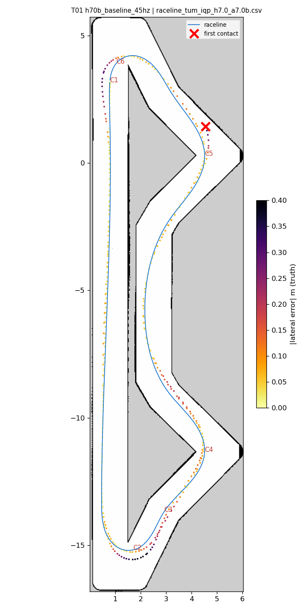
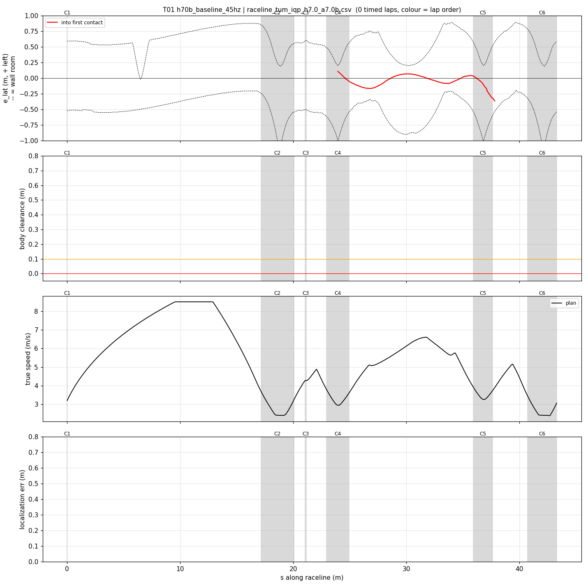
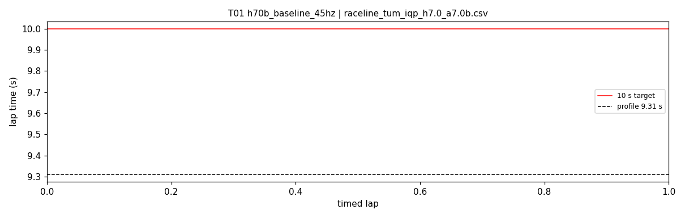
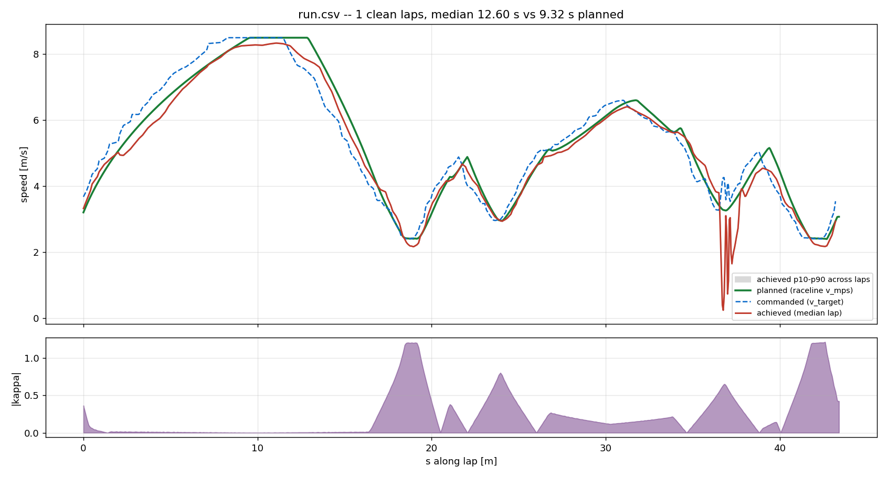
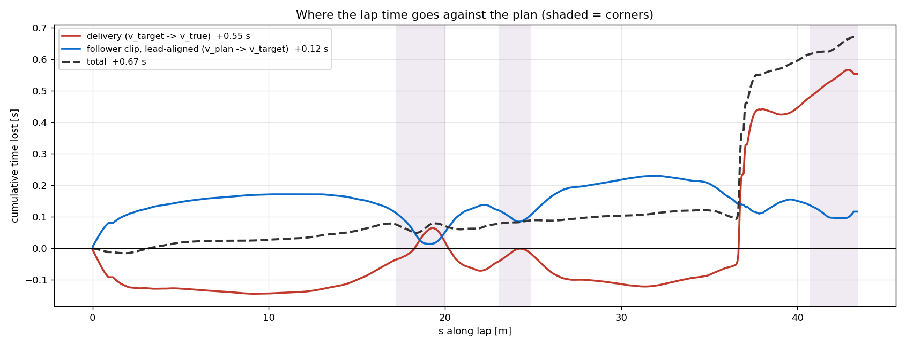

# T01 — h70b_baseline_45hz

- **date** 2026-09-17  **line** `raceline_tum_iqp_h7.0_a7.0b.csv` (profile 9.31 s)  **loop cap** 45  **laps asked** 25
- **overrides** `(none)`
- **hypothesis** Reproduce the teammates' run 18 on this machine through the tuning runner: multi-track registry defaults (v_max 8.5, target_lead 0, slip_circle 0.12, accel_ff 1, warmup cap 4.0 m/s over 19 m, enc_rate_window_s 0.05) on raceline_tum_iqp_h7.0_a7.0b.csv at 45 Hz; the control for every controller change on this line
- **prediction** 0 contacts in 25 laps; best 9.45-9.55, median 9.55-9.70 (run 18: 19 clean laps, best 9.45); tightest clearance at s 39.6-40.2

## Result

| timed laps | contacts | best | median | mean | std | worst | <10 s | gap to profile | loop Hz | delay |
|---|---|---|---|---|---|---|---|---|---|---|
| 0 | 1 | — | — | — | — | — | 0 | — | 27.2 | 0.110 |

First contact: +21.6 s at s = 37.82 m

| tracking (timed laps) | mean | p90 | max |
|---|---|---|---|
| |e_lat| m | 0.121 | 0.337 | 0.626 |
| outward m | 0.057 | 0.337 | 0.626 |
| localization m | 0.171 | 0.453 | 1.752 |
| a_lat m/s² | 2.701 | 6.333 | 7.593 |
| |v_est − v| m/s | 0.199 | 0.402 | 3.808 |

Body clearance: min 0.025 m, p05 0.127 m.  Steering at lock: 7.51 % of ticks.

| corner | s | side | κ | v plan apex | v true apex | worst outward | |e| p90 | min clearance | a_lat max | at lock % |
|---|---|---|---|---|---|---|---|---|---|---|
| C1 | 0.0-0.0 | L | 0.36 | 3.2 | 0.46 | 0.299 | 0.125 | 0.225 | 5.76 | 0.0 |
| C2 | 17.2-20.1 | L | 1.2 | 2.41 | 2.27 | 0.383 | 0.328 | 0.224 | 7.44 | 0.0 |
| C3 | 21.1-21.2 | R | 0.38 | 4.28 | 4.34 | -0.059 | 0.216 | 0.285 | 3.96 | 0.0 |
| C4 | 23.0-24.9 | L | 0.8 | 2.96 | 3.00 | 0.131 | 0.138 | 0.079 | 7.59 | 0.0 |
| C5 | 35.9-37.6 | L | 0.66 | 3.27 | 0.92 | 0.626 | 0.586 | 0.035 | 7.37 | 51.5 |
| C6 | 40.7-43.3 | L | 1.21 | 2.4 | 2.29 | 0.305 | 0.24 | 0.1 | 7.21 | 0.0 |

Gates: 50 clean laps **no**, mean < 10 s (worst < 10.2) **no**

## Figures

Time-loss split (plot_speed_tracking.py): see `speed_tracking.txt`.

## Verdict

Contact on the first timed lap at the C3 exit (s 37.8, (4.6, 1.3)): e_lat -0.14 -> -0.41 in 0.3 s at 3.6-3.8 m/s, heading error -13..-15 deg, commanded steering 0.28-0.33 (kappa ~0.55) against a path kappa 0.66 and an achieved 0.46; localization 4-5 cm, delay 103 ms. Same area the registry flags as this line's tightest (s 39.6-40.2). One sample: repeated as T02 with max-contacts 3.
