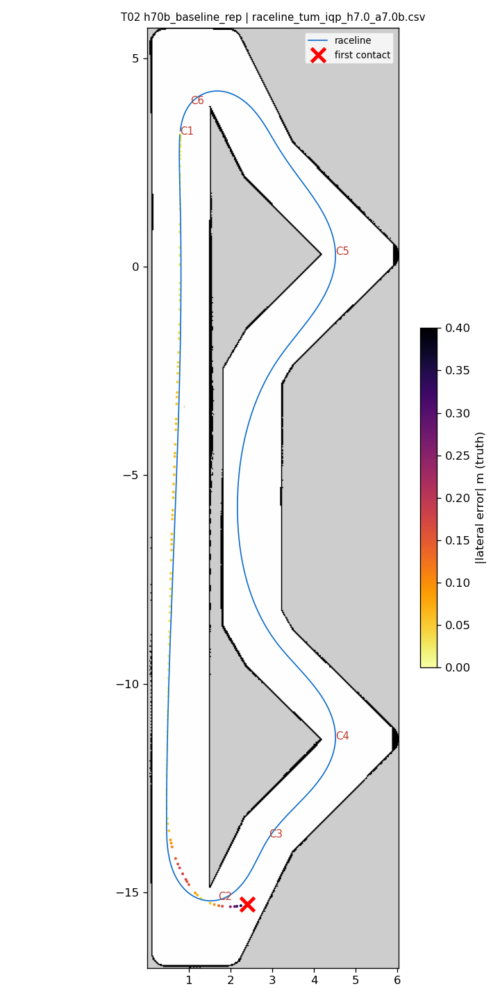
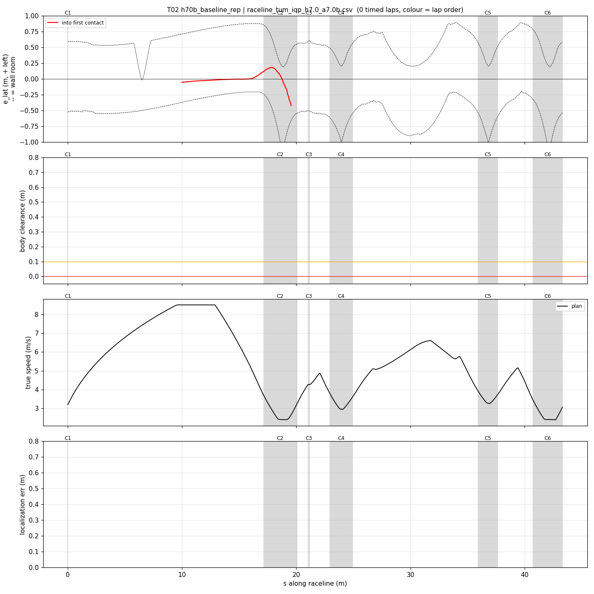
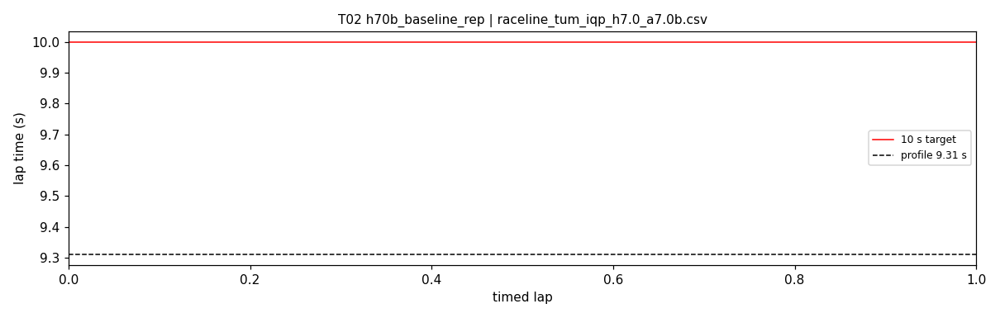

# T02 — h70b_baseline_rep

- **date** 2026-09-17  **line** `raceline_tum_iqp_h7.0_a7.0b.csv` (profile 9.31 s)  **loop cap** 45  **laps asked** 20
- **overrides** `(none)`
- **hypothesis** Repeat of T01 (registry defaults on the 9.4 line) to measure its contact rate on this laptop; T01 is one sample
- **prediction** 1-3 contacts in 20 laps, all at C3 exit s 37-40; clean laps 9.5-9.7 s

## Result

| timed laps | contacts | best | median | mean | std | worst | <10 s | gap to profile | loop Hz | delay |
|---|---|---|---|---|---|---|---|---|---|---|
| 0 | 4 | — | — | — | — | — | 0 | — | 18.9 | 0.159 |

First contact: +8.0 s at s = 19.56 m

| tracking (timed laps) | mean | p90 | max |
|---|---|---|---|
| |e_lat| m | 0.080 | 0.234 | 0.585 |
| outward m | 0.018 | 0.234 | 0.585 |
| localization m | 2.026 | 3.091 | 3.780 |
| a_lat m/s² | 0.546 | 1.251 | 7.687 |
| |v_est − v| m/s | 2.288 | 3.627 | 3.630 |

Body clearance: min 0.025 m, p05 0.096 m.  Steering at lock: 0.43 % of ticks.

| corner | s | side | κ | v plan apex | v true apex | worst outward | |e| p90 | min clearance | a_lat max | at lock % |
|---|---|---|---|---|---|---|---|---|---|---|
| C1 | 0.0-0.0 | L | 0.36 | 3.2 | 0.14 | -0.014 | 0.021 | 0.55 | 0.07 | 0.0 |
| C2 | 17.2-20.1 | L | 1.2 | 2.41 | 1.78 | 0.585 | 0.558 | 0.079 | 7.69 | 4.8 |
| C3 | 21.1-21.2 | R | 0.38 | 4.28 | 0.22 | 0.314 | 0.054 | 0.035 | 7.47 | 0.0 |

Gates: 50 clean laps **no**, mean < 10 s (worst < 10.2) **no**

## Figures

Time-loss split (plot_speed_tracking.py): see `speed_tracking.txt`.

## Verdict

Out-lap, under the 4 m/s warmup cap: entered hairpin 1 (kappa 1.2) at 2.6 -> 2.2 m/s, steering 0.54 -> 0.83, heading error -24 deg, ran 0.34 -> 0.88 m wide into the exit wall at +8 s; localization 6-10 cm there (0.3-0.6 m along-track on the straight before, as the warmup cap anticipates). The respawn was not flagged for ~1 s (ready stayed 1 with 1.4-2.4 m error) and the car hit twice more. With T01 that is 2/2 runs contacting inside the first lap on this line on this laptop: its hairpins (kappa 1.2 at 7.0 m/s^2, apex 2.4) sit at the understeer limit measured in E00-E03.
