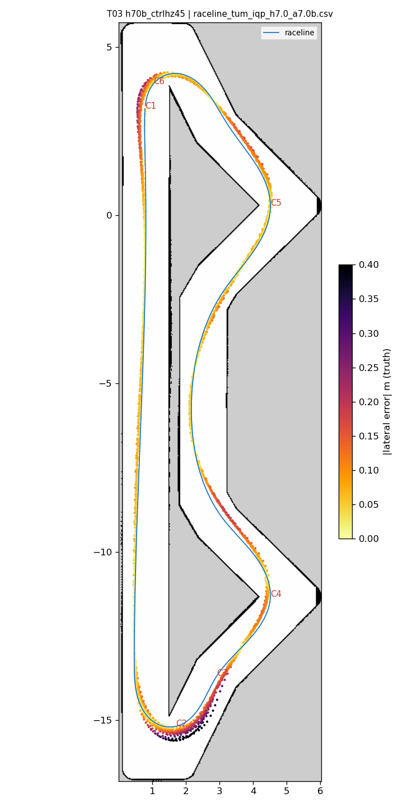
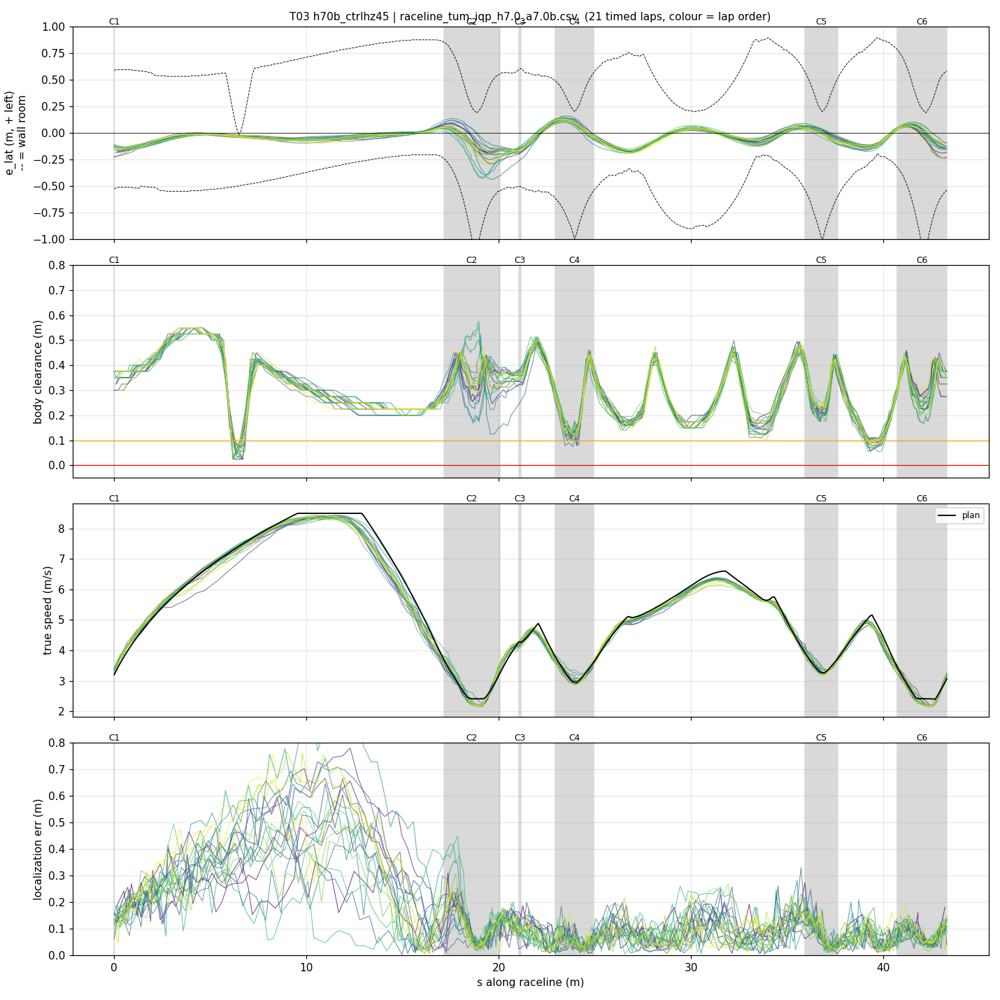
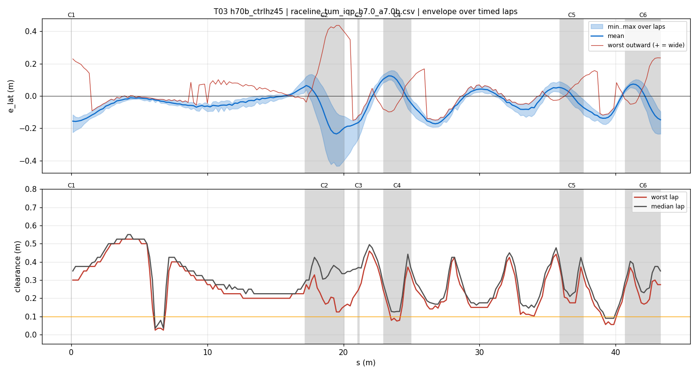
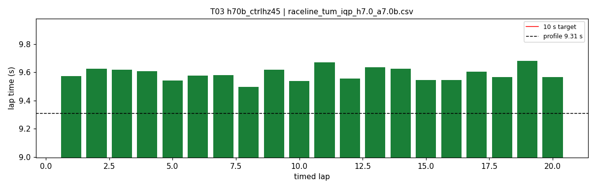
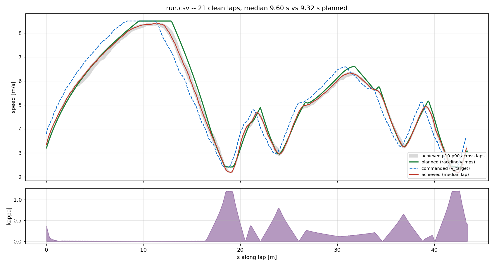
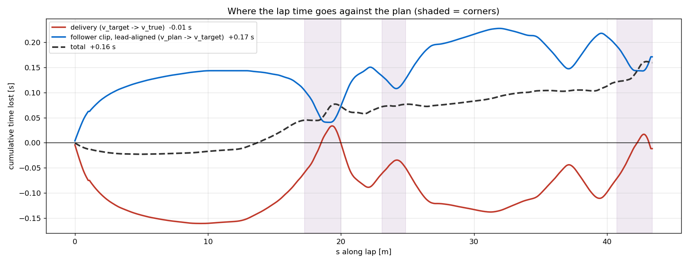

# T03 — h70b_ctrlhz45

- **date** 2026-09-17  **line** `raceline_tum_iqp_h7.0_a7.0b.csv` (profile 9.31 s)  **loop cap** 45  **laps asked** 20
- **overrides** `control_hz:=45`
- **hypothesis** The follower still runs control_hz 20 against a 45 Hz simulator loop, so every steering command is up to one extra frame stale and half the frames are dropped; at the hairpins and C3 exit, where T01/T02 understeered with steering lagging the path, a 45 Hz follower catches the turn-in earlier
- **prediction** fewer contacts than T01/T02 (<= 1 in 20 laps); hairpin worst outward < 0.3 m; clean laps 9.5-9.7 s

## Result

| timed laps | contacts | best | median | mean | std | worst | <10 s | gap to profile | loop Hz | delay |
|---|---|---|---|---|---|---|---|---|---|---|
| 20 | 0 | 9.496 | 9.578 | 9.589 | 0.046 | 9.681 | 20 | 0.268 | 30.2 | 0.099 |

First contact: none

| tracking (timed laps) | mean | p90 | max |
|---|---|---|---|
| |e_lat| m | 0.079 | 0.162 | 0.436 |
| outward m | 0.003 | 0.146 | 0.436 |
| localization m | 0.150 | 0.366 | 1.030 |
| a_lat m/s² | 3.422 | 6.308 | 7.903 |
| |v_est − v| m/s | 0.167 | 0.337 | 0.882 |

Body clearance: min 0.025 m, p05 0.125 m.  Steering at lock: 0.0 % of ticks.

| corner | s | side | κ | v plan apex | v true apex | worst outward | |e| p90 | min clearance | a_lat max | at lock % |
|---|---|---|---|---|---|---|---|---|---|---|
| C1 | 0.0-0.0 | L | 0.36 | 3.2 | 3.56 | 0.229 | 0.205 | 0.3 | 4.55 | 0.0 |
| C2 | 17.2-20.1 | L | 1.2 | 2.41 | 2.25 | 0.436 | 0.289 | 0.125 | 7.65 | 0.0 |
| C3 | 21.1-21.2 | R | 0.38 | 4.28 | 4.23 | -0.043 | 0.192 | 0.202 | 3.71 | 0.0 |
| C4 | 23.0-24.9 | L | 0.8 | 2.96 | 3.02 | 0.15 | 0.126 | 0.075 | 7.14 | 0.0 |
| C5 | 35.9-37.6 | L | 0.66 | 3.27 | 3.32 | 0.133 | 0.089 | 0.175 | 7.52 | 0.0 |
| C6 | 40.7-43.3 | L | 1.21 | 2.4 | 2.29 | 0.236 | 0.139 | 0.146 | 7.02 | 0.0 |

Gates: 50 clean laps **no**, mean < 10 s (worst < 10.2) **PASS**

## Figures

Time-loss split (plot_speed_tracking.py): see `speed_tracking.txt`.

## Verdict

ACCEPTED, the largest single gain of the campaign. control_hz 20 -> 45 on the teammates' line at the 45 Hz loop: 20/20 clean timed laps (T01, T02: contact inside lap 1), best 9.496, median 9.578, mean 9.589, worst 9.681, std 0.046, gap to profile 0.27 s, delay ~100 ms. Remaining weak spot: hairpin 1 (s 17-20) worst outward 0.44 m, |e| p90 0.29 m, min clearance 0.125 m; C4 (chevron, s 23-25) min clearance 0.075 m. Next: 50-lap validation (T04).
