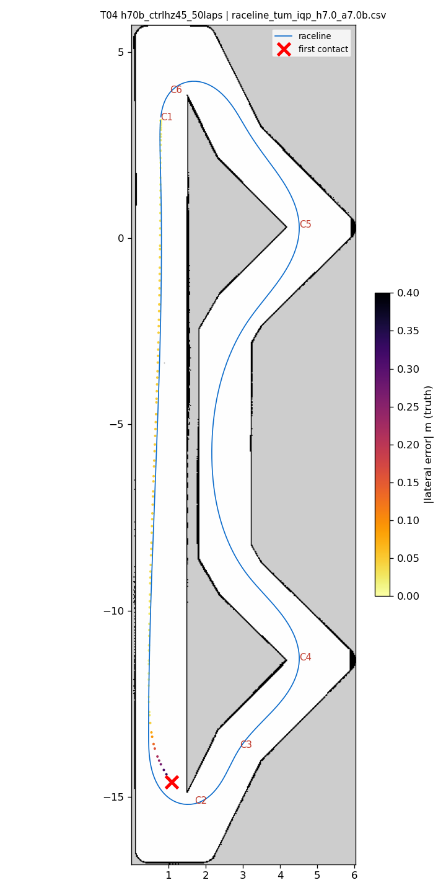
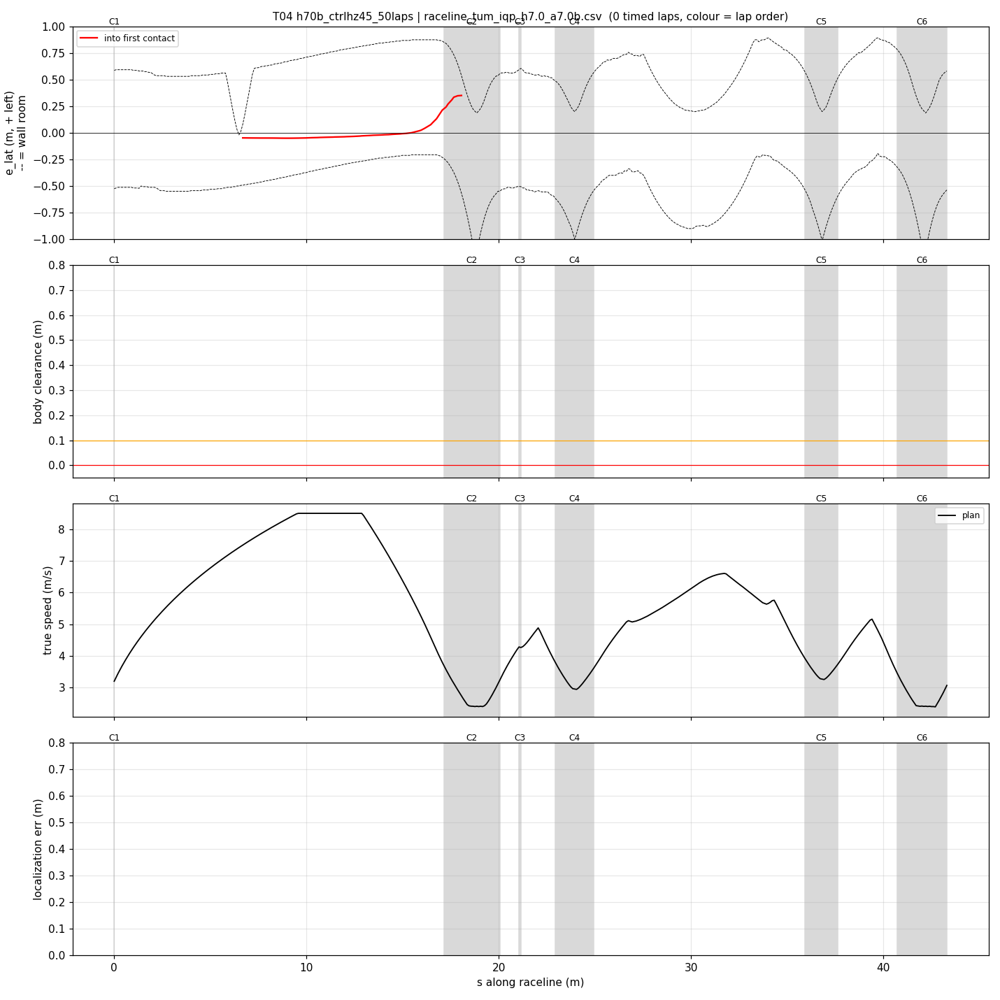
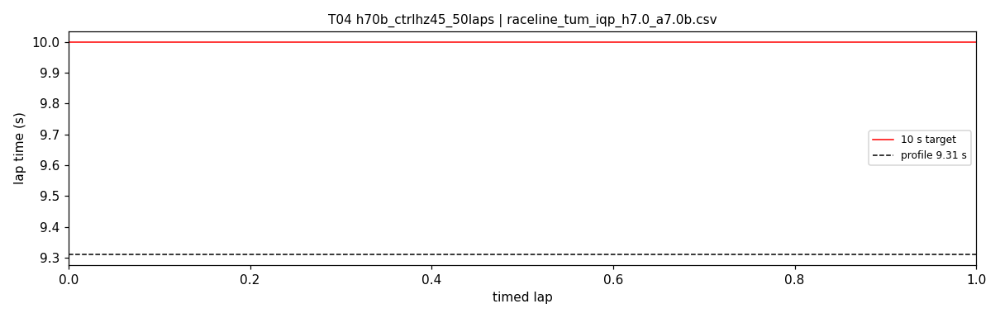

# T04 — h70b_ctrlhz45_50laps

- **date** 2026-09-17  **line** `raceline_tum_iqp_h7.0_a7.0b.csv` (profile 9.31 s)  **loop cap** 45  **laps asked** 50
- **overrides** `control_hz:=45`
- **hypothesis** T03's configuration (teammates' line + registry defaults + control_hz 45) holds for the 50-lap gate
- **prediction** 0 contacts in 50 laps, mean 9.55-9.65, worst < 9.8; risk: thermal loop decay over ~9 min, hairpin 1 exit

## Result

| timed laps | contacts | best | median | mean | std | worst | <10 s | gap to profile | loop Hz | delay |
|---|---|---|---|---|---|---|---|---|---|---|
| 0 | 3 | — | — | — | — | — | 0 | — | 40.7 | 0.074 |

First contact: +7.0 s at s = 18.06 m

| tracking (timed laps) | mean | p90 | max |
|---|---|---|---|
| |e_lat| m | 0.553 | 1.038 | 1.169 |
| outward m | 0.531 | 1.038 | 1.169 |
| localization m | 0.762 | 1.084 | 1.830 |
| a_lat m/s² | 0.327 | 1.173 | 4.061 |
| |v_est − v| m/s | 0.718 | 1.184 | 2.448 |

Body clearance: min 0.05 m, p05 0.15 m.  Steering at lock: 0.0 % of ticks.

| corner | s | side | κ | v plan apex | v true apex | worst outward | |e| p90 | min clearance | a_lat max | at lock % |
|---|---|---|---|---|---|---|---|---|---|---|
| C1 | 0.0-0.0 | L | 0.36 | 3.2 | 0.13 | -0.014 | 0.021 | 0.55 | 0.08 | 0.0 |
| C2 | 17.2-20.1 | L | 1.2 | 2.41 | 0.57 | 1.169 | 1.043 | 0.05 | 4.06 | 0.0 |

Gates: 50 clean laps **no**, mean < 10 s (worst < 10.2) **no**

## Figures

Time-loss split (plot_speed_tracking.py): see `speed_tracking.txt`.

## Verdict

Failed on the untimed out-lap: at hairpin 1 entry (s 16.4-18.4) the estimate was +0.54..+0.63 m AHEAD along-track (T03 same pass: -0.08..-0.20), so the follower turned in early, e_lat +0.01 -> +0.41 (inside), contact at the tip at 2.6 m/s; recovery rehit twice. The start straight is the along-track blind spot the warmup cap exists for; 2 of 4 out-laps on this line (T02, T04) have now hit, the timed laps never did (T03 20/20). Next: slower warmup through hairpin 1 (T05).
