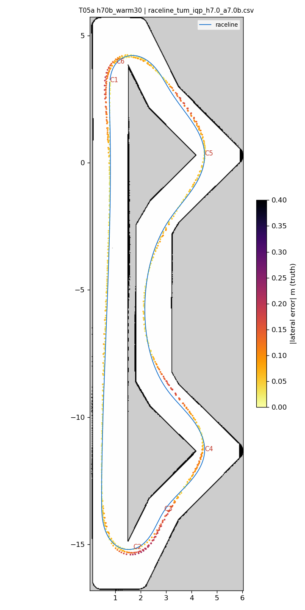
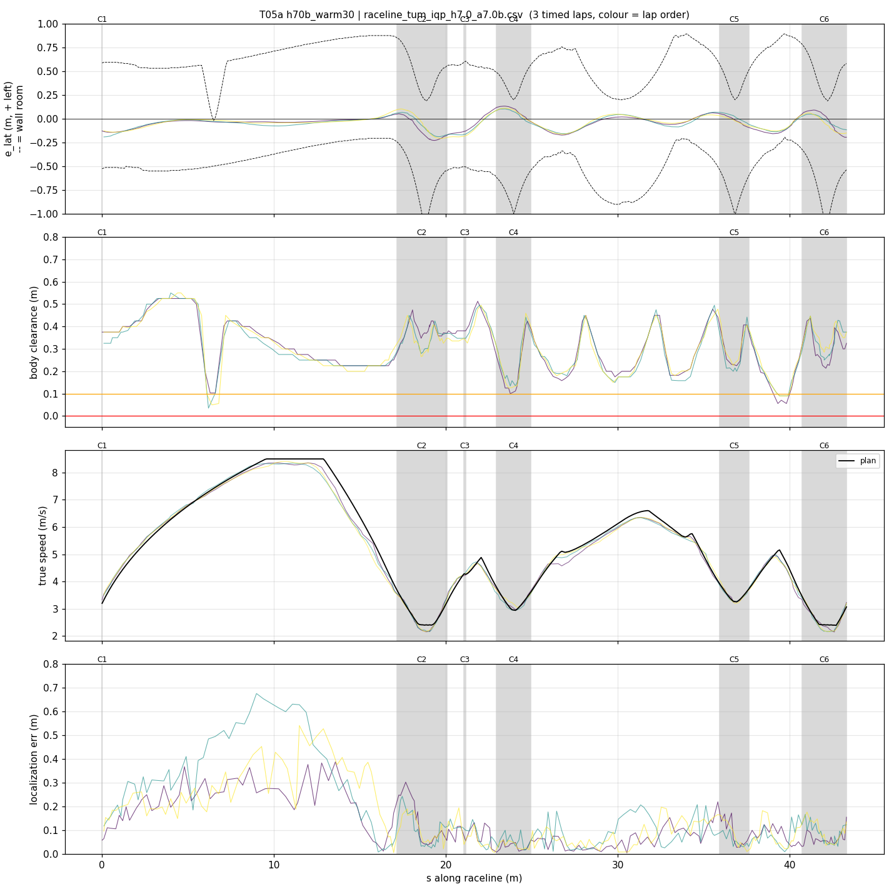
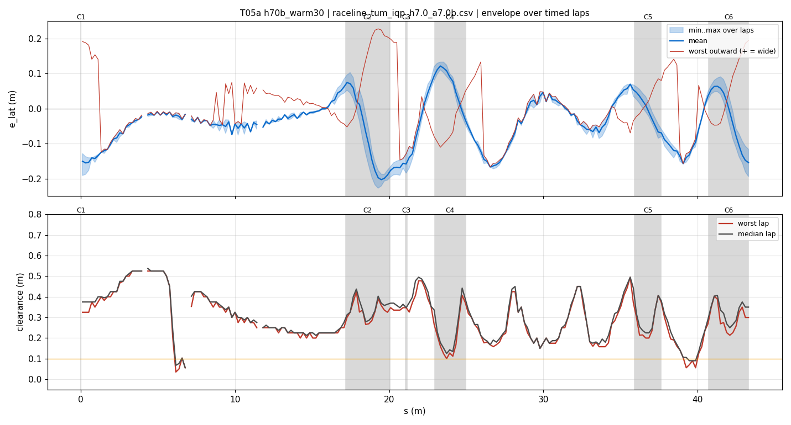
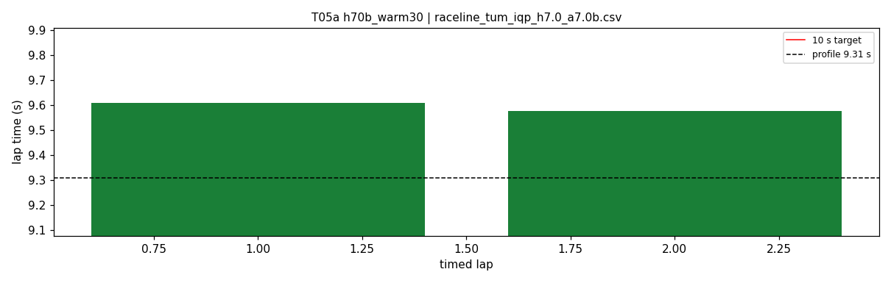
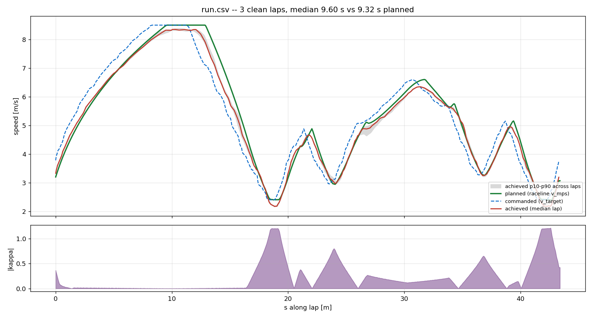
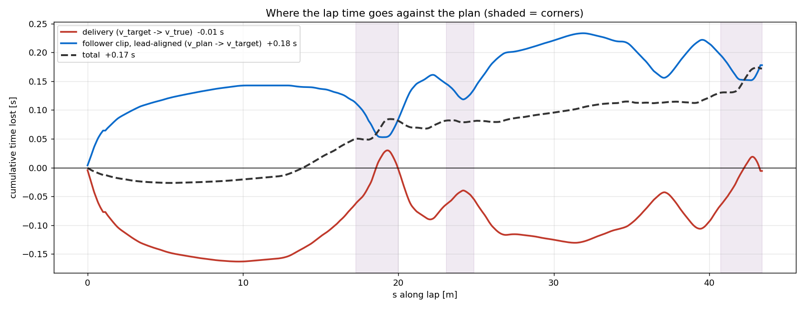

# T05a — h70b_warm30

- **date** 2026-09-17  **line** `raceline_tum_iqp_h7.0_a7.0b.csv` (profile 9.31 s)  **loop cap** 45  **laps asked** 2
- **overrides** `control_hz:=45 warmup_v_max:=3.0 warmup_dist_m:=19.5`
- **hypothesis** Out-lap robustness: warmup_v_max 3.0 over 19.5 m (was 4.0 over 19) gives AMCL more scans per metre through hairpin 1, so the +0.6 m along-track start-straight error is corrected before turn-in; control_hz 45 as T03
- **prediction** 0 contacts on the out-lap in 4 of 4 repeats; hairpin-1 entry along error |.| < 0.3 m

## Result

| timed laps | contacts | best | median | mean | std | worst | <10 s | gap to profile | loop Hz | delay |
|---|---|---|---|---|---|---|---|---|---|---|
| 2 | 0 | 9.577 | 9.593 | 9.593 | 0.016 | 9.610 | 2 | 0.283 | 29.9 | 0.100 |

First contact: none

| tracking (timed laps) | mean | p90 | max |
|---|---|---|---|
| |e_lat| m | 0.073 | 0.157 | 0.227 |
| outward m | 0.004 | 0.142 | 0.227 |
| localization m | 0.134 | 0.307 | 0.674 |
| a_lat m/s² | 3.363 | 6.182 | 7.555 |
| |v_est − v| m/s | 0.155 | 0.302 | 0.762 |

Body clearance: min 0.035 m, p05 0.135 m.  Steering at lock: 0.0 % of ticks.

| corner | s | side | κ | v plan apex | v true apex | worst outward | |e| p90 | min clearance | a_lat max | at lock % |
|---|---|---|---|---|---|---|---|---|---|---|
| C1 | 0.0-0.0 | L | 0.36 | 3.2 | 3.57 | 0.191 | 0.188 | 0.325 | 5.11 | 0.0 |
| C2 | 17.2-20.1 | L | 1.2 | 2.41 | 2.25 | 0.227 | 0.205 | 0.225 | 6.7 | 0.0 |
| C3 | 21.1-21.2 | R | 0.38 | 4.28 | 4.29 | -0.07 | 0.177 | 0.326 | 2.55 | 0.0 |
| C4 | 23.0-24.9 | L | 0.8 | 2.96 | 3.06 | 0.078 | 0.119 | 0.1 | 6.79 | 0.0 |
| C5 | 35.9-37.6 | L | 0.66 | 3.27 | 3.29 | 0.118 | 0.086 | 0.2 | 6.86 | 0.0 |
| C6 | 40.7-43.3 | L | 1.21 | 2.4 | 2.27 | 0.194 | 0.152 | 0.158 | 6.79 | 0.0 |

Gates: 50 clean laps **no**, mean < 10 s (worst < 10.2) **PASS**

## Figures

Time-loss split (plot_speed_tracking.py): see `speed_tracking.txt`.

## Verdict

_to be written after reading the figures_
