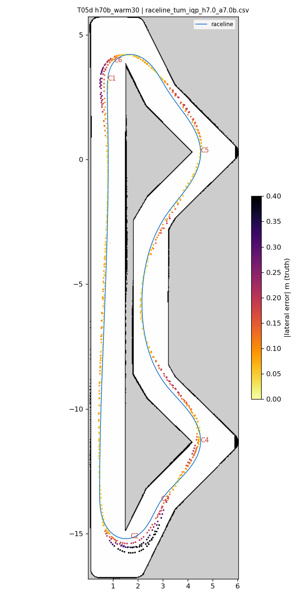
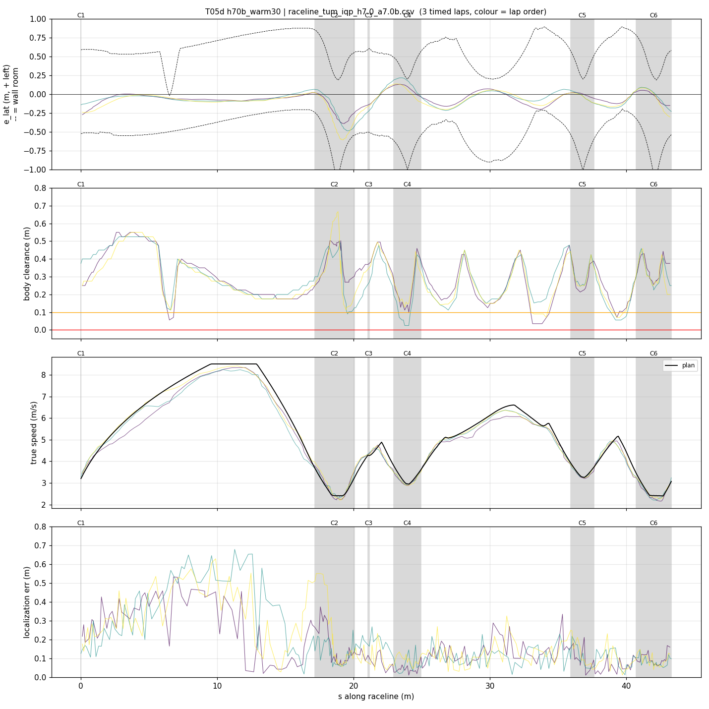
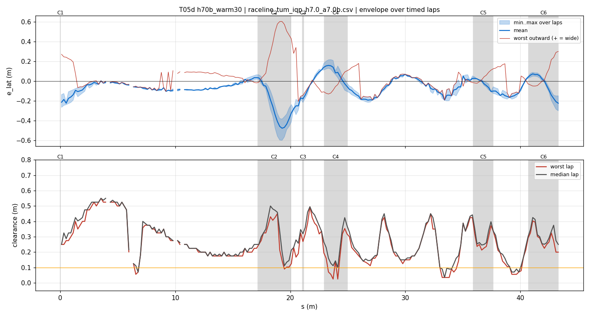
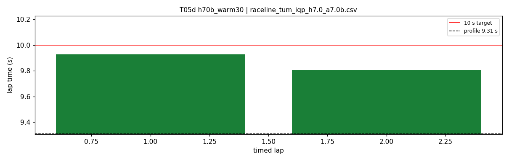
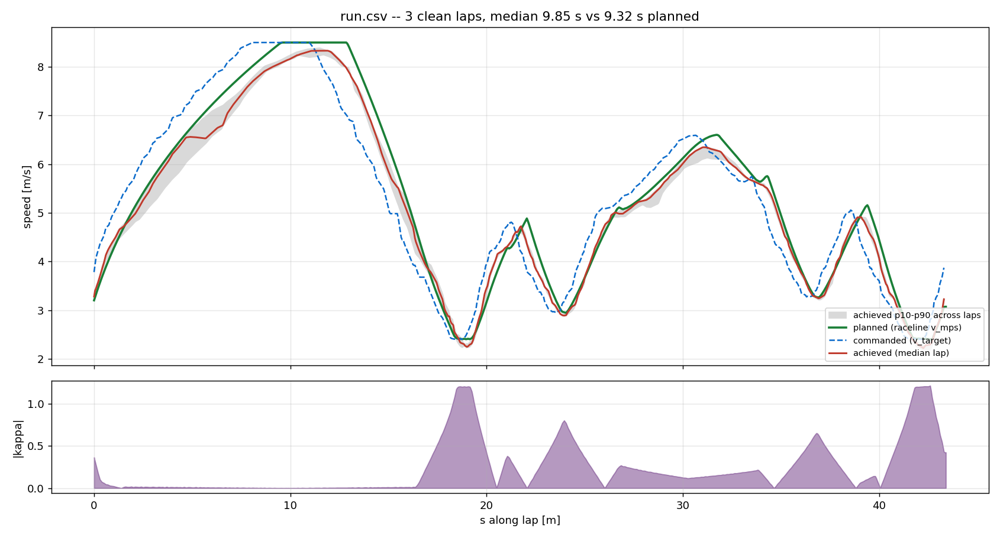
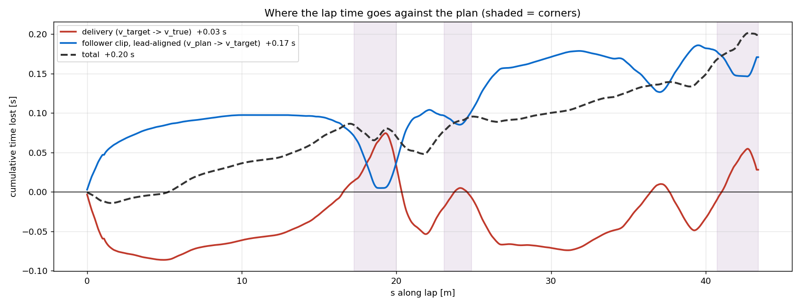

# T05d — h70b_warm30

- **date** 2026-09-17  **line** `raceline_tum_iqp_h7.0_a7.0b.csv` (profile 9.31 s)  **loop cap** 45  **laps asked** 2
- **overrides** `control_hz:=45 warmup_v_max:=3.0 warmup_dist_m:=19.5`
- **hypothesis** Out-lap robustness: warmup_v_max 3.0 over 19.5 m (was 4.0 over 19) gives AMCL more scans per metre through hairpin 1, so the +0.6 m along-track start-straight error is corrected before turn-in; control_hz 45 as T03
- **prediction** 0 contacts on the out-lap in 4 of 4 repeats; hairpin-1 entry along error |.| < 0.3 m

## Result

| timed laps | contacts | best | median | mean | std | worst | <10 s | gap to profile | loop Hz | delay |
|---|---|---|---|---|---|---|---|---|---|---|
| 2 | 0 | 9.806 | 9.866 | 9.866 | 0.061 | 9.927 | 2 | 0.556 | 24.2 | 0.124 |

First contact: none

| tracking (timed laps) | mean | p90 | max |
|---|---|---|---|
| |e_lat| m | 0.117 | 0.267 | 0.604 |
| outward m | 0.035 | 0.260 | 0.604 |
| localization m | 0.174 | 0.423 | 0.678 |
| a_lat m/s² | 3.537 | 6.672 | 8.022 |
| |v_est − v| m/s | 0.216 | 0.428 | 1.111 |

Body clearance: min 0.025 m, p05 0.103 m.  Steering at lock: 0.0 % of ticks.

| corner | s | side | κ | v plan apex | v true apex | worst outward | |e| p90 | min clearance | a_lat max | at lock % |
|---|---|---|---|---|---|---|---|---|---|---|
| C1 | 0.0-0.0 | L | 0.36 | 3.2 | 3.53 | 0.272 | 0.262 | 0.25 | 5.17 | 0.0 |
| C2 | 17.2-20.1 | L | 1.2 | 2.41 | 2.31 | 0.604 | 0.515 | 0.09 | 7.95 | 0.0 |
| C3 | 21.1-21.2 | R | 0.38 | 4.28 | 4.34 | -0.072 | 0.254 | 0.19 | 4.71 | 0.0 |
| C4 | 23.0-24.9 | L | 0.8 | 2.96 | 2.93 | 0.15 | 0.186 | 0.025 | 7.56 | 0.0 |
| C5 | 35.9-37.6 | L | 0.66 | 3.27 | 3.27 | 0.147 | 0.127 | 0.212 | 7.26 | 0.0 |
| C6 | 40.7-43.3 | L | 1.21 | 2.4 | 2.34 | 0.301 | 0.198 | 0.168 | 8.02 | 0.0 |

Gates: 50 clean laps **no**, mean < 10 s (worst < 10.2) **PASS**

## Figures

Time-loss split (plot_speed_tracking.py): see `speed_tracking.txt`.

## Verdict

_to be written after reading the figures_
