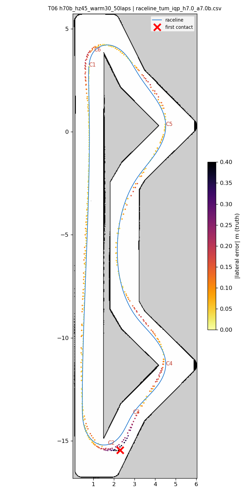
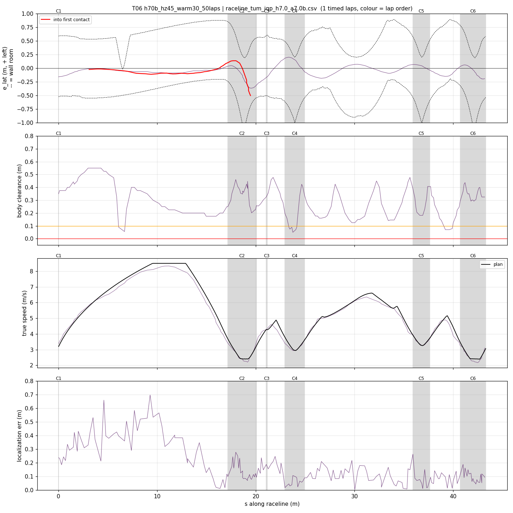
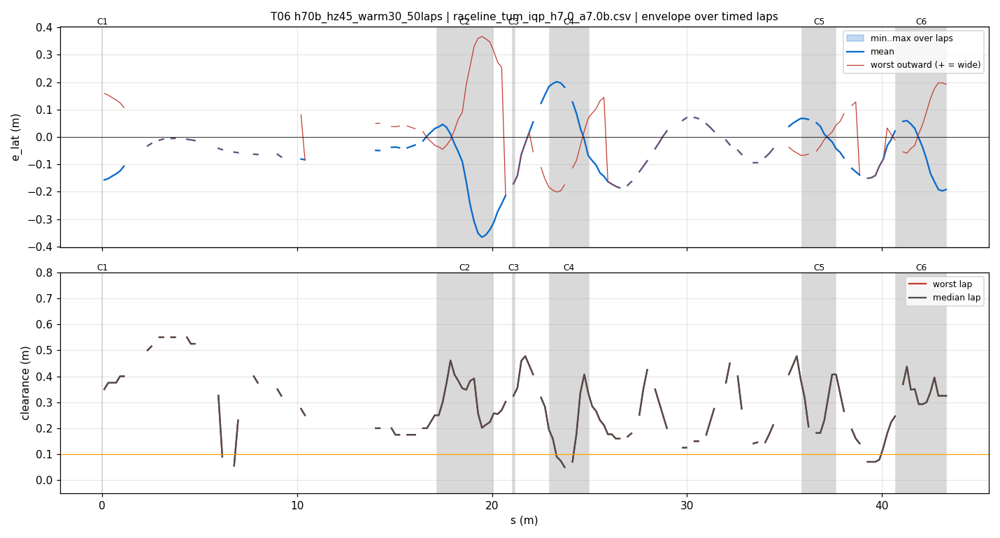
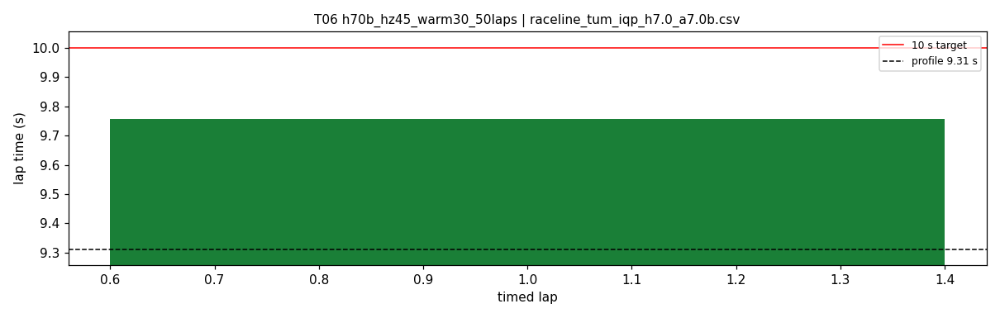
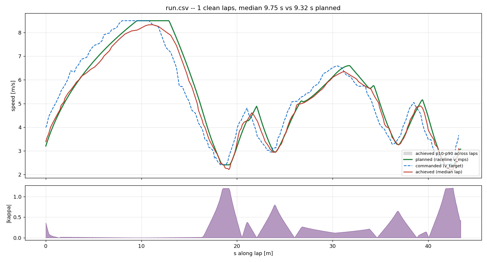
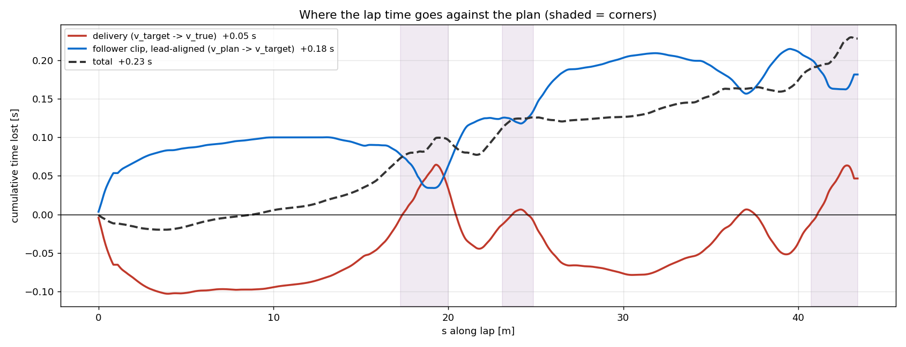

# T06 — h70b_hz45_warm30_50laps

- **date** 2026-09-17  **line** `raceline_tum_iqp_h7.0_a7.0b.csv` (profile 9.31 s)  **loop cap** 45  **laps asked** 50
- **overrides** `control_hz:=45 warmup_v_max:=3.0 warmup_dist_m:=19.5`
- **hypothesis** The two accepted changes together (control_hz 45 from T03, warmup 3.0 over 19.5 m from T05) pass the 50-lap gate under 10 s
- **prediction** 0 contacts in 50 laps; mean 9.6-9.75 (thermal drift), worst < 10.0

## Result

| timed laps | contacts | best | median | mean | std | worst | <10 s | gap to profile | loop Hz | delay |
|---|---|---|---|---|---|---|---|---|---|---|
| 1 | 5 | 9.757 | 9.757 | 9.757 | — | 9.757 | 1 | 0.447 | 24.8 | 0.121 |

First contact: +28.4 s at s = 19.46 m

| tracking (timed laps) | mean | p90 | max |
|---|---|---|---|
| |e_lat| m | 0.097 | 0.197 | 0.367 |
| outward m | 0.015 | 0.189 | 0.367 |
| localization m | 0.167 | 0.383 | 0.696 |
| a_lat m/s² | 3.643 | 6.441 | 7.843 |
| |v_est − v| m/s | 0.192 | 0.386 | 0.684 |

Body clearance: min 0.05 m, p05 0.09 m.  Steering at lock: 0.0 % of ticks.

| corner | s | side | κ | v plan apex | v true apex | worst outward | |e| p90 | min clearance | a_lat max | at lock % |
|---|---|---|---|---|---|---|---|---|---|---|
| C1 | 0.0-0.0 | L | 0.36 | 3.2 | 3.54 | 0.158 | 0.157 | 0.35 | 3.22 | 0.0 |
| C2 | 17.2-20.1 | L | 1.2 | 2.41 | 2.27 | 0.367 | 0.356 | 0.2 | 7.42 | 0.0 |
| C3 | 21.1-21.2 | R | 0.38 | 4.28 | 4.30 | -0.064 | 0.227 | 0.28 | 4.13 | 0.0 |
| C4 | 23.0-24.9 | L | 0.8 | 2.96 | 2.98 | 0.103 | 0.195 | 0.05 | 7.51 | 0.0 |
| C5 | 35.9-37.6 | L | 0.66 | 3.27 | 3.30 | 0.085 | 0.068 | 0.182 | 6.18 | 0.0 |
| C6 | 40.7-43.3 | L | 1.21 | 2.4 | 2.32 | 0.197 | 0.193 | 0.18 | 6.9 | 0.0 |

Gates: 50 clean laps **no**, mean < 10 s (worst < 10.2) **PASS**

## Figures

Time-loss split (plot_speed_tracking.py): see `speed_tracking.txt`.

## Verdict

Out-lap clean (warmup 3.0 holds). Timed lap 1 9.757. Lap 2, hairpin 1: through the braking zone v_est read 0.4-0.8 m/s above truth (4.83 vs 4.05, 4.50 vs 3.95), so the slip band braked too little and the car entered at 3.3-3.7 against a 2.4-3.0 target; at 2.9 m/s the curvature cap (7/v^2 = 0.83) held steering at 0.4-0.55 against kappa 1.2 and it ran 0.62 m wide; localization 2-12 cm. Then blind rehits (5 in the simulator's count). The E02 mechanism, with enc_rate_window_s 0.05 (~2 frames). Next: 0.10 (T07), which held v_est within 0.1-0.3 in E03.
