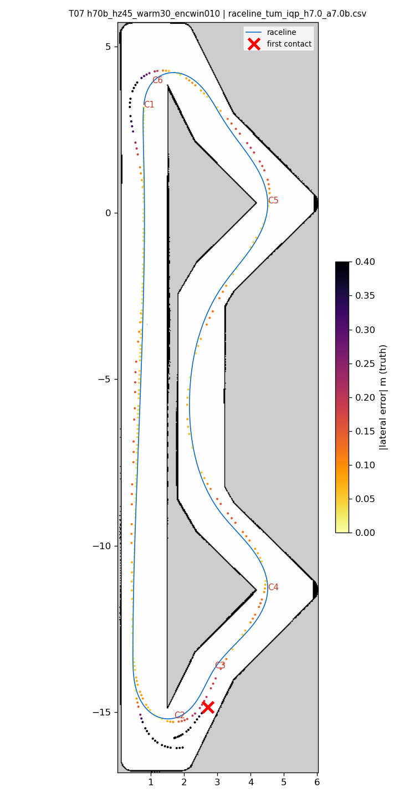
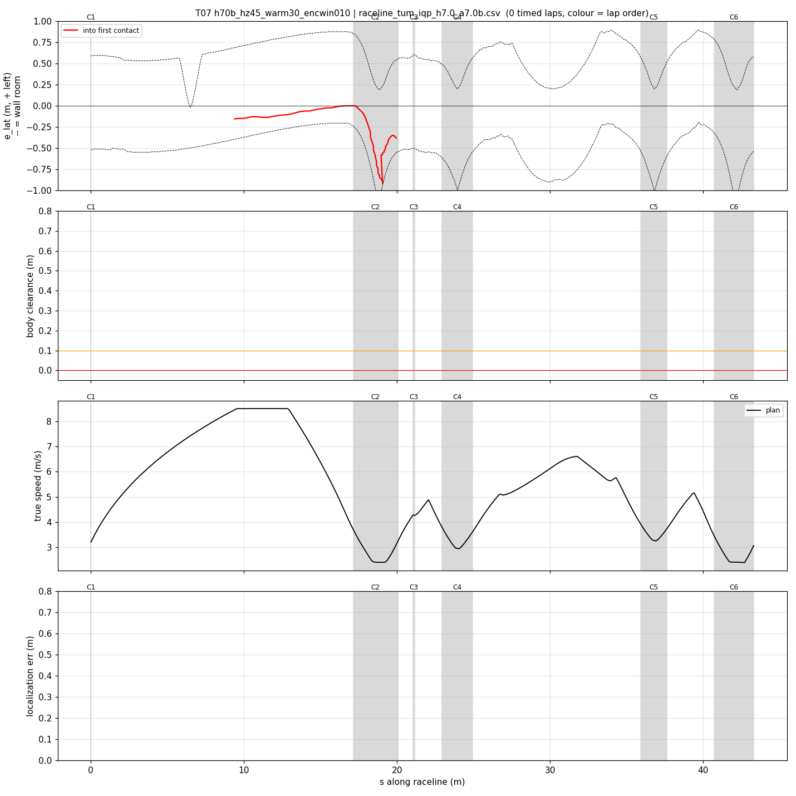
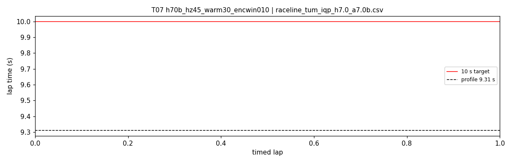

# T07 — h70b_hz45_warm30_encwin010

- **date** 2026-09-17  **line** `raceline_tum_iqp_h7.0_a7.0b.csv` (profile 9.31 s)  **loop cap** 45  **laps asked** 25
- **overrides** `control_hz:=45 warmup_v_max:=3.0 warmup_dist_m:=19.5 enc_rate_window_s:=0.10`
- **hypothesis** enc_rate_window_s 0.05 -> 0.10 (~4.5 frames at 45 Hz) removes the braking-zone speed over-read seen in T06 (and E02), so the car reaches hairpin 1 at the planned speed
- **prediction** 0 contacts in 25 laps; |v_est - v| p90 < 0.3; hairpin 1 worst outward < 0.35 m; mean 9.6-9.75

## Result

| timed laps | contacts | best | median | mean | std | worst | <10 s | gap to profile | loop Hz | delay |
|---|---|---|---|---|---|---|---|---|---|---|
| 0 | 2 | — | — | — | — | — | 0 | — | 24.8 | 0.121 |

First contact: +19.6 s at s = 19.96 m

| tracking (timed laps) | mean | p90 | max |
|---|---|---|---|
| |e_lat| m | 0.141 | 0.575 | 0.915 |
| outward m | 0.090 | 0.575 | 0.915 |
| localization m | 1.466 | 3.779 | 4.847 |
| a_lat m/s² | 1.592 | 5.310 | 7.742 |
| |v_est − v| m/s | 0.283 | 0.620 | 2.056 |

Body clearance: min 0.025 m, p05 0.106 m.  Steering at lock: 7.81 % of ticks.

| corner | s | side | κ | v plan apex | v true apex | worst outward | |e| p90 | min clearance | a_lat max | at lock % |
|---|---|---|---|---|---|---|---|---|---|---|
| C1 | 0.0-0.0 | L | 0.36 | 3.2 | 0.27 | 0.412 | 0.022 | 0.125 | 7.19 | 0.0 |
| C2 | 17.2-20.1 | L | 1.2 | 2.41 | 0.81 | 0.915 | 0.62 | 0.05 | 6.97 | 37.6 |
| C3 | 21.1-21.2 | R | 0.38 | 4.28 | 0.33 | 0.357 | 0.108 | 0.025 | 5.22 | 0.0 |
| C4 | 23.0-24.9 | L | 0.8 | 2.96 | 2.94 | 0.084 | 0.13 | 0.112 | 6.81 | 0.0 |
| C5 | 35.9-37.6 | L | 0.66 | 3.27 | 3.44 | 0.179 | 0.172 | 0.212 | 7.66 | 0.0 |
| C6 | 40.7-43.3 | L | 1.21 | 2.4 | 2.34 | 0.422 | 0.409 | 0.1 | 7.71 | 0.0 |

Gates: 50 clean laps **no**, mean < 10 s (worst < 10.2) **no**

## Figures

Time-loss split (plot_speed_tracking.py): see `speed_tracking.txt`.

## Verdict

Out-lap (warmup 3.0 active, car at 3.07 m/s) hit at hairpin 1: estimate 0.82 m BEHIND along-track at entry (T04 was 0.6 AHEAD), turn-in late, e_lat -0.07 -> -0.88, contact; the error collapsed to 0.14 m within ~1 m once the hairpin walls were in view. Out-lap hairpin-1 record on this line: 3 contacts in 8 (T02, T04, T07). enc_rate_window_s 0.10 never reached a timed lap. Next: slower warmup (2.0 over 21 m).
