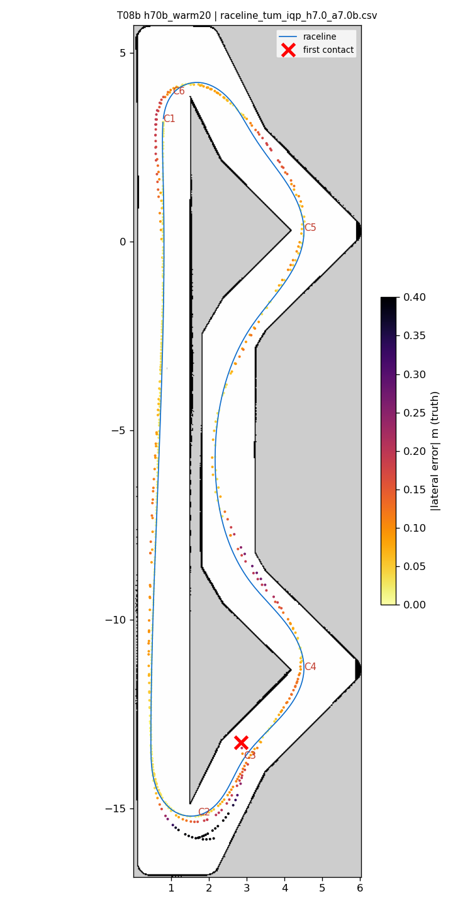
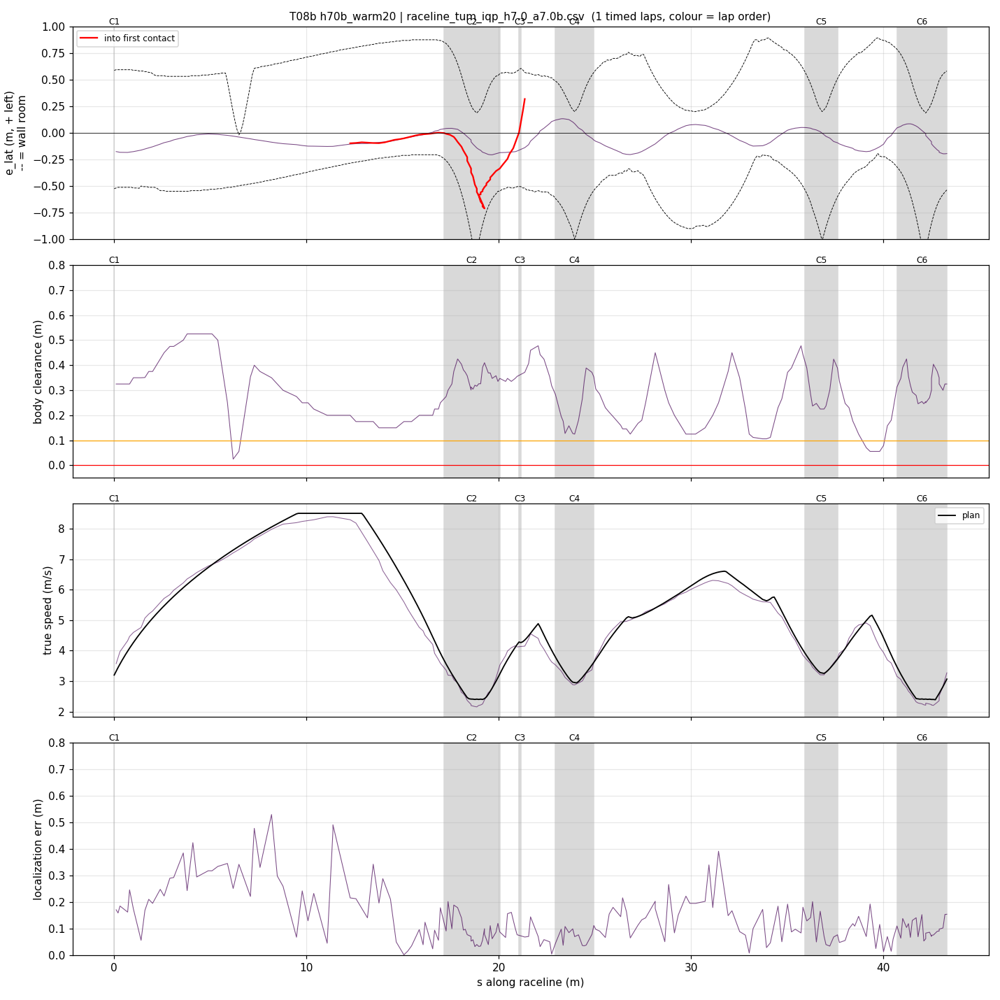
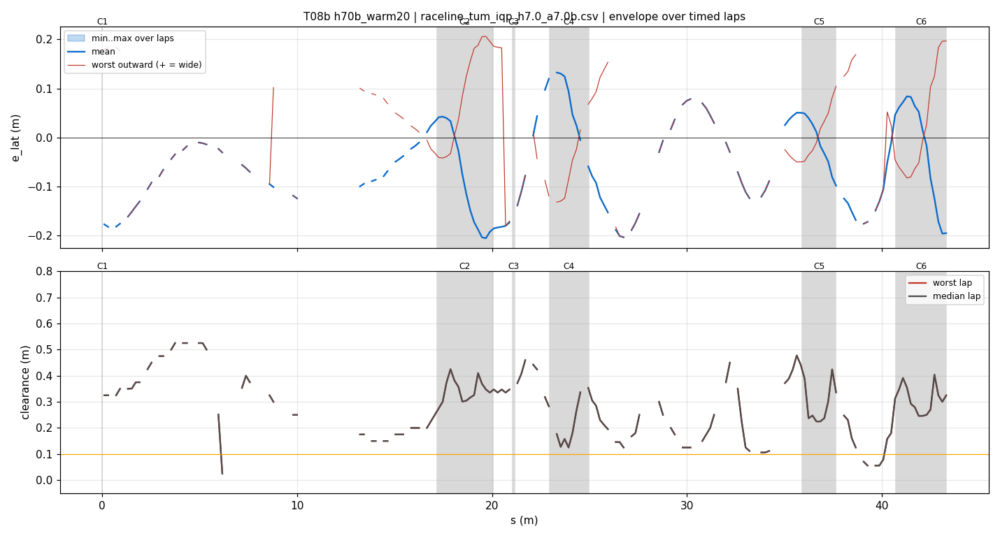
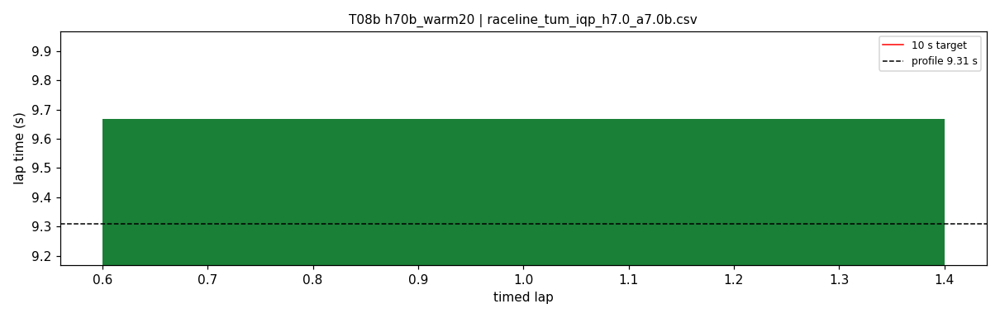
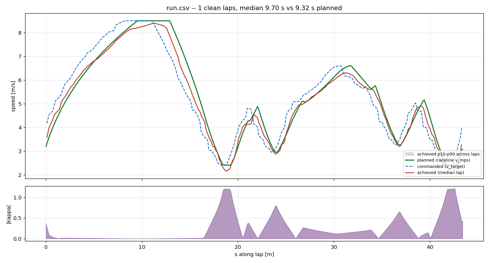
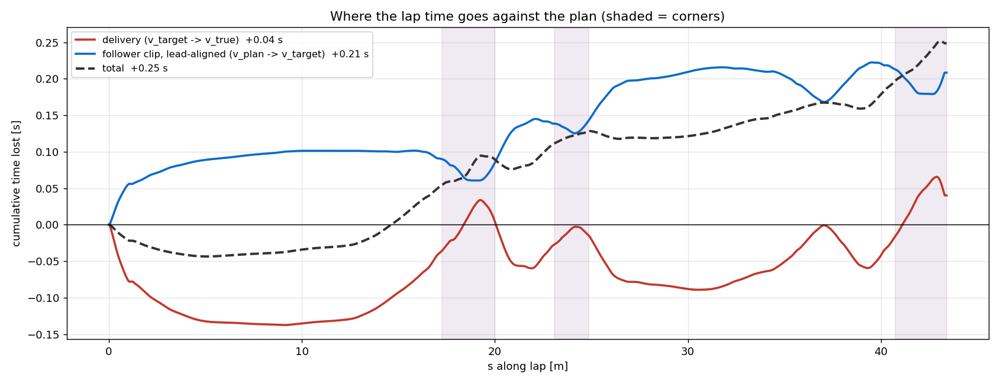

# T08b — h70b_warm20

- **date** 2026-09-17  **line** `raceline_tum_iqp_h7.0_a7.0b.csv` (profile 9.31 s)  **loop cap** 45  **laps asked** 2
- **overrides** `control_hz:=45 warmup_v_max:=2.0 warmup_dist_m:=21.0 enc_rate_window_s:=0.10`
- **hypothesis** Out-lap: warmup_v_max 2.0 over 21 m lets AMCL snap to the hairpin-1 walls (error collapses within ~1 m of them) before turn-in, whichever sign the start-straight along error takes (+0.6 T04, -0.8 T07)
- **prediction** out-lap clean 4/4; timed laps clean with enc_rate_window_s 0.10

## Result

| timed laps | contacts | best | median | mean | std | worst | <10 s | gap to profile | loop Hz | delay |
|---|---|---|---|---|---|---|---|---|---|---|
| 1 | 3 | 9.668 | 9.668 | 9.668 | — | 9.668 | 1 | 0.358 | 22.5 | 0.133 |

First contact: +32.9 s at s = 21.35 m

| tracking (timed laps) | mean | p90 | max |
|---|---|---|---|
| |e_lat| m | 0.092 | 0.183 | 0.206 |
| outward m | 0.006 | 0.176 | 0.206 |
| localization m | 0.137 | 0.281 | 0.529 |
| a_lat m/s² | 3.480 | 6.505 | 7.999 |
| |v_est − v| m/s | 0.223 | 0.472 | 0.698 |

Body clearance: min 0.025 m, p05 0.112 m.  Steering at lock: 0.0 % of ticks.

| corner | s | side | κ | v plan apex | v true apex | worst outward | |e| p90 | min clearance | a_lat max | at lock % |
|---|---|---|---|---|---|---|---|---|---|---|
| C1 | 0.0-0.0 | L | 0.36 | 3.2 | 3.77 | 0.183 | 0.182 | 0.325 | 3.71 | 0.0 |
| C2 | 17.2-20.1 | L | 1.2 | 2.41 | 2.25 | 0.206 | 0.197 | 0.225 | 7.89 | 0.0 |
| C3 | 21.1-21.2 | R | 0.38 | 4.28 | 4.14 | -0.078 | 0.179 | 0.335 | 2.66 | 0.0 |
| C4 | 23.0-24.9 | L | 0.8 | 2.96 | 2.93 | 0.093 | 0.131 | 0.125 | 6.98 | 0.0 |
| C5 | 35.9-37.6 | L | 0.66 | 3.27 | 3.26 | 0.125 | 0.1 | 0.225 | 7.62 | 0.0 |
| C6 | 40.7-43.3 | L | 1.21 | 2.4 | 2.30 | 0.197 | 0.189 | 0.158 | 6.76 | 0.0 |

Gates: 50 clean laps **no**, mean < 10 s (worst < 10.2) **PASS**

## Figures

Time-loss split (plot_speed_tracking.py): see `speed_tracking.txt`.

## Verdict

_to be written after reading the figures_
