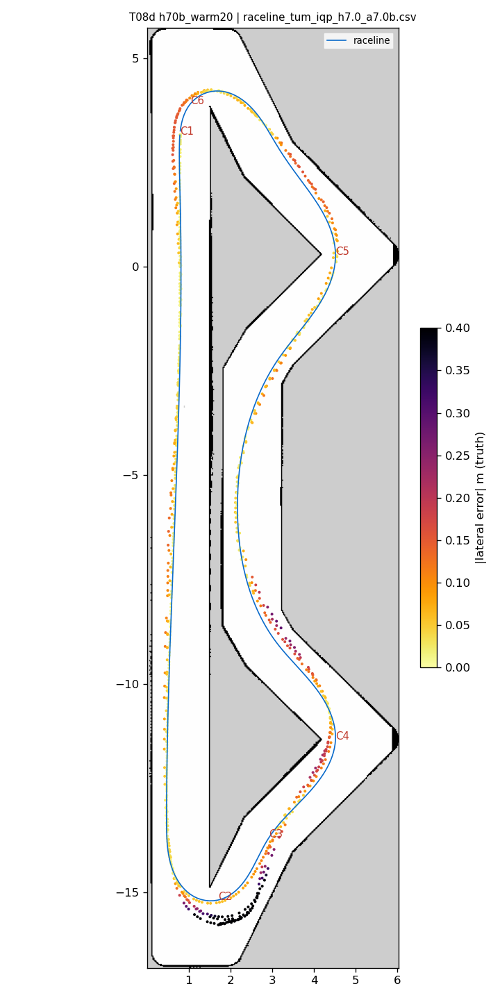
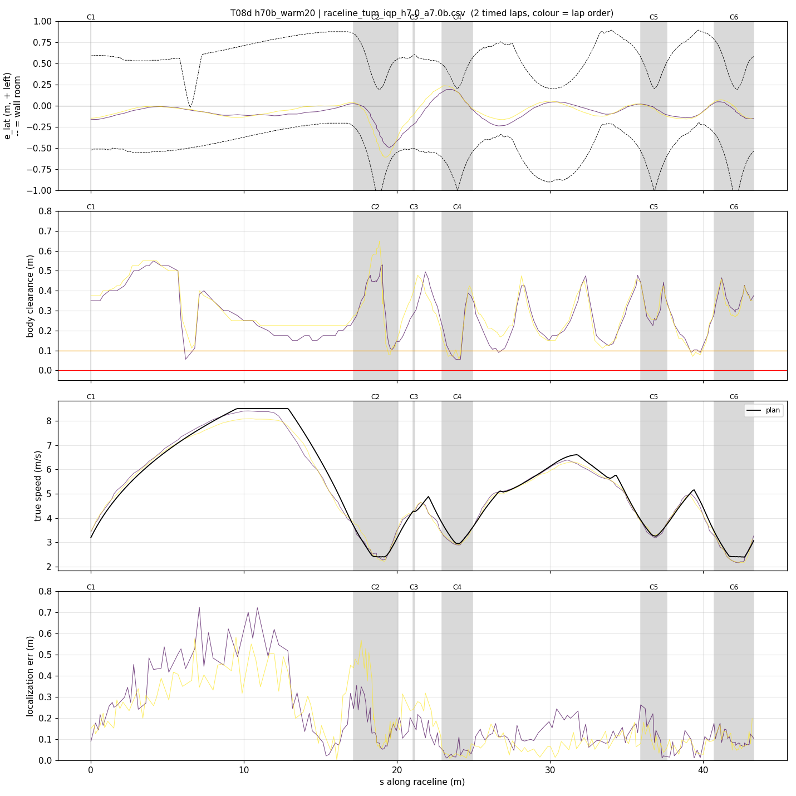
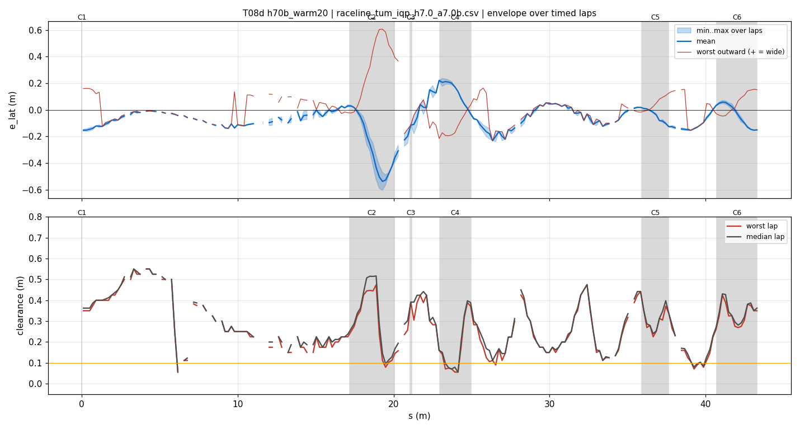
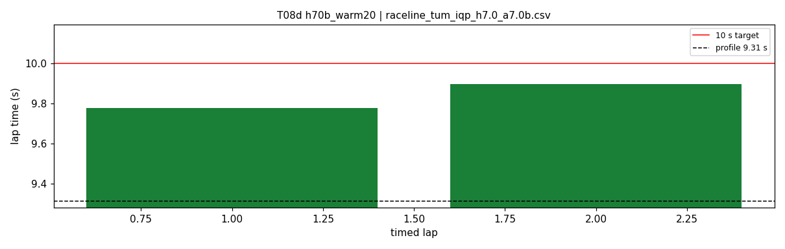
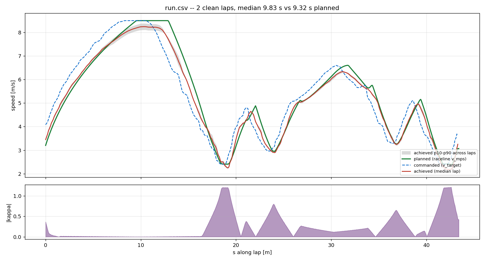
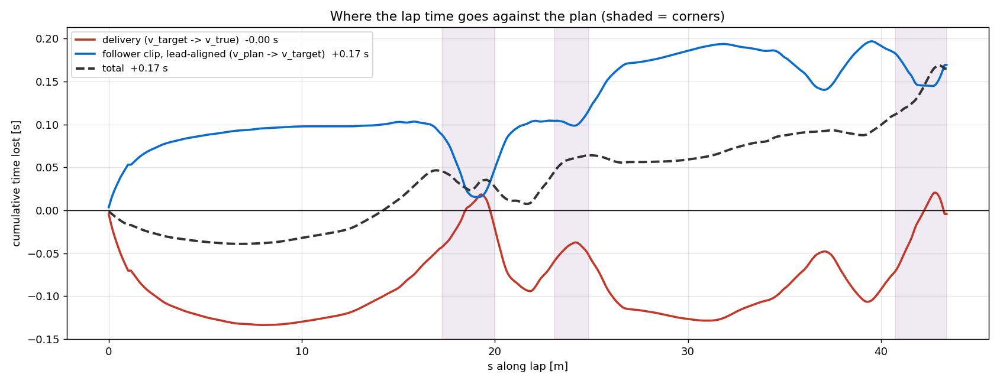

# T08d — h70b_warm20

- **date** 2026-09-17  **line** `raceline_tum_iqp_h7.0_a7.0b.csv` (profile 9.31 s)  **loop cap** 45  **laps asked** 2
- **overrides** `control_hz:=45 warmup_v_max:=2.0 warmup_dist_m:=21.0 enc_rate_window_s:=0.10`
- **hypothesis** Out-lap: warmup_v_max 2.0 over 21 m lets AMCL snap to the hairpin-1 walls (error collapses within ~1 m of them) before turn-in, whichever sign the start-straight along error takes (+0.6 T04, -0.8 T07)
- **prediction** out-lap clean 4/4; timed laps clean with enc_rate_window_s 0.10

## Result

| timed laps | contacts | best | median | mean | std | worst | <10 s | gap to profile | loop Hz | delay |
|---|---|---|---|---|---|---|---|---|---|---|
| 2 | 0 | 9.779 | 9.838 | 9.838 | 0.059 | 9.896 | 2 | 0.527 | 24.2 | 0.124 |

First contact: none

| tracking (timed laps) | mean | p90 | max |
|---|---|---|---|
| |e_lat| m | 0.121 | 0.272 | 0.607 |
| outward m | 0.037 | 0.263 | 0.607 |
| localization m | 0.176 | 0.432 | 0.723 |
| a_lat m/s² | 3.602 | 6.548 | 7.993 |
| |v_est − v| m/s | 0.188 | 0.395 | 0.748 |

Body clearance: min 0.056 m, p05 0.098 m.  Steering at lock: 0.0 % of ticks.

| corner | s | side | κ | v plan apex | v true apex | worst outward | |e| p90 | min clearance | a_lat max | at lock % |
|---|---|---|---|---|---|---|---|---|---|---|
| C1 | 0.0-0.0 | L | 0.36 | 3.2 | 3.64 | 0.161 | 0.161 | 0.35 | 4.93 | 0.0 |
| C2 | 17.2-20.1 | L | 1.2 | 2.41 | 2.32 | 0.607 | 0.572 | 0.079 | 7.81 | 0.0 |
| C3 | 21.1-21.2 | R | 0.38 | 4.28 | 4.29 | 0.002 | 0.253 | 0.236 | 6.17 | 0.0 |
| C4 | 23.0-24.9 | L | 0.8 | 2.96 | 2.93 | 0.125 | 0.22 | 0.056 | 7.39 | 0.0 |
| C5 | 35.9-37.6 | L | 0.66 | 3.27 | 3.27 | 0.145 | 0.127 | 0.225 | 7.13 | 0.0 |
| C6 | 40.7-43.3 | L | 1.21 | 2.4 | 2.24 | 0.155 | 0.149 | 0.146 | 6.61 | 0.0 |

Gates: 50 clean laps **no**, mean < 10 s (worst < 10.2) **PASS**

## Figures

Time-loss split (plot_speed_tracking.py): see `speed_tracking.txt`.

## Verdict

_to be written after reading the figures_
