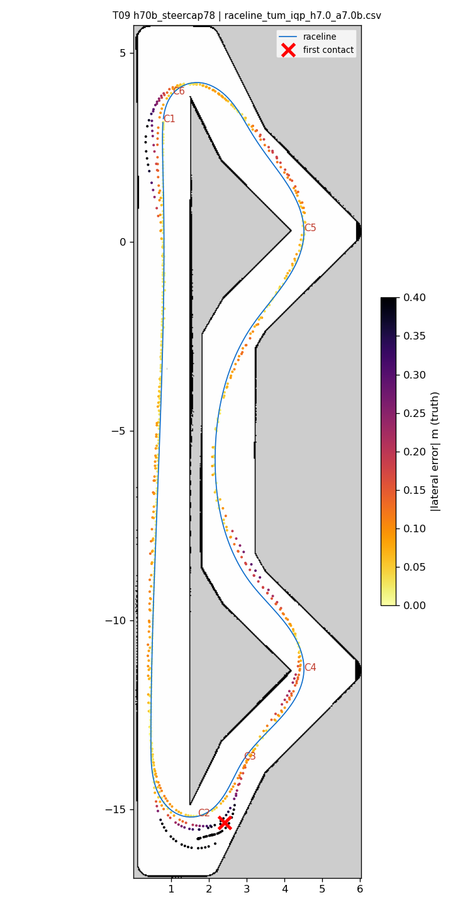
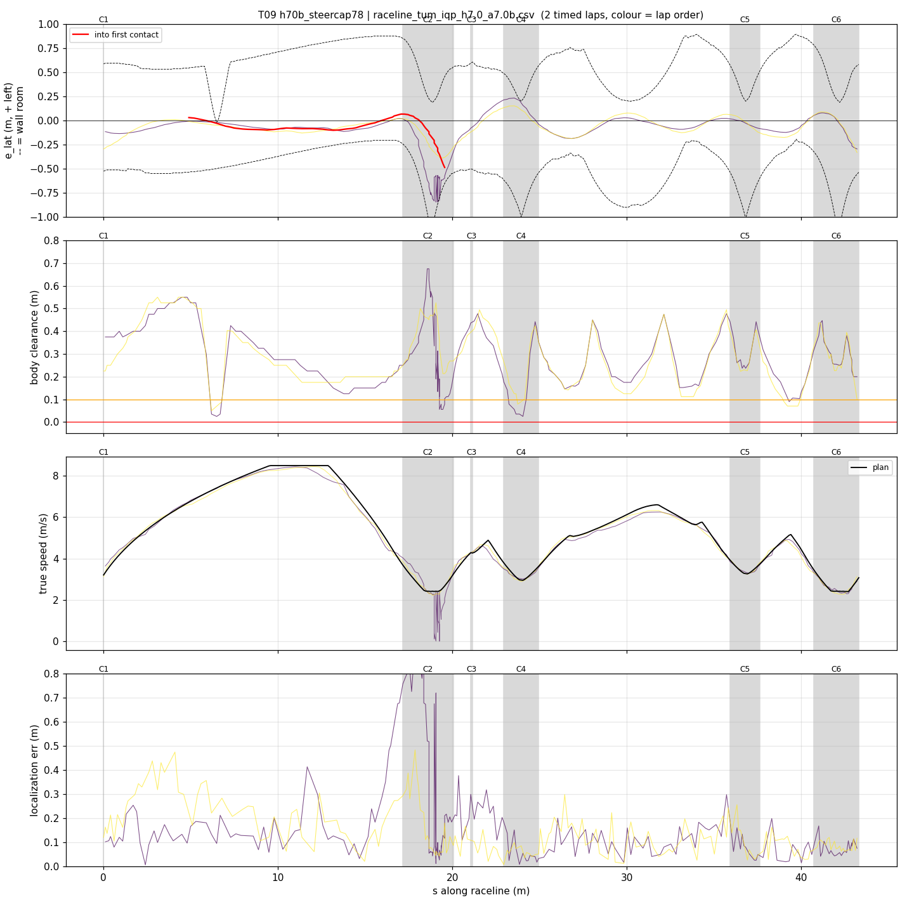
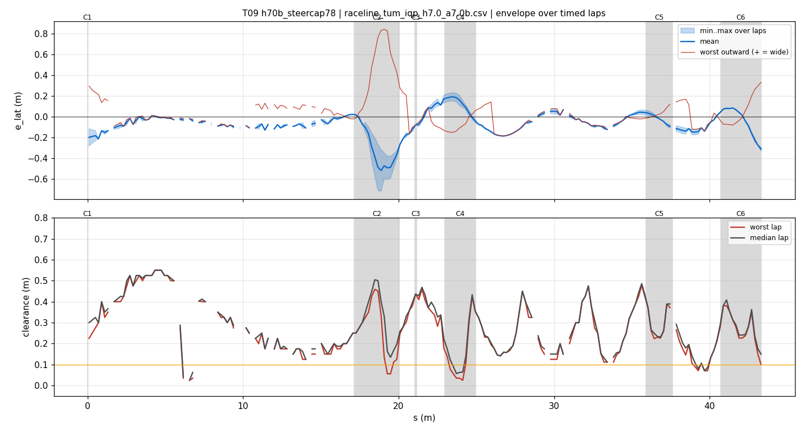
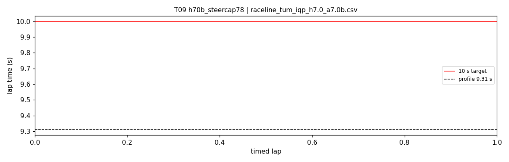

# T09 — h70b_steercap78

- **date** 2026-09-17  **line** `raceline_tum_iqp_h7.0_a7.0b.csv` (profile 9.31 s)  **loop cap** 45  **laps asked** 25
- **overrides** `control_hz:=45 warmup_v_max:=2.0 warmup_dist_m:=21.0 enc_rate_window_s:=0.10 steer_a_lat_max:=7.8`
- **hypothesis** The follower's curvature cap steer_a_lat_max 7.0 equals the line's planned 7.0 m/s^2, so at the hairpin apex speed (2.4-2.5 m/s) it allows kappa 1.12-1.21 against the path's 1.20: zero steering headroom to correct any drift (T06, T08b ran 0.6 m wide at 0.64 steer). 7.8 gives ~11 % headroom
- **prediction** 0 contacts in 25 laps; hairpin 1/2 worst outward < 0.35 m; steering at lock stays ~0 %; mean 9.6-9.7

## Result

| timed laps | contacts | best | median | mean | std | worst | <10 s | gap to profile | loop Hz | delay |
|---|---|---|---|---|---|---|---|---|---|---|
| 0 | 3 | — | — | — | — | — | 0 | — | 25.6 | 0.117 |

First contact: +44.6 s at s = 19.56 m

| tracking (timed laps) | mean | p90 | max |
|---|---|---|---|
| |e_lat| m | 0.185 | 0.580 | 0.844 |
| outward m | 0.114 | 0.580 | 0.844 |
| localization m | 0.147 | 0.298 | 0.925 |
| a_lat m/s² | 3.313 | 6.540 | 8.778 |
| |v_est − v| m/s | 0.398 | 0.677 | 2.427 |

Body clearance: min 0.025 m, p05 0.09 m.  Steering at lock: 2.02 % of ticks.

| corner | s | side | κ | v plan apex | v true apex | worst outward | |e| p90 | min clearance | a_lat max | at lock % |
|---|---|---|---|---|---|---|---|---|---|---|
| C1 | 0.0-0.0 | L | 0.36 | 3.2 | 3.51 | 0.295 | 0.289 | 0.225 | 7.33 | 0.0 |
| C2 | 17.2-20.1 | L | 1.2 | 2.41 | 0.77 | 0.844 | 0.623 | 0.056 | 8.02 | 7.4 |
| C3 | 21.1-21.2 | R | 0.38 | 4.28 | 4.25 | -0.02 | 0.165 | 0.313 | 6.34 | 0.0 |
| C4 | 23.0-24.9 | L | 0.8 | 2.96 | 3.00 | 0.097 | 0.218 | 0.025 | 7.56 | 0.0 |
| C5 | 35.9-37.6 | L | 0.66 | 3.27 | 3.34 | 0.156 | 0.12 | 0.212 | 7.75 | 0.0 |
| C6 | 40.7-43.3 | L | 1.21 | 2.4 | 2.41 | 0.332 | 0.252 | 0.1 | 8.22 | 0.0 |

Gates: 50 clean laps **no**, mean < 10 s (worst < 10.2) **no**

## Figures

Time-loss split (plot_speed_tracking.py): see `speed_tracking.txt`.

## Verdict

Rejected. Two contacts, both hairpin 1. At the timed-lap hit: speed on plan (2.26-2.44 vs 2.41), localization 7 cm, steering 0.72-0.82 (the raised cap was not binding), yet achieved curvature 0.65-0.95 against the path's 1.20 and the car ran 0.58 m wide: the tire, not the cap. Consistent with the lock analysis (kappa ~1.0 at 2.0-2.6 m/s near lock). The 7.0 m/s^2 hairpins of this line are beyond this car; T03's clean run was marginal (worst outward 0.44). Next: hairpins profiled at 6.0 on the same geometry (T10).
