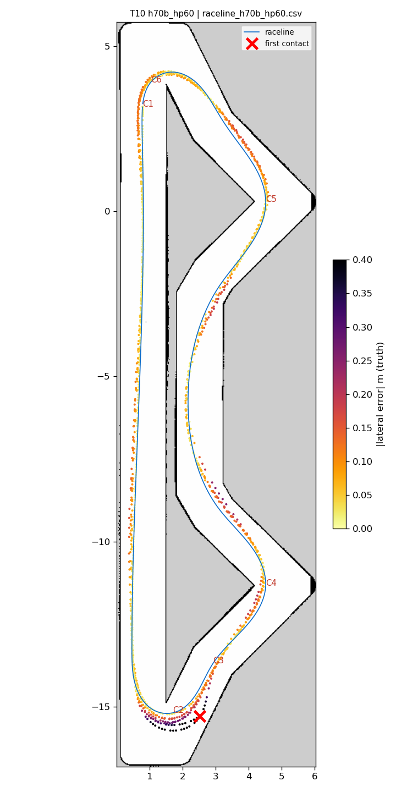
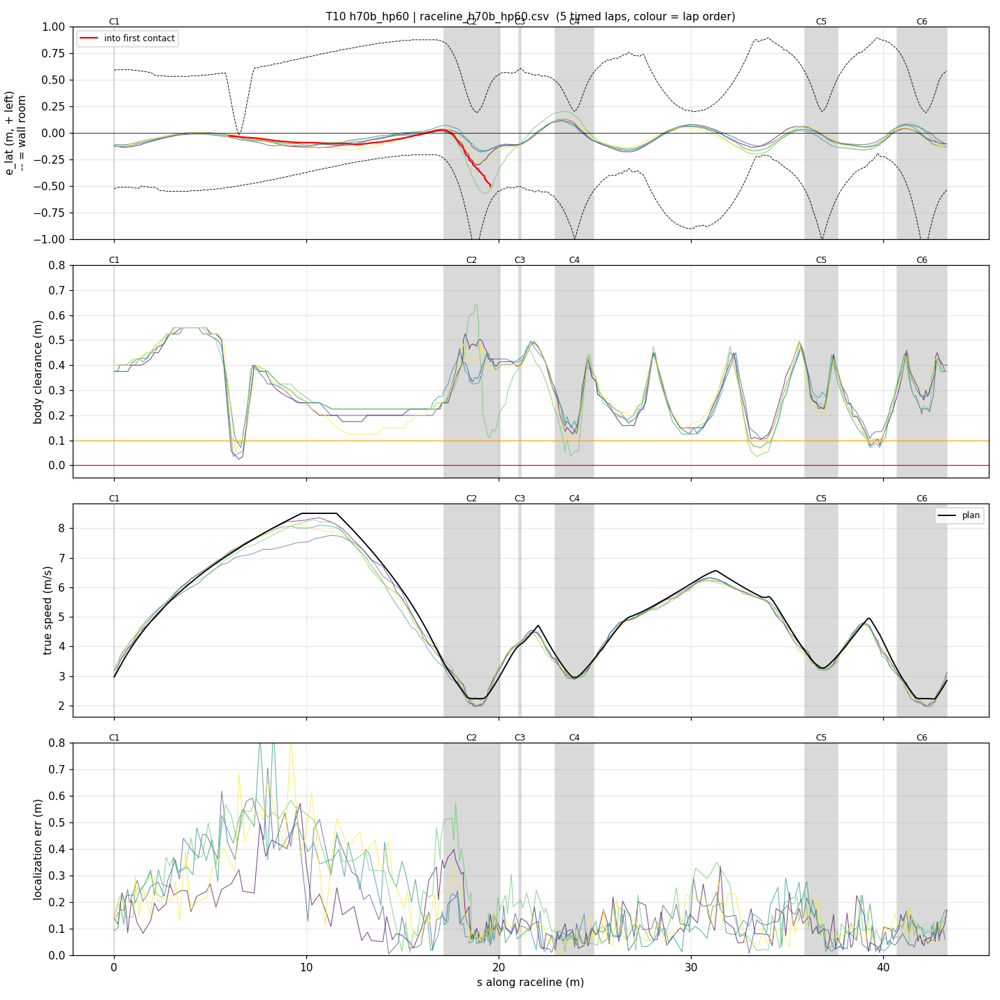
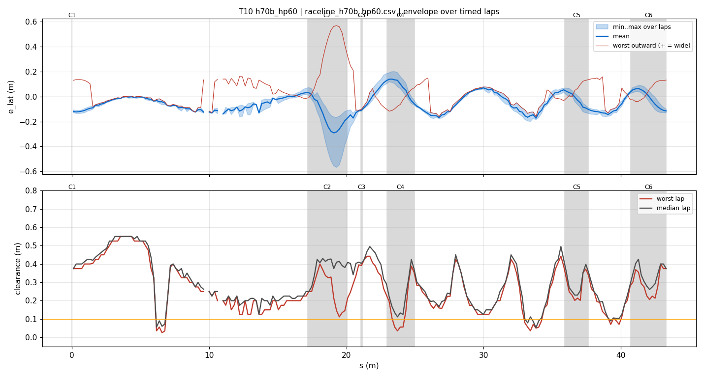
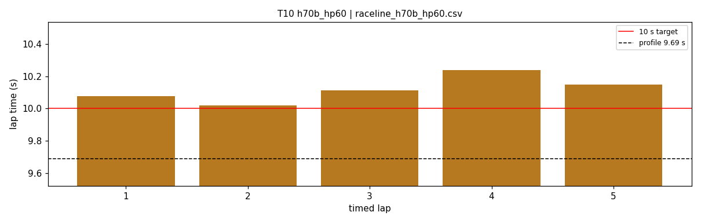
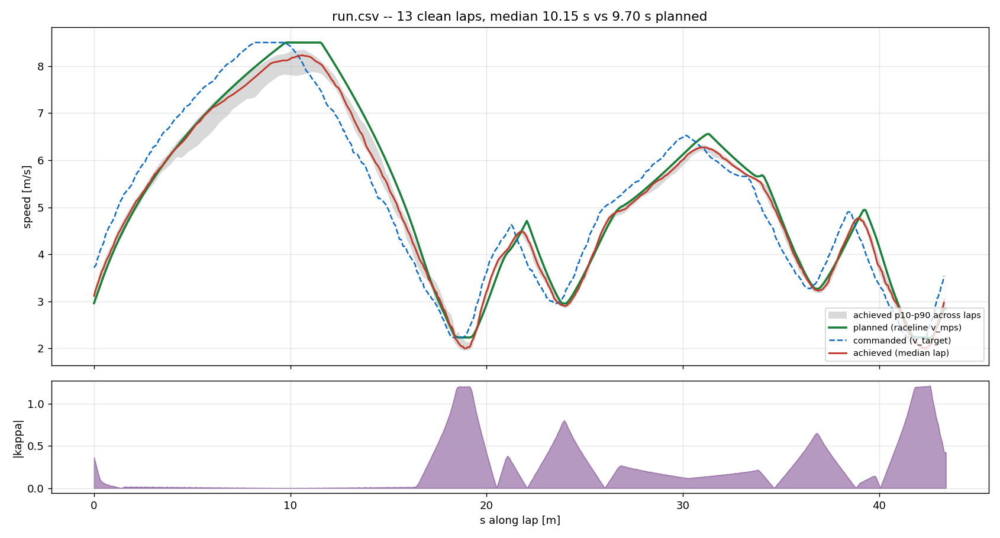
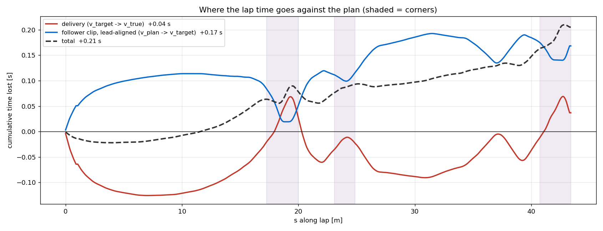

# T10 — h70b_hp60

- **date** 2026-09-17  **line** `raceline_h70b_hp60.csv` (profile 9.689 s)  **loop cap** 45  **laps asked** 25
- **overrides** `control_hz:=45 warmup_v_max:=2.0 warmup_dist_m:=21.0 enc_rate_window_s:=0.10`
- **hypothesis** Same geometry as the teammates' line, hairpins (|kappa| > 1.0, +-1.2 m) profiled at 6.0 m/s^2 instead of 7.0 (apex 2.22 vs 2.41 m/s), rest unchanged (7.0 lateral, accel 5.0, brake 5.5, 8.5 m/s): the car stays inside the kappa it can achieve at hairpin speed; curvature cap 7.0 now leaves 18 % headroom at the apex
- **prediction** 0 contacts in 25 laps; hairpin worst outward < 0.3 m; mean 9.65-9.8 (about +0.1 s vs T03)

## Result

| timed laps | contacts | best | median | mean | std | worst | <10 s | gap to profile | loop Hz | delay |
|---|---|---|---|---|---|---|---|---|---|---|
| 5 | 2 | 10.020 | 10.113 | 10.119 | 0.073 | 10.238 | 0 | 0.424 | 25.1 | 0.119 |

First contact: +73.3 s at s = 19.56 m

| tracking (timed laps) | mean | p90 | max |
|---|---|---|---|
| |e_lat| m | 0.090 | 0.160 | 0.568 |
| outward m | 0.018 | 0.140 | 0.568 |
| localization m | 0.162 | 0.361 | 0.866 |
| a_lat m/s² | 3.342 | 6.212 | 8.049 |
| |v_est − v| m/s | 0.204 | 0.414 | 1.136 |

Body clearance: min 0.025 m, p05 0.106 m.  Steering at lock: 0.0 % of ticks.

| corner | s | side | κ | v plan apex | v true apex | worst outward | |e| p90 | min clearance | a_lat max | at lock % |
|---|---|---|---|---|---|---|---|---|---|---|
| C1 | 0.0-0.0 | L | 0.36 | 2.96 | 3.36 | 0.135 | 0.129 | 0.375 | 4.95 | 0.0 |
| C2 | 17.2-20.1 | L | 1.2 | 2.23 | 2.10 | 0.567 | 0.403 | 0.112 | 6.82 | 0.0 |
| C3 | 21.1-21.2 | R | 0.38 | 4.03 | 4.12 | -0.039 | 0.132 | 0.335 | 5.03 | 0.0 |
| C4 | 23.0-24.9 | L | 0.8 | 2.96 | 2.94 | 0.115 | 0.137 | 0.035 | 7.45 | 0.0 |
| C5 | 35.9-37.6 | L | 0.66 | 3.27 | 3.26 | 0.143 | 0.11 | 0.202 | 7.49 | 0.0 |
| C6 | 40.7-43.3 | L | 1.21 | 2.22 | 2.15 | 0.132 | 0.112 | 0.18 | 5.67 | 0.0 |

Gates: 50 clean laps **no**, mean < 10 s (worst < 10.2) **no**

## Figures

Time-loss split (plot_speed_tracking.py): see `speed_tracking.txt`.

## Verdict

Partial. First contact after 5 clean timed laps (T06-T09: inside lap 2), 15 timed laps at 9.99-10.38 s, 2 contacts: hairpin 1 exit (lap 7) and hairpin 2 exit (lap 16). Both at 2.1-2.5 m/s, localization 5-8 cm, steering 0.63-0.90, target rising 2.23 -> 2.89 and the car accelerating, achieved kappa 0.62-0.79 against 1.2-0.9: exit understeer under acceleration (ICRA run 14/15 signature). Slower hairpins alone cost 0.4 s and did not remove it. Next: accel_ff 0 on the fast line (T11).
