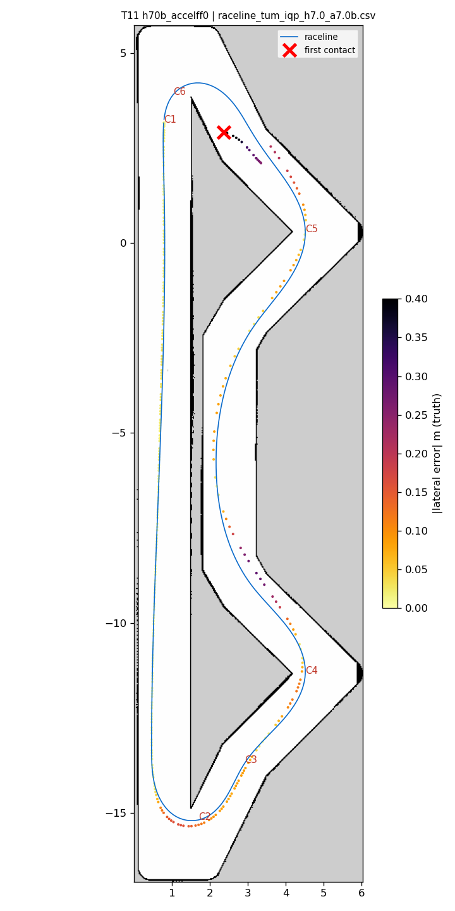
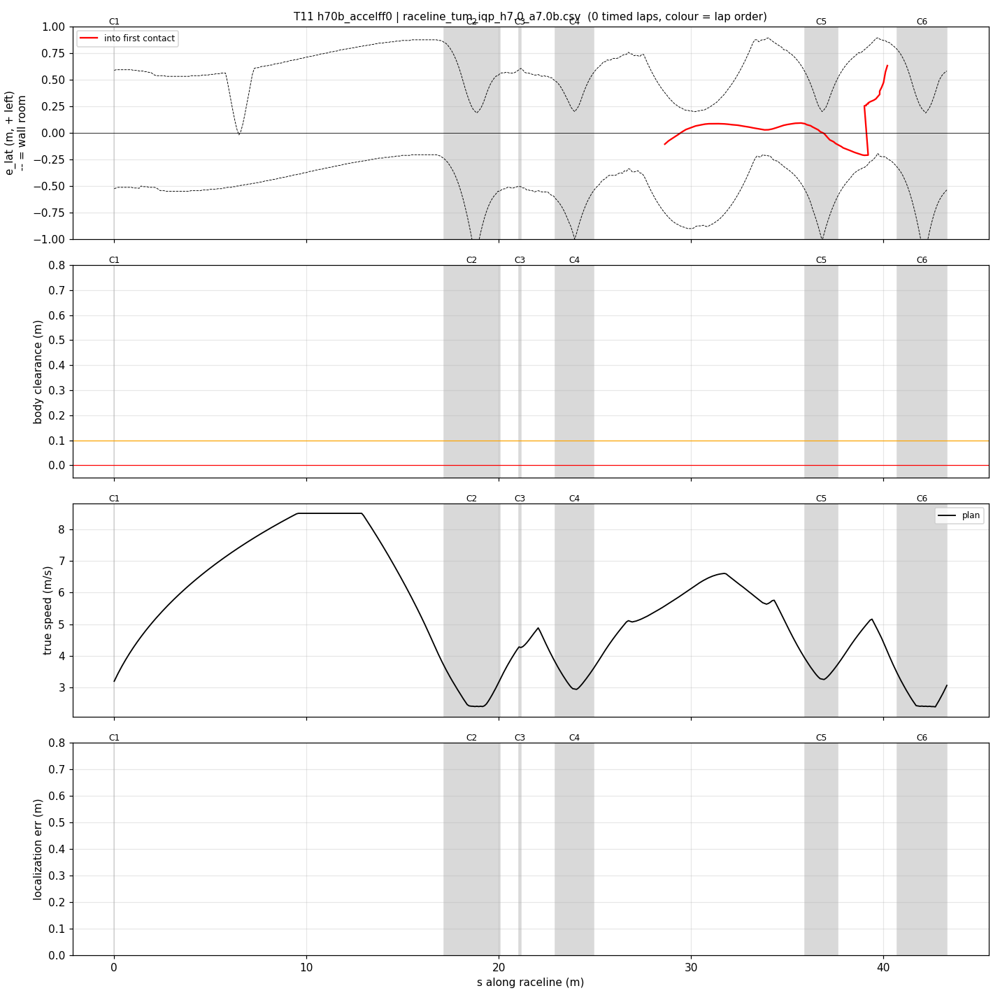
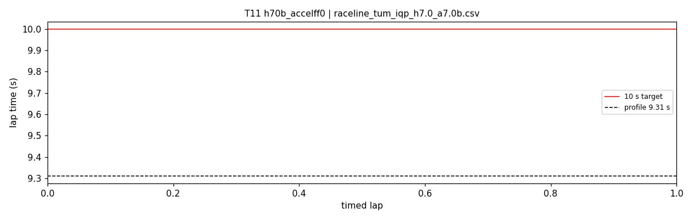

# T11 — h70b_accelff0

- **date** 2026-09-17  **line** `raceline_tum_iqp_h7.0_a7.0b.csv` (profile 9.31 s)  **loop cap** 45  **laps asked** 25
- **overrides** `control_hz:=45 warmup_v_max:=2.0 warmup_dist_m:=21.0 enc_rate_window_s:=0.10 accel_ff:=0.0`
- **hypothesis** Hairpin-exit contacts (T06-T10) happen while the car accelerates at 0.6-0.9 steering: accel_ff 1 feeds the plan's exit acceleration into the slip band at the moment the front tires are near their lateral limit; without it the exit throttle follows the speed error only, leaving grip for cornering
- **prediction** 0-1 contacts in 25 laps; hairpin exit worst outward < 0.35 m; mean 9.65-9.8 (slower exits)

## Result

| timed laps | contacts | best | median | mean | std | worst | <10 s | gap to profile | loop Hz | delay |
|---|---|---|---|---|---|---|---|---|---|---|
| 0 | 3 | — | — | — | — | — | 0 | — | 20.1 | 0.149 |

First contact: +18.2 s at s = 40.21 m

| tracking (timed laps) | mean | p90 | max |
|---|---|---|---|
| |e_lat| m | 0.159 | 0.371 | 0.661 |
| outward m | 0.072 | 0.289 | 0.501 |
| localization m | 1.501 | 4.732 | 10.585 |
| a_lat m/s² | 1.105 | 3.732 | 7.530 |
| |v_est − v| m/s | 0.412 | 1.288 | 4.135 |

Body clearance: min 0.025 m, p05 0.102 m.  Steering at lock: 40.62 % of ticks.

| corner | s | side | κ | v plan apex | v true apex | worst outward | |e| p90 | min clearance | a_lat max | at lock % |
|---|---|---|---|---|---|---|---|---|---|---|
| C1 | 0.0-0.0 | L | 0.36 | 3.2 | 0.16 | -0.014 | 0.02 | 0.525 | 0.13 | 0.0 |
| C2 | 17.2-20.1 | L | 1.2 | 2.41 | 1.88 | 0.162 | 0.154 | 0.225 | 4.45 | 0.0 |
| C3 | 21.1-21.2 | R | 0.38 | 4.28 | 2.14 | -0.024 | 0.087 | 0.43 | 1.48 | 0.0 |
| C4 | 23.0-24.9 | L | 0.8 | 2.96 | 2.85 | 0.133 | 0.12 | 0.1 | 6.54 | 0.0 |
| C5 | 35.9-37.6 | L | 0.66 | 3.27 | 3.30 | 0.155 | 0.135 | 0.195 | 6.91 | 0.0 |
| C6 | 40.7-43.3 | L | 1.21 | 2.4 | — | -0.526 | 0.651 | 0.025 | 4.22 | 95.7 |

Gates: 50 clean laps **no**, mean < 10 s (worst < 10.2) **no**

## Figures

Time-loss split (plot_speed_tracking.py): see `speed_tracking.txt`.

## Verdict

Inconclusive on accel_ff (no timed lap). Out-lap, just after the warmup release: contact at s 40.2 ((3.6, 2.5), the bend before hairpin 2) at 4.6-4.9 m/s with e_lat -0.18 (right) and localization 8-15 cm; this is the registry's documented tightest spot (body clearance 0.071 m, car runs 0.10 m right). With the hairpins that makes two geometric weak spots on this line. Next: regenerate it at kappa_bound 1.1 with a deeper right margin there.
