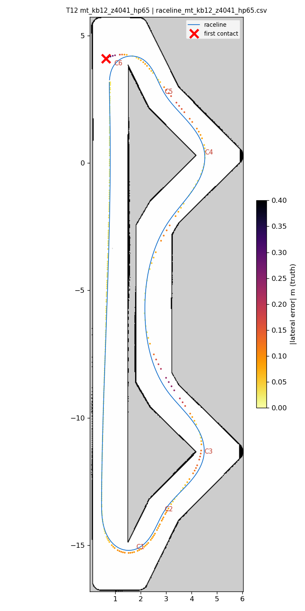
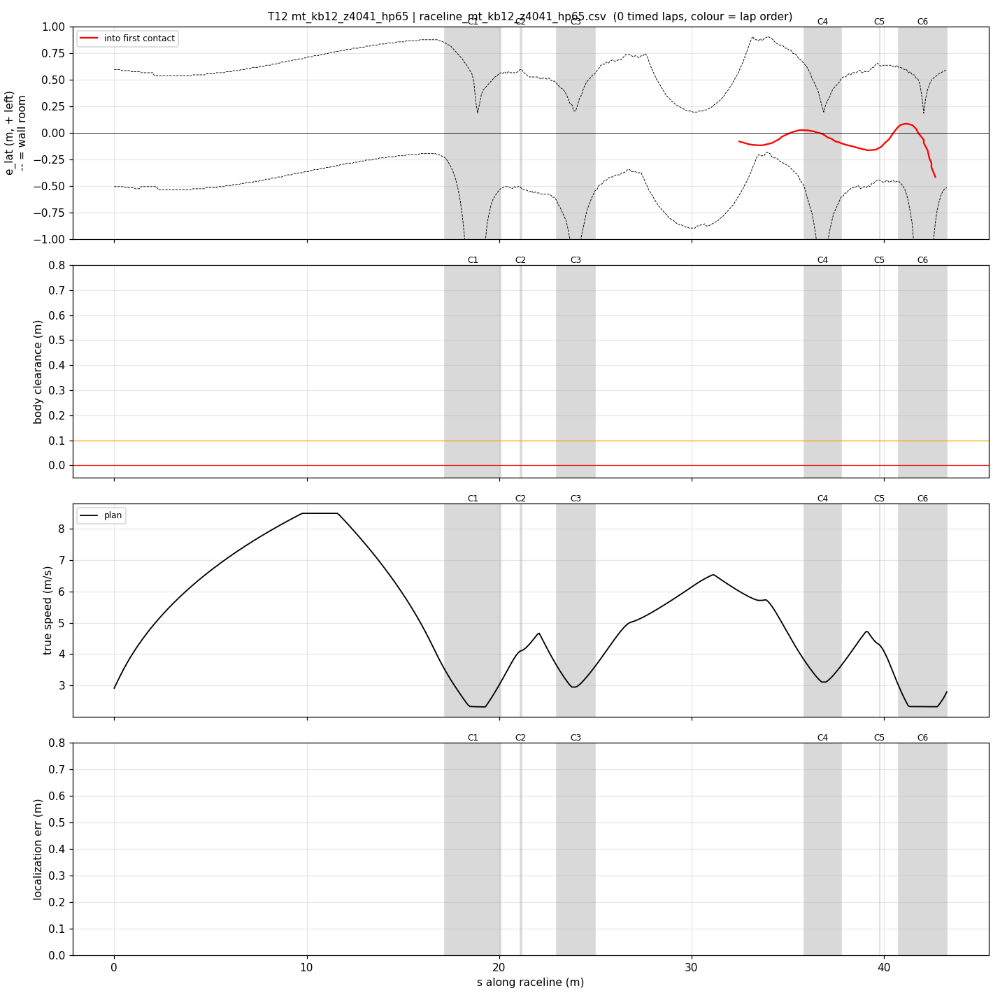
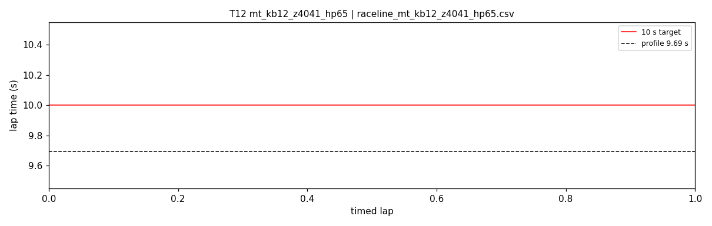
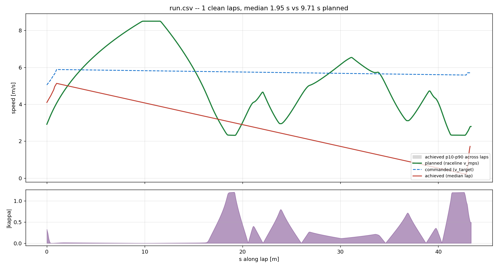
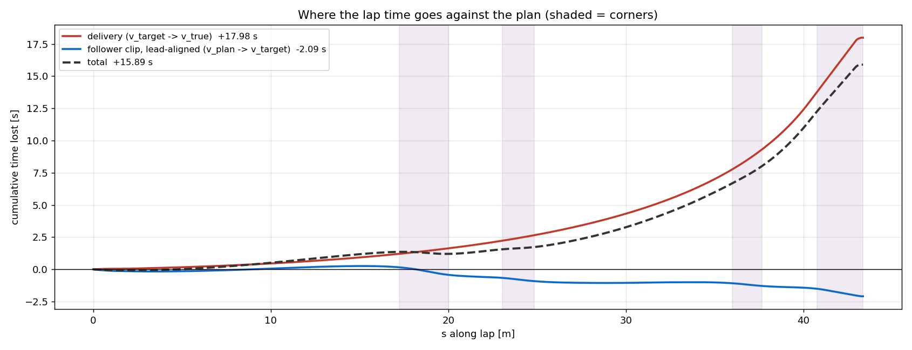

# T12 — mt_kb12_z4041_hp65

- **date** 2026-09-17  **line** `raceline_mt_kb12_z4041_hp65.csv` (profile 9.694 s)  **loop cap** 45  **laps asked** 25
- **overrides** `control_hz:=45 warmup_v_max:=2.0 warmup_dist_m:=21.0 enc_rate_window_s:=0.10 accel_ff:=0.0`
- **hypothesis** Teammates' geometry regenerated with a 0.25 m right margin at s 36.5-41 (line 0.58 m from the s-40 wall, was 0.34) and hairpins profiled at 6.5 (apex 2.32): removes the s-40 contact of T11 and part of the hairpin-exit margin, controller at the best settings with accel_ff 0
- **prediction** 0-1 contacts in 25 laps; clearance at s 39-41 >= 0.2 m; mean 9.65-9.8

## Result

| timed laps | contacts | best | median | mean | std | worst | <10 s | gap to profile | loop Hz | delay |
|---|---|---|---|---|---|---|---|---|---|---|
| 0 | 3 | — | — | — | — | — | 0 | — | 19.8 | 0.152 |

First contact: +18.8 s at s = 42.66 m

| tracking (timed laps) | mean | p90 | max |
|---|---|---|---|
| |e_lat| m | 0.124 | 0.343 | 0.727 |
| outward m | -0.063 | 0.085 | 0.727 |
| localization m | 1.444 | 4.138 | 6.059 |
| a_lat m/s² | 1.094 | 4.153 | 8.644 |
| |v_est − v| m/s | 0.323 | 0.952 | 2.266 |

Body clearance: min 0.056 m, p05 0.158 m.  Steering at lock: 7.06 % of ticks.

| corner | s | side | κ | v plan apex | v true apex | worst outward | |e| p90 | min clearance | a_lat max | at lock % |
|---|---|---|---|---|---|---|---|---|---|---|
| C1 | 17.2-20.1 | L | 1.21 | 2.32 | 1.87 | 0.102 | 0.432 | 0.075 | 4.42 | 0.0 |
| C2 | 21.1-21.2 | R | 0.41 | 4.1 | 2.01 | -0.029 | 0.096 | 0.425 | 1.41 | 0.0 |
| C3 | 23.0-25.0 | L | 0.81 | 2.95 | 2.96 | 0.088 | 0.138 | 0.056 | 6.64 | 0.0 |
| C4 | 35.9-37.8 | L | 0.72 | 3.11 | 3.06 | 0.119 | 0.1 | 0.225 | 6.57 | 0.0 |
| C5 | 39.8-39.8 | R | 0.36 | 4.3 | 3.89 | -0.058 | 0.155 | 0.292 | 1.56 | 0.0 |
| C6 | 40.8-43.3 | L | 1.21 | 2.32 | 0.94 | 0.727 | 0.644 | 0.15 | 8.0 | 0.0 |

Gates: 50 clean laps **no**, mean < 10 s (worst < 10.2) **no**

## Figures

Time-loss split (plot_speed_tracking.py): see `speed_tracking.txt`.

## Verdict

Out-lap, hairpin 2 (s 41-43): speed on plan 2.24-2.35 vs 2.32, localization 5-9 cm, steering 0.72-0.80 (not at lock), achieved kappa 0.66-0.90 vs 1.2, heading error opened to -25..-29 deg, contact 0.56 m wide. Compared with T03's clean passes at the same speed (kappa 1.12-1.22 at steer 0.72-0.75, heading error ~-4 deg) the difference is turn-in timing: steering was 0.37 when the path was already at kappa 0.66 and yaw rate built too late. The s-40 margin was not reached. Next: lookahead_min 1.0 (earlier turn-in, T13).
