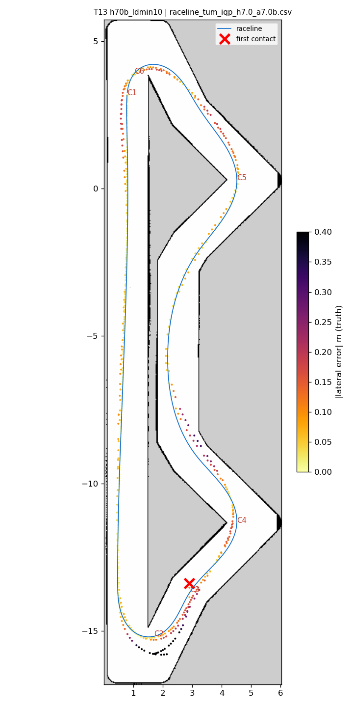
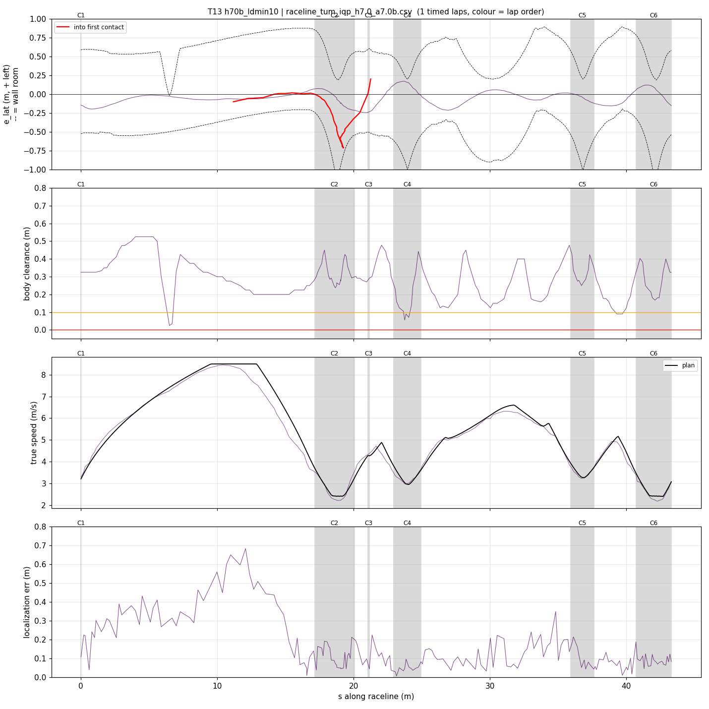
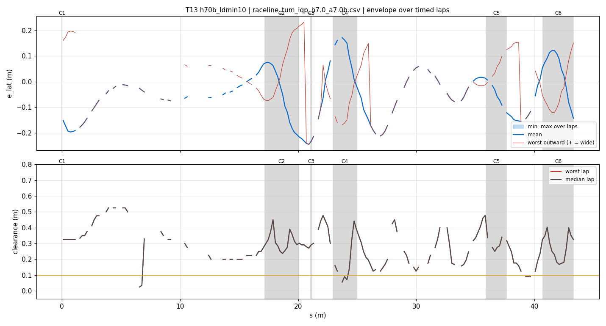
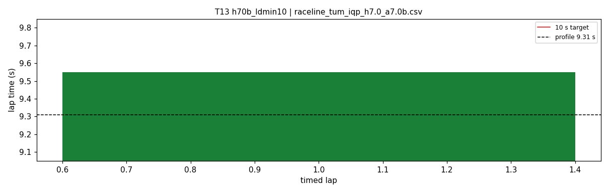
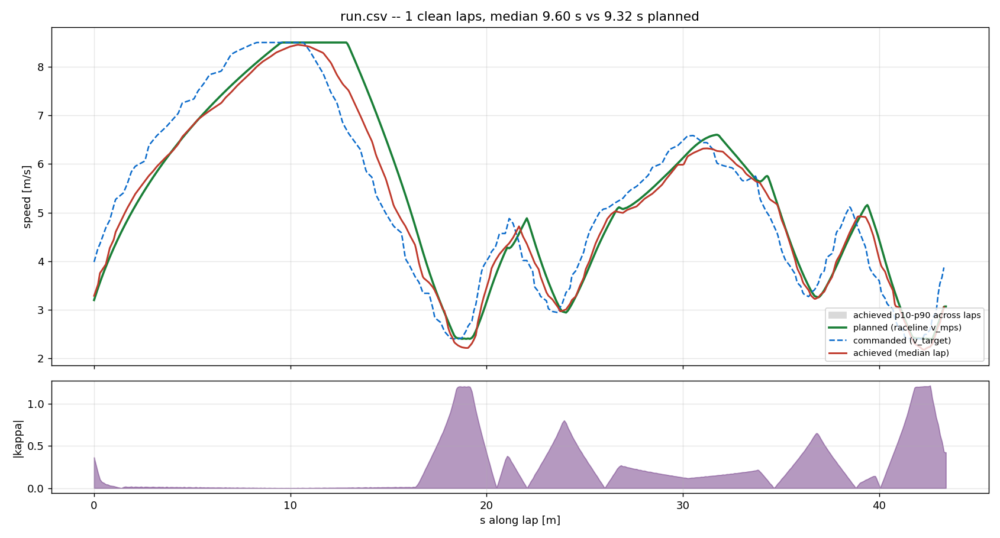
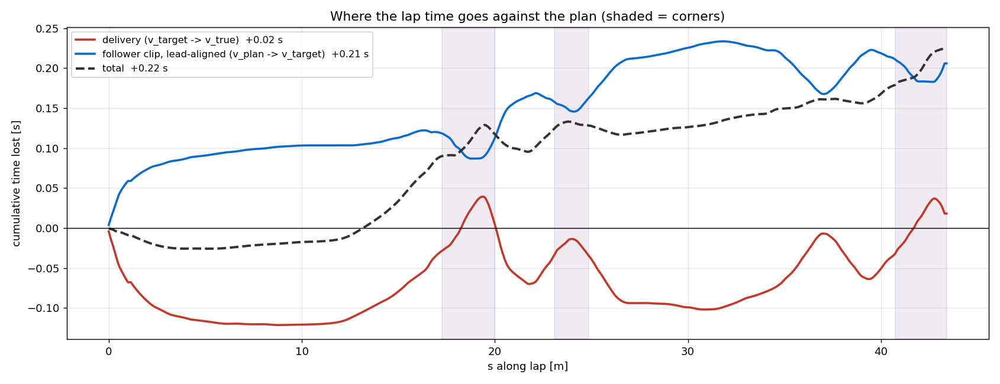

# T13 — h70b_ldmin10

- **date** 2026-09-17  **line** `raceline_tum_iqp_h7.0_a7.0b.csv` (profile 9.31 s)  **loop cap** 45  **laps asked** 25
- **overrides** `control_hz:=45 warmup_v_max:=2.0 warmup_dist_m:=21.0 enc_rate_window_s:=0.10 lookahead_min:=1.0`
- **hypothesis** Hairpin contacts come from late turn-in: with Ld pinned at lookahead_min 0.8 m, ~120 ms delay and the 3.2 rad/s steering rate, yaw builds after the path has already curved (T12 heading error -25 deg, T03 clean -4). lookahead_min 1.0 starts the arc earlier and biases the car inside, the side away from every hairpin contact so far
- **prediction** 0-1 contacts in 25 laps; hairpin worst outward < 0.3 m and inside cut < 0.25 m; mean 9.6-9.7

## Result

| timed laps | contacts | best | median | mean | std | worst | <10 s | gap to profile | loop Hz | delay |
|---|---|---|---|---|---|---|---|---|---|---|
| 1 | 3 | 9.550 | 9.550 | 9.550 | — | 9.550 | 1 | 0.240 | 22.5 | 0.133 |

First contact: +32.8 s at s = 21.25 m

| tracking (timed laps) | mean | p90 | max |
|---|---|---|---|
| |e_lat| m | 0.087 | 0.189 | 0.245 |
| outward m | -0.010 | 0.149 | 0.232 |
| localization m | 0.165 | 0.378 | 0.682 |
| a_lat m/s² | 3.392 | 6.359 | 7.596 |
| |v_est − v| m/s | 0.187 | 0.371 | 0.705 |

Body clearance: min 0.025 m, p05 0.125 m.  Steering at lock: 0.0 % of ticks.

| corner | s | side | κ | v plan apex | v true apex | worst outward | |e| p90 | min clearance | a_lat max | at lock % |
|---|---|---|---|---|---|---|---|---|---|---|
| C1 | 0.0-0.0 | L | 0.36 | 3.2 | 3.52 | 0.174 | 0.171 | 0.325 | 6.06 | 0.0 |
| C2 | 17.2-20.1 | L | 1.2 | 2.41 | 2.26 | 0.232 | 0.21 | 0.237 | 6.39 | 0.0 |
| C3 | 21.1-21.2 | R | 0.38 | 4.28 | 4.38 | -0.145 | 0.244 | 0.27 | 1.63 | 0.0 |
| C4 | 23.0-24.9 | L | 0.8 | 2.96 | 3.03 | 0.065 | 0.165 | 0.056 | 6.91 | 0.0 |
| C5 | 35.9-37.6 | L | 0.66 | 3.27 | 3.27 | 0.137 | 0.127 | 0.247 | 7.46 | 0.0 |
| C6 | 40.7-43.3 | L | 1.21 | 2.4 | 2.29 | 0.151 | 0.121 | 0.168 | 6.07 | 0.0 |

Gates: 50 clean laps **no**, mean < 10 s (worst < 10.2) **PASS**

## Figures

Time-loss split (plot_speed_tracking.py): see `speed_tracking.txt`.

## Verdict

Rejected. Timed lap 1 9.550; lap 2 hairpin 1 exit: e_lat -0.69 m at 2.5 m/s with lookahead 1.00, steering 0.67, achieved kappa 0.74-0.88 vs 0.9-1.0 path, localization 8 cm. Since T03, every run on this line's kappa-1.2 hairpins has hit a hairpin (planned 7.0, 6.5, 6.0; steer cap 7.8; accel_ff 0; Ld_min 1.0). Next: kappa-1.1 geometry (E05/E06, 0 % lock) with the teammates' longitudinal budget (T14).
