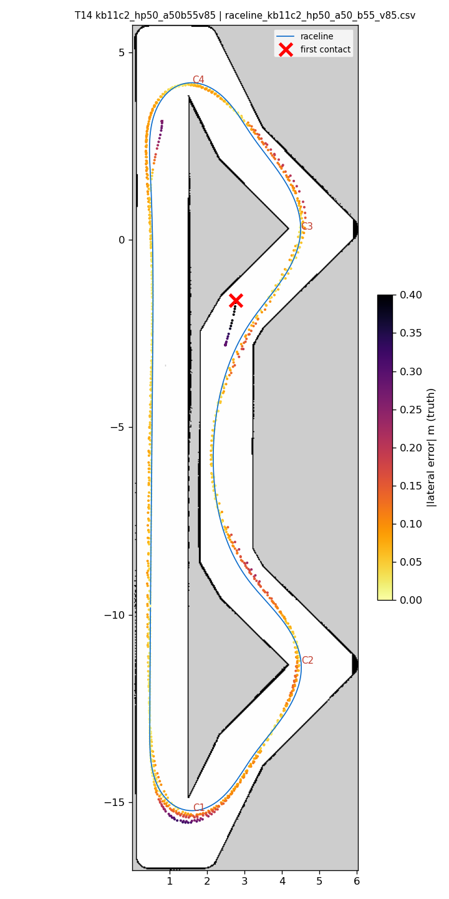
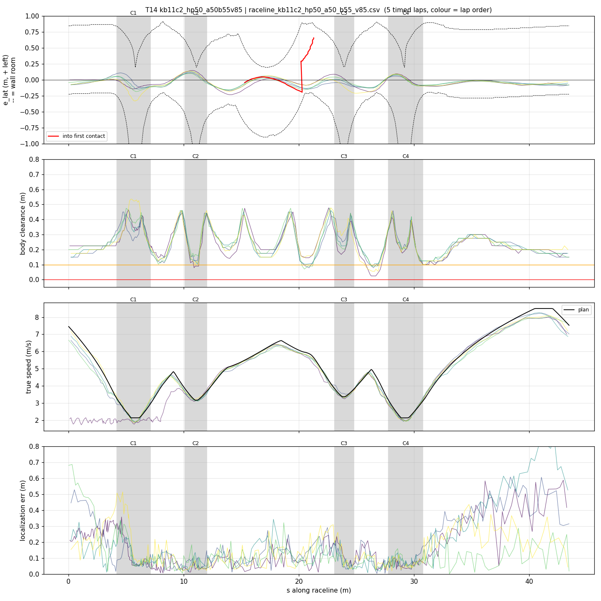
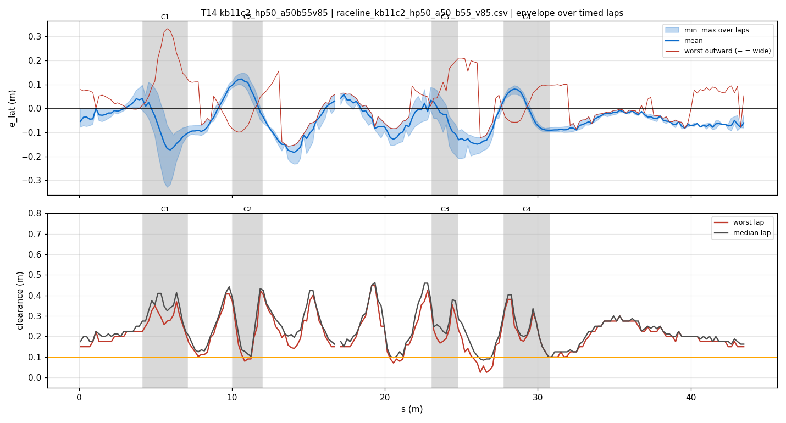
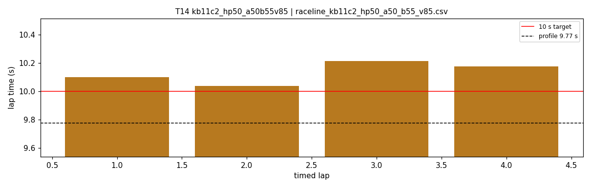
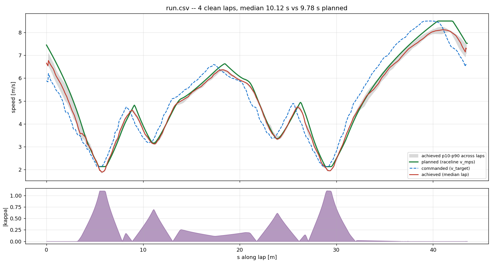
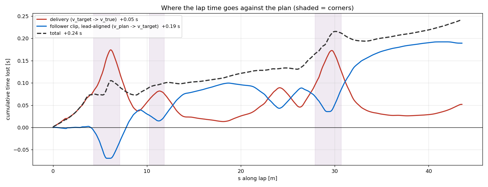

# T14 — kb11c2_hp50_a50b55v85

- **date** 2026-09-17  **line** `raceline_kb11c2_hp50_a50_b55_v85.csv` (profile 9.774 s)  **loop cap** 45  **laps asked** 25
- **overrides** `control_hz:=45 warmup_v_max:=2.0 warmup_dist_m:=21.0 enc_rate_window_s:=0.10`
- **hypothesis** The kappa-1.1 geometry (fallback E06: 0 % steering lock, clean hairpins, C2-exit margin) carries hairpins at 5.0 (apex 2.13) and takes the teammates' longitudinal budget (accel 5.0, brake 5.5, 8.5 m/s) plus control_hz 45: clean like E06 and close to 10 s
- **prediction** 0 contacts in 25 laps; hairpins 0 % lock, worst outward < 0.3; mean 9.95-10.1 (profile 9.77 + ~0.25)

## Result

| timed laps | contacts | best | median | mean | std | worst | <10 s | gap to profile | loop Hz | delay |
|---|---|---|---|---|---|---|---|---|---|---|
| 4 | 2 | 10.038 | 10.138 | 10.132 | 0.068 | 10.215 | 0 | 0.364 | 24.1 | 0.124 |

First contact: +68.3 s at s = 21.28 m

| tracking (timed laps) | mean | p90 | max |
|---|---|---|---|
| |e_lat| m | 0.072 | 0.138 | 0.332 |
| outward m | 0.005 | 0.113 | 0.332 |
| localization m | 0.155 | 0.346 | 0.860 |
| a_lat m/s² | 2.971 | 5.913 | 7.699 |
| |v_est − v| m/s | 0.198 | 0.411 | 0.789 |

Body clearance: min 0.025 m, p05 0.106 m.  Steering at lock: 0.0 % of ticks.

| corner | s | side | κ | v plan apex | v true apex | worst outward | |e| p90 | min clearance | a_lat max | at lock % |
|---|---|---|---|---|---|---|---|---|---|---|
| C1 | 4.2-7.1 | L | 1.1 | 2.13 | 1.98 | 0.332 | 0.184 | 0.135 | 5.14 | 0.0 |
| C2 | 10.1-12.0 | L | 0.7 | 3.16 | 3.18 | 0.09 | 0.129 | 0.079 | 6.7 | 0.0 |
| C3 | 23.1-24.8 | L | 0.62 | 3.36 | 3.39 | 0.21 | 0.145 | 0.125 | 7.49 | 0.0 |
| C4 | 27.8-30.8 | L | 1.1 | 2.13 | 2.03 | 0.098 | 0.093 | 0.1 | 5.91 | 0.0 |

Gates: 50 clean laps **no**, mean < 10 s (worst < 10.2) **no**

## Figures

Time-loss split (plot_speed_tracking.py): see `speed_tracking.txt`.

## Verdict

Hairpins held (the point of the geometry). 4 timed laps 10.04-10.22 s. Contact on lap 5 at s 20.7, (2.97, -2.91), heading +60 deg, 6.0-6.3 m/s, e_lat only -0.13 m, localization 11 cm: the line runs too close to the upper chevron's diagonal wall on the right, a spot the E-series (max 5.4 m/s there) never reached and where the teammates' line carries a 0.30 R margin zone. Next: add a right margin zone at s 18.5-22.5 to the kappa-1.1 geometry (T15).
