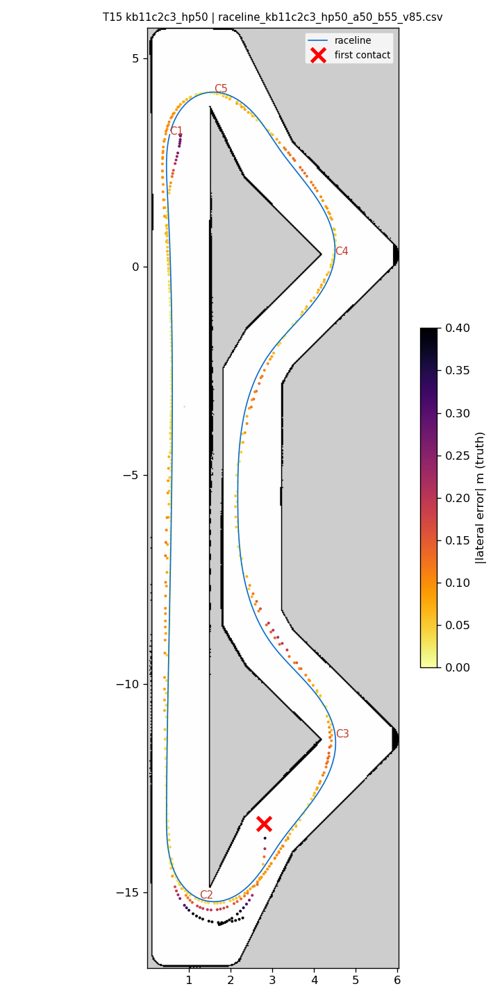
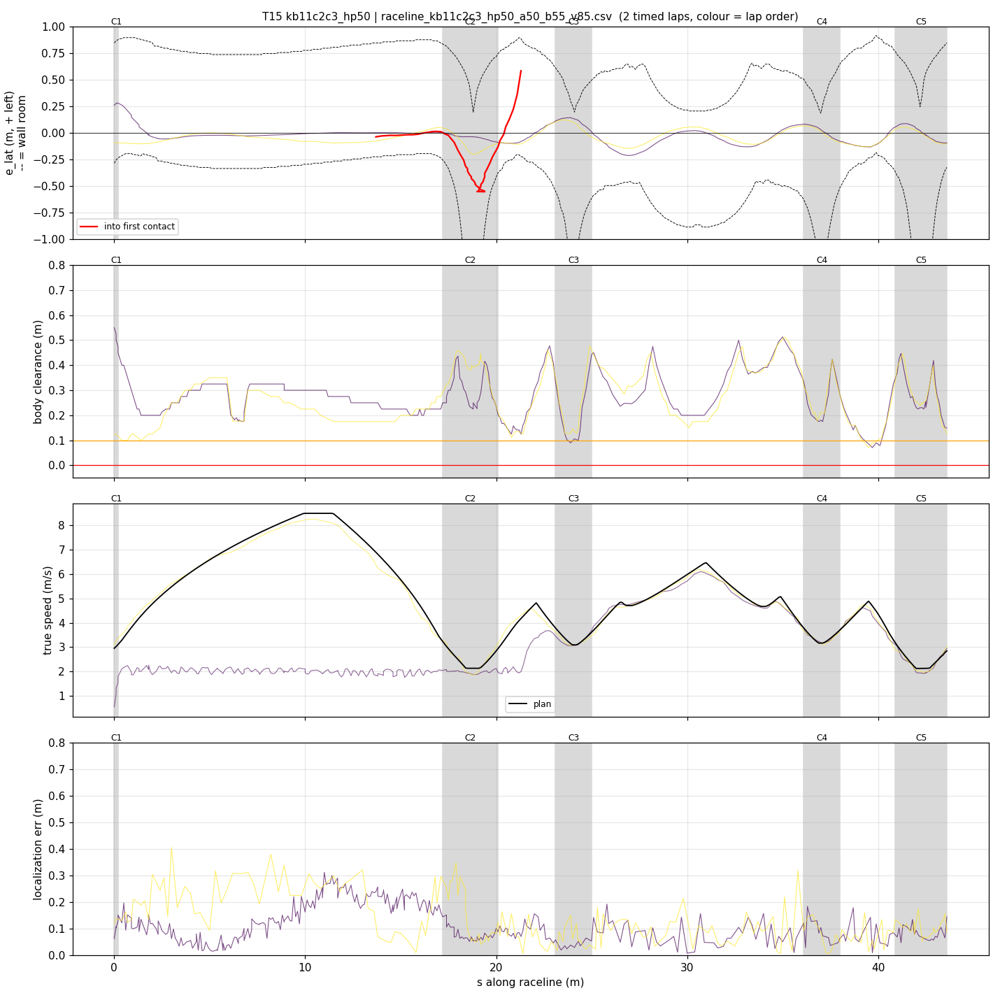
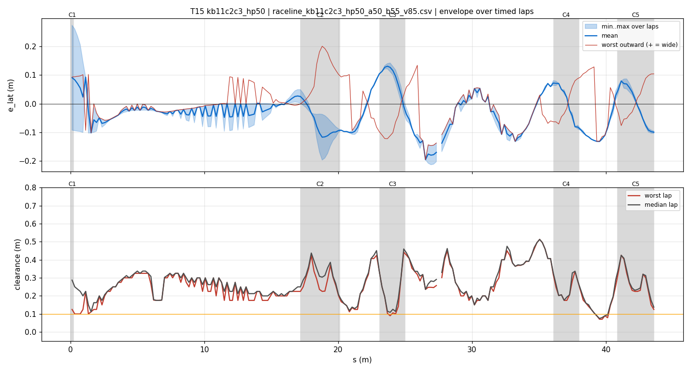
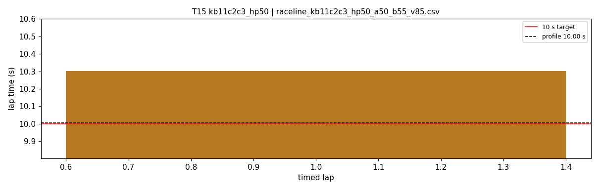

# T15 — kb11c2c3_hp50

- **date** 2026-09-17  **line** `raceline_kb11c2c3_hp50_a50_b55_v85.csv` (profile 10.004 s)  **loop cap** 45  **laps asked** 25
- **overrides** `control_hz:=45 warmup_v_max:=2.0 warmup_dist_m:=21.0 enc_rate_window_s:=0.10`
- **hypothesis** T14 (kappa-1.1 hairpins held) with the line moved from 0.36 to 0.48 m off the upper-chevron lane's right wall where T14 hit at 6 m/s, C2 exit kept at 0.58: nothing left at the geometric edge
- **prediction** 0 contacts in 25 laps; mean 10.1-10.3; hairpins 0 % lock

## Result

| timed laps | contacts | best | median | mean | std | worst | <10 s | gap to profile | loop Hz | delay |
|---|---|---|---|---|---|---|---|---|---|---|
| 1 | 5 | 10.302 | 10.302 | 10.302 | — | 10.302 | 0 | 0.298 | 21.9 | 0.137 |

First contact: +34.2 s at s = 21.29 m

| tracking (timed laps) | mean | p90 | max |
|---|---|---|---|
| |e_lat| m | 0.059 | 0.125 | 0.280 |
| outward m | -0.014 | 0.093 | 0.201 |
| localization m | 0.118 | 0.235 | 0.405 |
| a_lat m/s² | 2.177 | 4.930 | 7.141 |
| |v_est − v| m/s | 0.150 | 0.339 | 0.711 |

Body clearance: min 0.071 m, p05 0.125 m.  Steering at lock: 0.0 % of ticks.

| corner | s | side | κ | v plan apex | v true apex | worst outward | |e| p90 | min clearance | a_lat max | at lock % |
|---|---|---|---|---|---|---|---|---|---|---|
| C1 | 0.0-0.2 | L | 0.49 | 2.95 | 1.80 | 0.097 | 0.279 | 0.1 | 4.05 | 0.0 |
| C2 | 17.2-20.1 | L | 1.1 | 2.13 | 1.93 | 0.201 | 0.175 | 0.146 | 5.0 | 0.0 |
| C3 | 23.1-25.0 | L | 0.73 | 3.1 | 3.10 | 0.078 | 0.132 | 0.09 | 7.14 | 0.0 |
| C4 | 36.1-38.0 | L | 0.7 | 3.17 | 3.20 | 0.104 | 0.088 | 0.175 | 6.97 | 0.0 |
| C5 | 40.9-43.6 | L | 1.11 | 2.13 | 2.04 | 0.104 | 0.095 | 0.125 | 5.67 | 0.0 |

Gates: 50 clean laps **no**, mean < 10 s (worst < 10.2) **no**

## Figures

Time-loss split (plot_speed_tracking.py): see `speed_tracking.txt`.

## Verdict

One timed lap 10.302. Lap 2, hairpin 1 exit: steering at lock (0.99) at s 19.3, e_lat -0.48, speed 2.20-2.48 (plan 2.39-2.66), localization 7 cm, achieved kappa 0.65-0.79 against 0.92-0.70: over the limit at 5.0 m/s^2 even on kappa 1.1. The only hairpin setting clean on this laptop so far is 4.5 (E05/E06, 0 % lock over 24 laps). Next: same line, hairpins 4.5 (T16).
