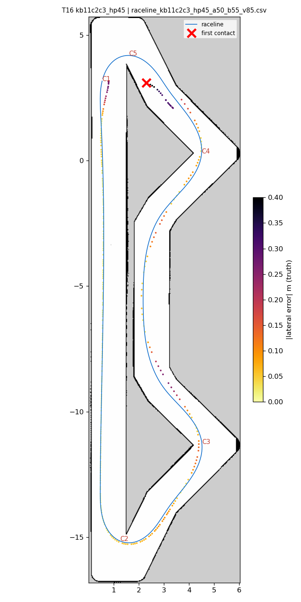
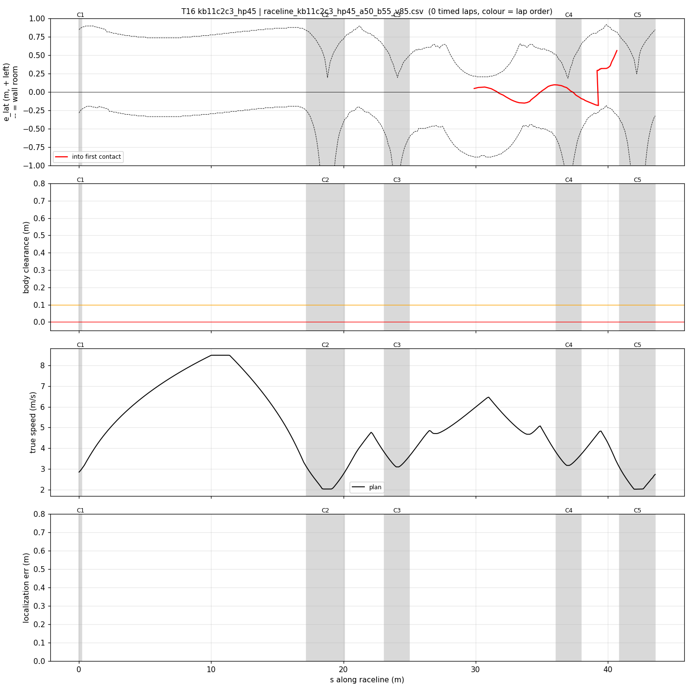
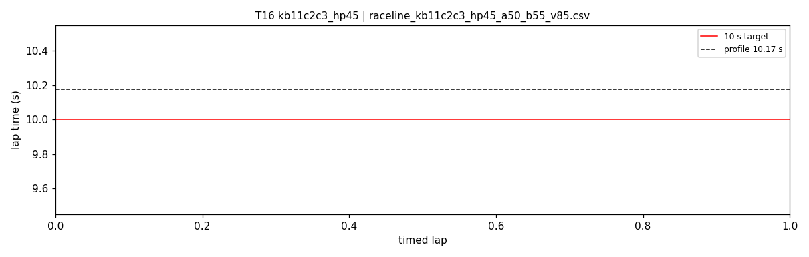

# T16 — kb11c2c3_hp45

- **date** 2026-09-17  **line** `raceline_kb11c2c3_hp45_a50_b55_v85.csv` (profile 10.175 s)  **loop cap** 45  **laps asked** 25
- **overrides** `control_hz:=45 warmup_v_max:=2.0 warmup_dist_m:=21.0 enc_rate_window_s:=0.10`
- **hypothesis** Hairpins at 4.5 m/s^2 (apex ~2.0), the only setting that has kept the steering off lock on this laptop (E05/E06), on the double-margin kappa-1.1 line with the teammates' longitudinal budget and control_hz 45
- **prediction** 0 contacts in 25 laps; hairpins 0 % lock; mean 10.15-10.35

## Result

| timed laps | contacts | best | median | mean | std | worst | <10 s | gap to profile | loop Hz | delay |
|---|---|---|---|---|---|---|---|---|---|---|
| 0 | 2 | — | — | — | — | — | 0 | — | 19.4 | 0.155 |

First contact: +18.0 s at s = 40.69 m

| tracking (timed laps) | mean | p90 | max |
|---|---|---|---|
| |e_lat| m | 0.193 | 0.352 | 0.618 |
| outward m | 0.060 | 0.309 | 0.476 |
| localization m | 1.052 | 2.642 | 2.728 |
| a_lat m/s² | 0.837 | 3.479 | 6.679 |
| |v_est − v| m/s | 0.456 | 1.839 | 4.608 |

Body clearance: min 0.025 m, p05 0.147 m.  Steering at lock: 33.66 % of ticks.

| corner | s | side | κ | v plan apex | v true apex | worst outward | |e| p90 | min clearance | a_lat max | at lock % |
|---|---|---|---|---|---|---|---|---|---|---|
| C1 | 0.0-0.2 | L | 0.49 | 2.84 | 1.18 | -0.209 | 0.278 | 0.35 | 1.28 | 0.0 |
| C2 | 17.2-20.1 | L | 1.1 | 2.02 | 1.88 | 0.096 | 0.087 | 0.146 | 4.17 | 0.0 |
| C3 | 23.1-25.0 | L | 0.73 | 3.1 | 3.06 | 0.077 | 0.136 | 0.1 | 6.0 | 0.0 |
| C4 | 36.1-38.0 | L | 0.7 | 3.17 | 3.10 | 0.117 | 0.1 | 0.15 | 6.5 | 0.0 |
| C5 | 40.9-43.6 | L | 1.11 | 2.02 | — | -0.253 | 0.585 | 0.025 | 3.66 | 27.9 |

Gates: 50 clean laps **no**, mean < 10 s (worst < 10.2) **no**

## Figures

Time-loss split (plot_speed_tracking.py): see `speed_tracking.txt`.

## Verdict

Out-lap, after the warmup release: contact at the bend before hairpin 2 ((3.7, 2.4) -> respawn (3.36, 2.10)) at 4.55-4.61 m/s, e_lat -0.17..-0.20 (right), localization 4-21 cm, steering small: the T11 spot. This geometry carries right margins at the C2 exit and the chevron lane only. Hairpins not reached at speed. Next: all three right-wall spots protected (T17).
