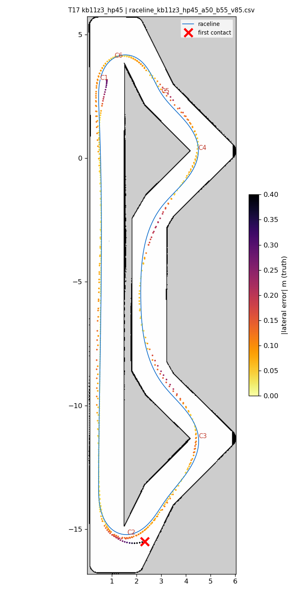
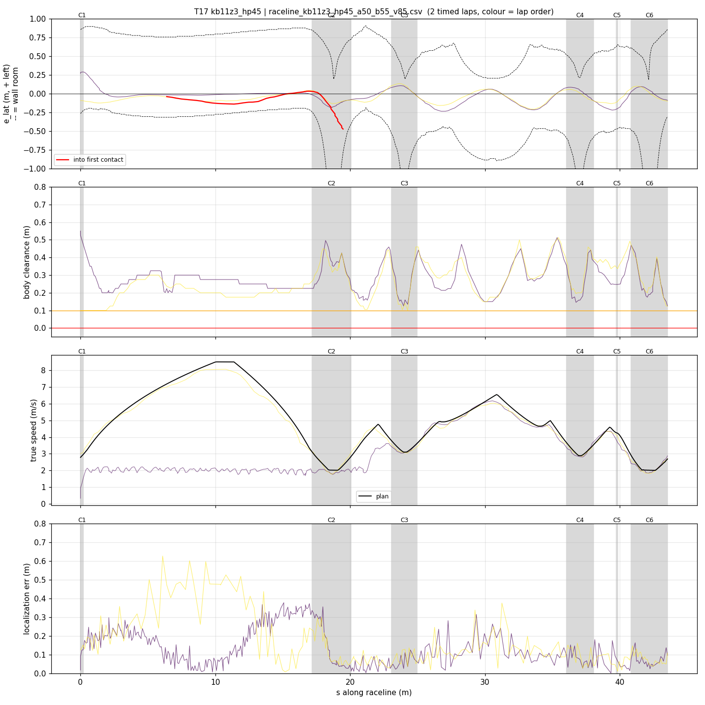
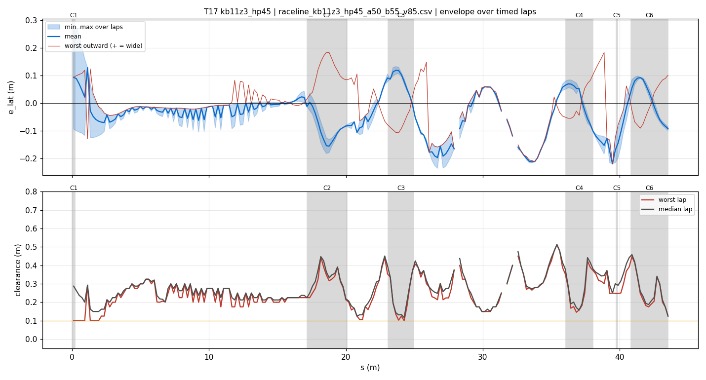
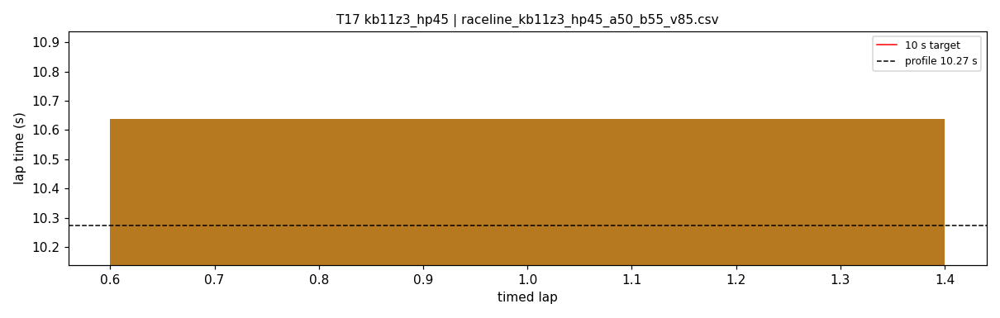

# T17 — kb11z3_hp45

- **date** 2026-09-17  **line** `raceline_kb11z3_hp45_a50_b55_v85.csv` (profile 10.274 s)  **loop cap** 45  **laps asked** 25
- **overrides** `control_hz:=45 warmup_v_max:=2.0 warmup_dist_m:=21.0 enc_rate_window_s:=0.10`
- **hypothesis** kappa-1.1 hairpins at 4.5 m/s^2 (the only clean hairpin setting here) on a geometry that keeps >= 0.50 m from all three right-wall contact spots (C2 exit, chevron lane, s-40 bend), teammates' longitudinal budget, control_hz 45 + slow warmup + enc window 0.10: every failure mode seen so far is addressed
- **prediction** 0 contacts in 25 laps; hairpins 0 % lock; mean 10.15-10.35

## Result

| timed laps | contacts | best | median | mean | std | worst | <10 s | gap to profile | loop Hz | delay |
|---|---|---|---|---|---|---|---|---|---|---|
| 1 | 4 | 10.638 | 10.638 | 10.638 | — | 10.638 | 0 | 0.364 | 18.7 | 0.161 |

First contact: +33.9 s at s = 19.48 m

| tracking (timed laps) | mean | p90 | max |
|---|---|---|---|
| |e_lat| m | 0.068 | 0.152 | 0.289 |
| outward m | -0.020 | 0.098 | 0.184 |
| localization m | 0.142 | 0.312 | 0.626 |
| a_lat m/s² | 2.120 | 4.875 | 8.288 |
| |v_est − v| m/s | 0.189 | 0.411 | 0.817 |

Body clearance: min 0.1 m, p05 0.148 m.  Steering at lock: 0.0 % of ticks.

| corner | s | side | κ | v plan apex | v true apex | worst outward | |e| p90 | min clearance | a_lat max | at lock % |
|---|---|---|---|---|---|---|---|---|---|---|
| C1 | 0.0-0.2 | L | 0.47 | 2.78 | 1.65 | 0.108 | 0.286 | 0.1 | 3.79 | 0.0 |
| C2 | 17.2-20.1 | L | 1.11 | 2.02 | 1.92 | 0.184 | 0.16 | 0.158 | 4.6 | 0.0 |
| C3 | 23.1-25.0 | L | 0.73 | 3.1 | 3.08 | 0.102 | 0.12 | 0.1 | 7.19 | 0.0 |
| C4 | 36.1-38.1 | L | 0.84 | 2.89 | 2.88 | 0.145 | 0.106 | 0.146 | 7.21 | 0.0 |
| C5 | 39.7-39.8 | R | 0.38 | 4.23 | 3.74 | -0.022 | 0.215 | 0.247 | 3.29 | 0.0 |
| C6 | 40.8-43.5 | L | 1.11 | 2.01 | 1.96 | 0.101 | 0.095 | 0.125 | 5.08 | 0.0 |

Gates: 50 clean laps **no**, mean < 10 s (worst < 10.2) **no**

## Figures

Time-loss split (plot_speed_tracking.py): see `speed_tracking.txt`.

## Verdict

One timed lap 10.638 (slow: loop delay 143-150 ms, laptop hot). Lap 2, hairpin 1: steering 0.47 -> 1.00 from s 17.9 to 18.8, at lock 0.96-1.00 at 1.9-2.05 m/s (plan 2.02), achieved kappa 0.79-0.85 vs 1.10, heading error -17..-19 deg, e_lat -0.46 at the exit, localization 4-7 cm. The car was still decelerating 2.9 -> 1.9 m/s while turning in: the 5.5 m/s^2 brake budget pushes braking into the corner (E05/E06, clean at the same hairpin setting, planned 4.5). Next: brake 4.5 (T18).
