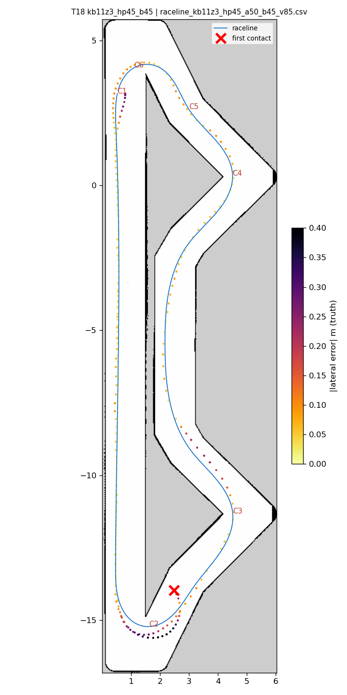
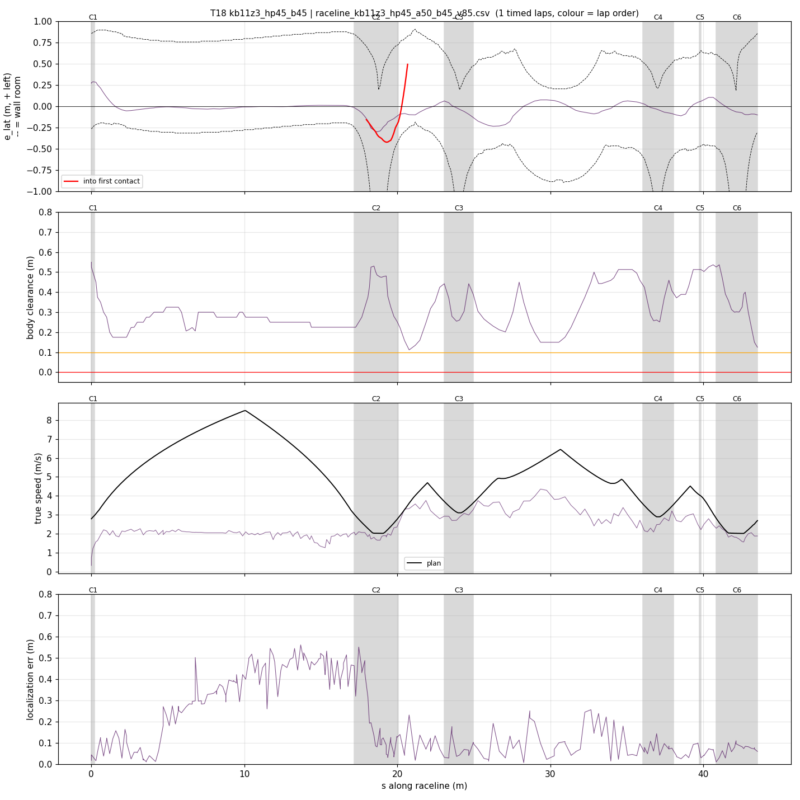
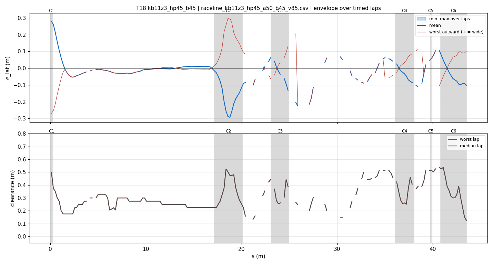
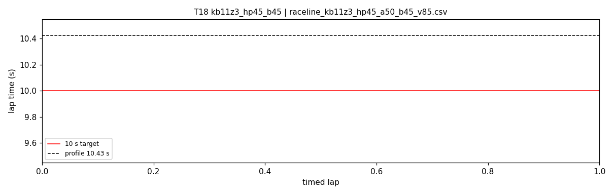
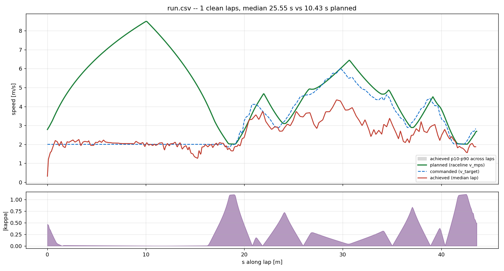
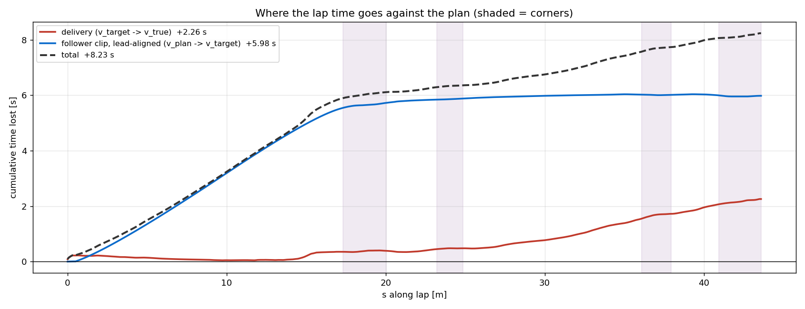

# T18 — kb11z3_hp45_b45

- **date** 2026-09-17  **line** `raceline_kb11z3_hp45_a50_b45_v85.csv` (profile 10.425 s)  **loop cap** 45  **laps asked** 25
- **overrides** `control_hz:=45 warmup_v_max:=2.0 warmup_dist_m:=21.0 enc_rate_window_s:=0.10`
- **hypothesis** T17's hairpin-1 contact came with the car still braking hard into the turn under the 5.5 m/s^2 brake budget (fronts saturated by longitudinal + lateral demand at turn-in); braking at 4.5 ends the deceleration before turn-in, as on the clean E05/E06 line
- **prediction** 0 contacts in 25 laps; hairpins 0 % lock; mean 10.3-10.5

## Result

| timed laps | contacts | best | median | mean | std | worst | <10 s | gap to profile | loop Hz | delay |
|---|---|---|---|---|---|---|---|---|---|---|
| 0 | 2 | — | — | — | — | — | 0 | — | 14.1 | 0.212 |

First contact: +39.2 s at s = 20.67 m

| tracking (timed laps) | mean | p90 | max |
|---|---|---|---|
| |e_lat| m | 0.064 | 0.178 | 0.299 |
| outward m | 0.003 | 0.102 | 0.299 |
| localization m | 0.203 | 0.482 | 0.560 |
| a_lat m/s² | 1.495 | 4.095 | 6.850 |
| |v_est − v| m/s | 0.503 | 0.924 | 1.793 |

Body clearance: min 0.112 m, p05 0.158 m.  Steering at lock: 0.0 % of ticks.

| corner | s | side | κ | v plan apex | v true apex | worst outward | |e| p90 | min clearance | a_lat max | at lock % |
|---|---|---|---|---|---|---|---|---|---|---|
| C1 | 0.0-0.2 | L | 0.47 | 2.78 | 0.90 | -0.213 | 0.288 | 0.35 | 1.48 | 0.0 |
| C2 | 17.2-20.1 | L | 1.11 | 2.02 | 1.81 | 0.3 | 0.282 | 0.158 | 3.88 | 0.0 |
| C3 | 23.1-25.0 | L | 0.73 | 3.1 | 2.82 | 0.174 | 0.157 | 0.255 | 5.73 | 0.0 |
| C4 | 36.1-38.1 | L | 0.84 | 2.89 | 2.37 | 0.112 | 0.102 | 0.251 | 6.85 | 0.0 |
| C5 | 39.7-39.8 | R | 0.38 | 3.99 | 2.41 | 0.104 | 0.104 | 0.503 | 4.19 | 0.0 |
| C6 | 40.8-43.5 | L | 1.11 | 2.01 | 1.68 | 0.104 | 0.102 | 0.125 | 4.46 | 0.0 |

Gates: 50 clean laps **no**, mean < 10 s (worst < 10.2) **no**

## Figures

Time-loss split (plot_speed_tracking.py): see `speed_tracking.txt`.

## Verdict

Invalid run. Loop delay median 0.212 s (E05/E06/T03: 0.10-0.14; T17 0.161), out-lap 24.4 s, and pure_pursuit's status froze for more than a second (pp_s and delay constant) while the car kept moving on its last command into hairpin 1. GPU 85 C at 22 W (thermal throttling) after ~2 h of simulator graphics. T15-T18 are confounded by this decay to an unknown degree; the ICRA/Porto notes record the same session decay and a simulator restart as the fix.
