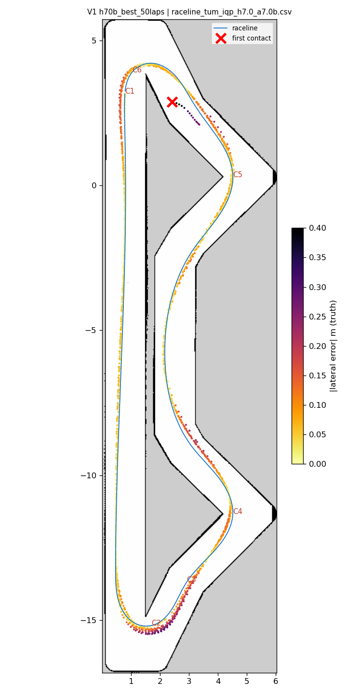
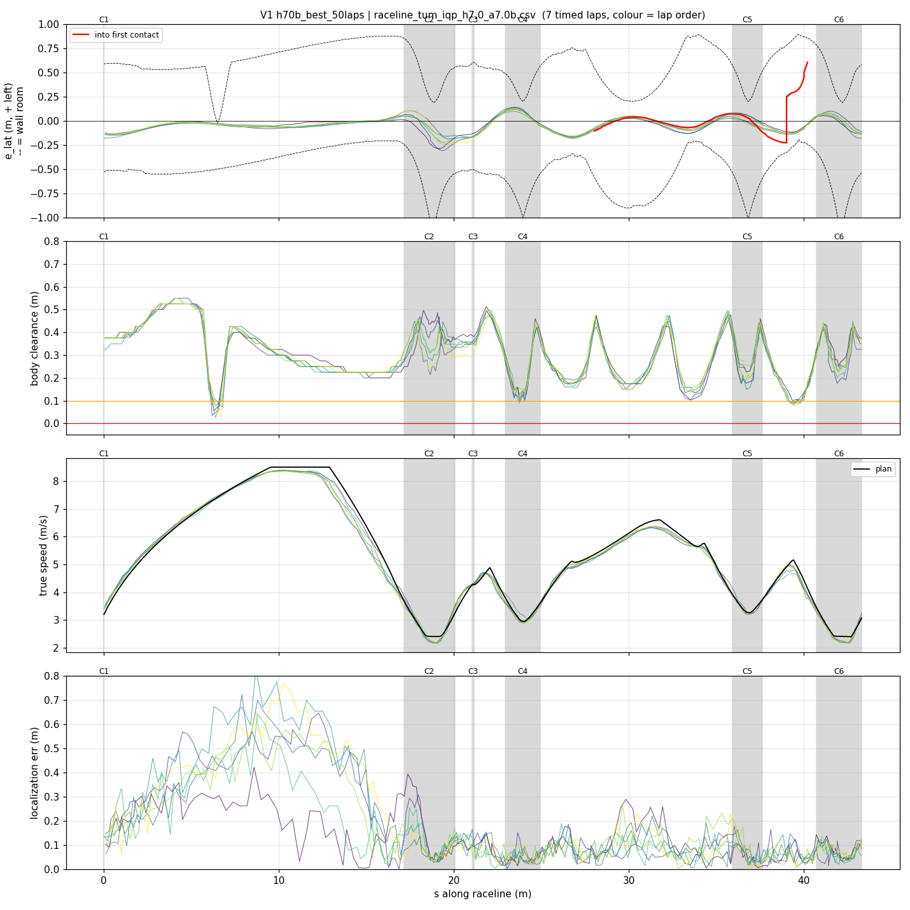
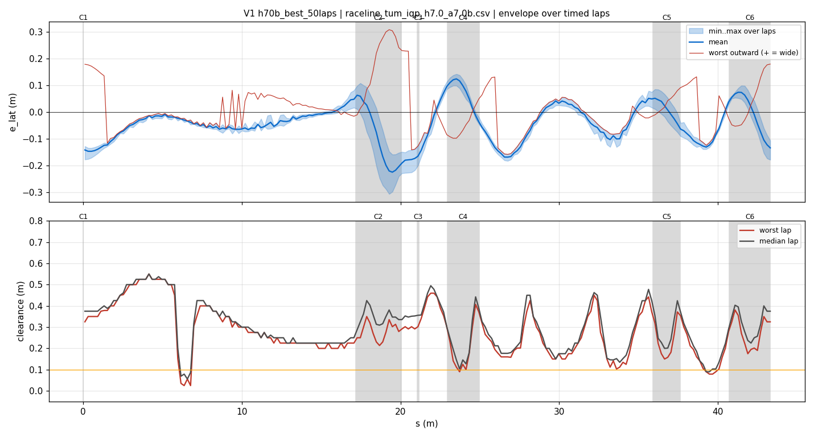
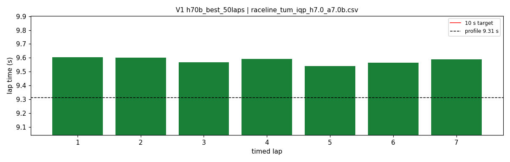
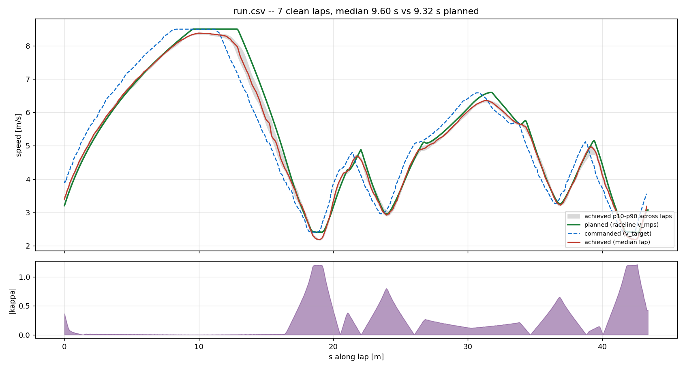
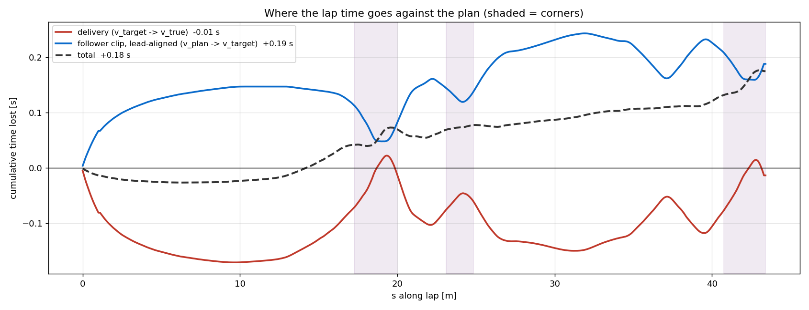

# V1 — h70b_best_50laps

- **date** 2026-09-17  **line** `raceline_tum_iqp_h7.0_a7.0b.csv` (profile 9.31 s)  **loop cap** 45  **laps asked** 50
- **overrides** `control_hz:=45 warmup_v_max:=2.0 warmup_dist_m:=21.0 enc_rate_window_s:=0.10`
- **hypothesis** Fresh boot, cool laptop: T03 (20 clean laps, mean 9.59) plus the two fixes found since (warmup 2.0 over 21 m: out-lap 8/8 clean; enc_rate_window_s 0.10: no braking-zone speed over-read) passes the 50-lap sub-10 gate when the loop is healthy
- **prediction** 0 contacts in 50 laps, mean 9.6-9.7, delay median ~0.10; if a hairpin exit hits, the machine-state explanation for T06-T18 is weakened

## Result

| timed laps | contacts | best | median | mean | std | worst | <10 s | gap to profile | loop Hz | delay |
|---|---|---|---|---|---|---|---|---|---|---|
| 7 | 2 | 9.541 | 9.588 | 9.579 | 0.021 | 9.603 | 7 | 0.278 | 31.8 | 0.094 |

First contact: +94.3 s at s = 40.21 m

| tracking (timed laps) | mean | p90 | max |
|---|---|---|---|
| |e_lat| m | 0.076 | 0.157 | 0.308 |
| outward m | -0.001 | 0.138 | 0.308 |
| localization m | 0.152 | 0.409 | 0.827 |
| a_lat m/s² | 3.379 | 6.271 | 7.536 |
| |v_est − v| m/s | 0.147 | 0.294 | 0.550 |

Body clearance: min 0.025 m, p05 0.127 m.  Steering at lock: 0.0 % of ticks.

| corner | s | side | κ | v plan apex | v true apex | worst outward | |e| p90 | min clearance | a_lat max | at lock % |
|---|---|---|---|---|---|---|---|---|---|---|
| C1 | 0.0-0.0 | L | 0.36 | 3.2 | 3.57 | 0.178 | 0.176 | 0.325 | 3.66 | 0.0 |
| C2 | 17.2-20.1 | L | 1.2 | 2.41 | 2.25 | 0.308 | 0.247 | 0.214 | 6.9 | 0.0 |
| C3 | 21.1-21.2 | R | 0.38 | 4.28 | 4.26 | -0.077 | 0.184 | 0.292 | 3.22 | 0.0 |
| C4 | 23.0-24.9 | L | 0.8 | 2.96 | 2.99 | 0.097 | 0.126 | 0.09 | 7.01 | 0.0 |
| C5 | 35.9-37.6 | L | 0.66 | 3.27 | 3.27 | 0.103 | 0.08 | 0.15 | 6.8 | 0.0 |
| C6 | 40.7-43.3 | L | 1.21 | 2.4 | 2.29 | 0.179 | 0.123 | 0.158 | 6.94 | 0.0 |

Gates: 50 clean laps **no**, mean < 10 s (worst < 10.2) **PASS**

## Figures

Time-loss split (plot_speed_tracking.py): see `speed_tracking.txt`.

## Verdict

Fresh boot, loop healthy (delay median 0.095). Out-lap clean, 7 timed laps 9.603 9.602 9.567 9.591 9.541 9.564 9.588. Lap 8: contact at the bend before hairpin 2 ((3.74, 2.38), s 39.5-40) at 4.97 m/s, e_lat -0.19 (right), localization 7-11 cm, heading error +6 deg: the line's 0.35 m right-wall spot (T11, T16). The hairpins were clean at this loop health, which supports the machine-decay reading of T15-T18. GPU 86 C / ACPI 91 C after 3 min (PC had shut itself off once). Next: the same profile on the geometry with the s-40 margin (V2).
