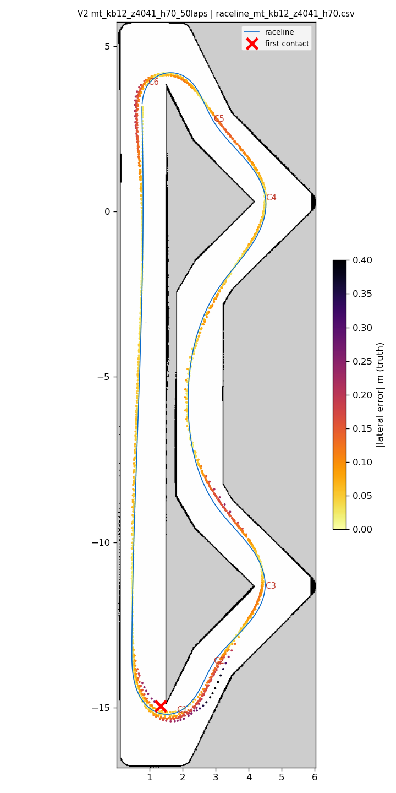
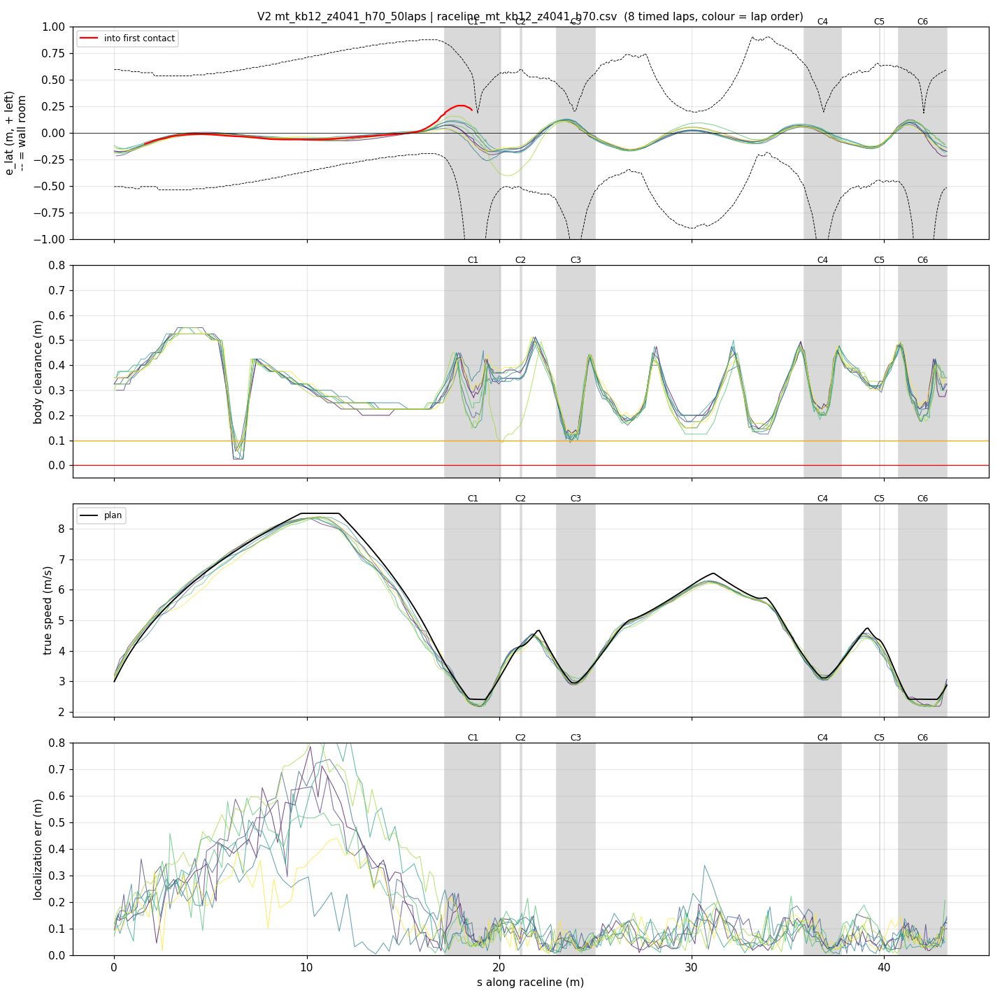
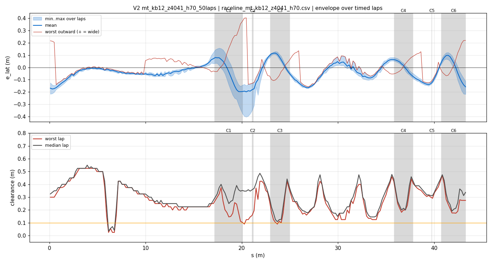
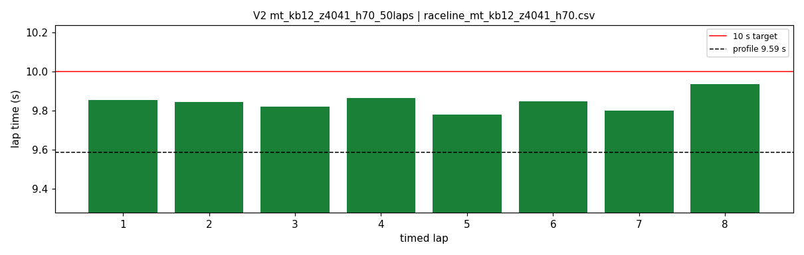
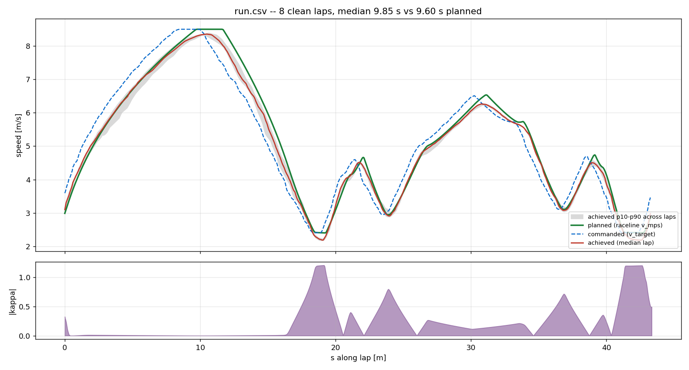
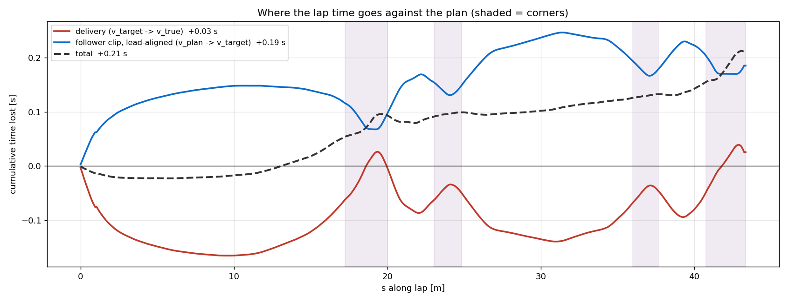

# V2 — mt_kb12_z4041_h70_50laps

- **date** 2026-09-17  **line** `raceline_mt_kb12_z4041_h70.csv` (profile 9.588 s)  **loop cap** 45  **laps asked** 50
- **overrides** `control_hz:=45 warmup_v_max:=2.0 warmup_dist_m:=21.0 enc_rate_window_s:=0.10`
- **hypothesis** V1's only failure mode on a healthy loop was the s-40 bend wall (line 0.35 m off it); the same geometry regenerated with a 0.25 m right margin there (0.62 m) and profiled exactly as the teammates' line (7.0 everywhere, accel 5.0, brake 5.5, 8.5 m/s), with the V1 controller settings
- **prediction** 0 contacts in 50 laps; mean 9.6-9.75; s-40 bend clearance >= 0.25 m

## Result

| timed laps | contacts | best | median | mean | std | worst | <10 s | gap to profile | loop Hz | delay |
|---|---|---|---|---|---|---|---|---|---|---|
| 8 | 2 | 9.780 | 9.846 | 9.844 | 0.044 | 9.937 | 8 | 0.259 | 30.0 | 0.100 |

First contact: +100.6 s at s = 18.58 m

| tracking (timed laps) | mean | p90 | max |
|---|---|---|---|
| |e_lat| m | 0.076 | 0.157 | 0.403 |
| outward m | -0.012 | 0.121 | 0.403 |
| localization m | 0.142 | 0.357 | 0.835 |
| a_lat m/s² | 3.275 | 6.190 | 7.497 |
| |v_est − v| m/s | 0.163 | 0.336 | 0.890 |

Body clearance: min 0.025 m, p05 0.146 m.  Steering at lock: 0.0 % of ticks.

| corner | s | side | κ | v plan apex | v true apex | worst outward | |e| p90 | min clearance | a_lat max | at lock % |
|---|---|---|---|---|---|---|---|---|---|---|
| C1 | 17.2-20.1 | L | 1.21 | 2.4 | 2.30 | 0.402 | 0.196 | 0.09 | 7.11 | 0.0 |
| C2 | 21.1-21.2 | R | 0.41 | 4.15 | 4.13 | -0.054 | 0.223 | 0.125 | 3.18 | 0.0 |
| C3 | 23.0-25.0 | L | 0.81 | 2.95 | 2.98 | 0.102 | 0.116 | 0.09 | 6.94 | 0.0 |
| C4 | 35.9-37.8 | L | 0.72 | 3.11 | 3.13 | 0.111 | 0.086 | 0.182 | 7.13 | 0.0 |
| C5 | 39.8-39.8 | R | 0.36 | 4.36 | 4.08 | -0.041 | 0.141 | 0.292 | 2.69 | 0.0 |
| C6 | 40.8-43.3 | L | 1.21 | 2.41 | 2.27 | 0.219 | 0.142 | 0.175 | 6.88 | 0.0 |

Gates: 50 clean laps **no**, mean < 10 s (worst < 10.2) **PASS**

## Figures

Time-loss split (plot_speed_tracking.py): see `speed_tracking.txt`.

## Verdict

_to be written after reading the figures_
